# Datenmanagement

## 1 Relationenmodell

Tabellen sind **Relationen**.

- Überschriften: **Relationenschema**
- Einträge der Tabelle: **Relation**
- Einzelner Eintrag: **Tupel**
- Einzelne Überschrift: **Attribut**

Integitätsbedingungen:

- lokal, z.B. UNIQUE
- global, z.B. FOREIGN KEY

## 2 ER

Nach P. P. Chen, 1976

- **Entity**: Objekt, über das Informationen gespeichert werden
- **Relationship**: Beziehung zw. Entities
- **Attribut**: Eigenschaft von Entities o. Beziehungen

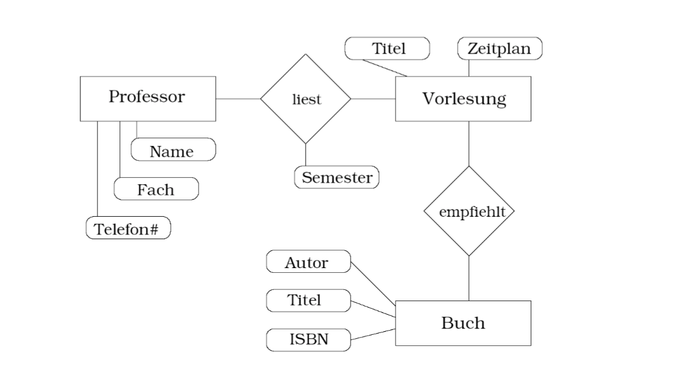
Beispiel eines ER-Modells

### 2.1 Mehrstellige Beziehungen

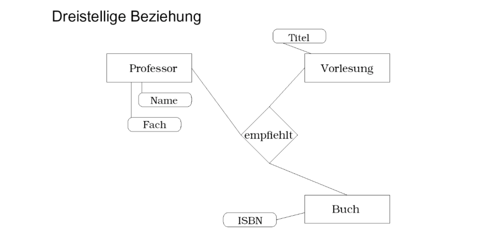
**Mehrstellige Beziehung** im ER-Modell

### 2.2 Funktionale Beziehungen

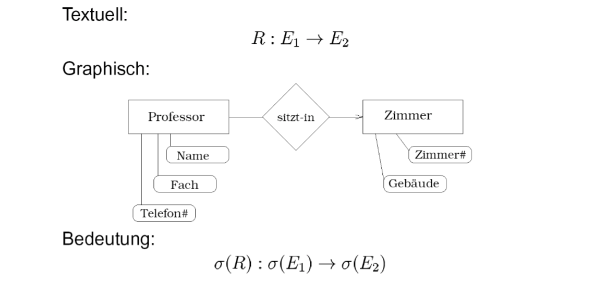
**Funktionale Beziehung** im ER-Modell

### 2.3 Abhängigkeiten

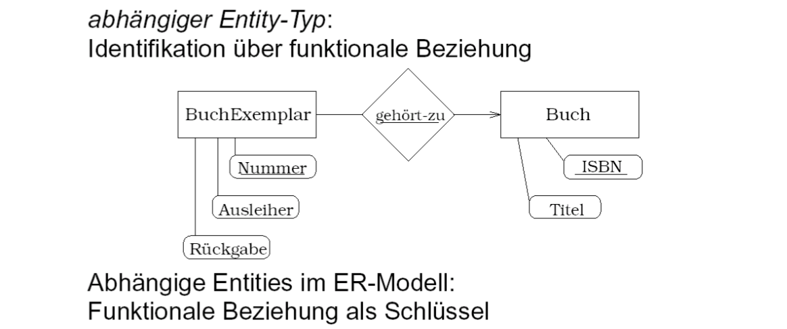
**Abhängige Entität** im ER-Modell

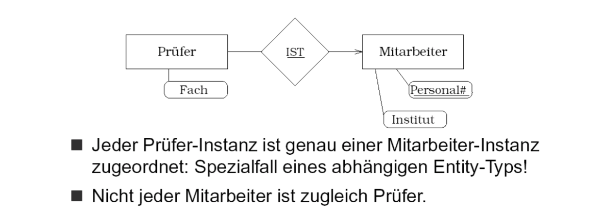
**IST-Beziehung** im ER-Modell

### 2.4 Kardinalitäten

Angaben (**Min/Max** bzw. **Chen-Notation**):

- 0 oder 1: [0, 1] bzw. c
- genau 1: [1, 1] bzw. 1
- 1 oder mehr: [1, *] bzw. m
- 0 oder mehr: [0, *] bzw. mc

**Achtung!** Min/Max-Notation gibt Häufigkeit in Zuordnungstabelle an: Aus c - mc wird [0, *] -
[0, 1].

### 2.5 Weitere Konzepte

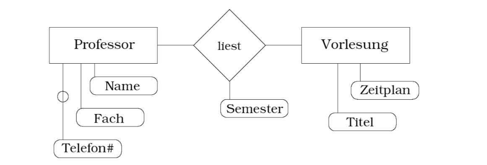
**Optionales Attribut** Telefon

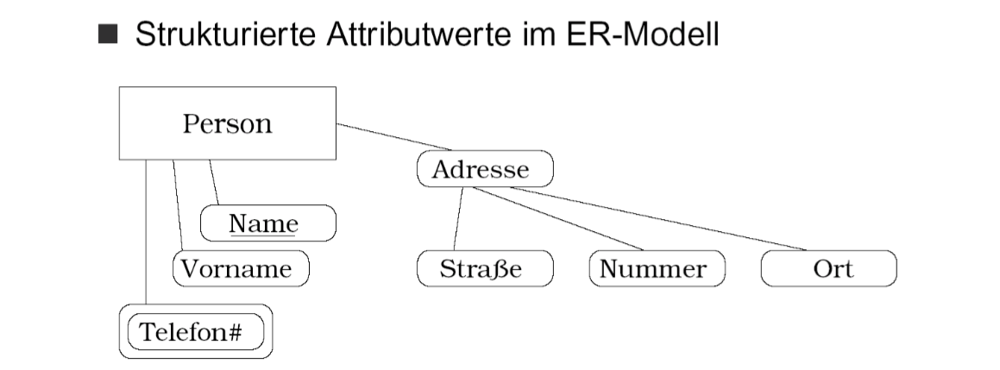
**Strukturierte Attribute**, doppelter Rahmen: leer oder mengenwertig

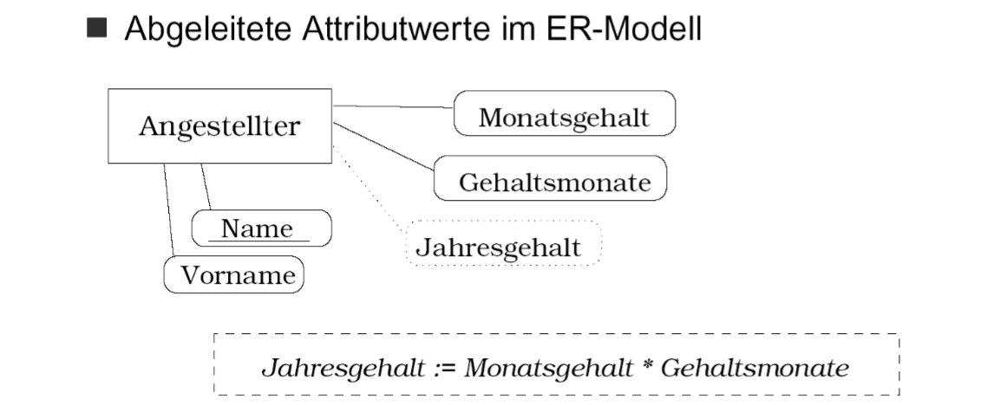
**Abgeleitetes Attribut** Jahresgehalt

## 3 EER

Nach Hohenstein und Golla.

Unterstützte “höhere” Konzepte:

- **Spezialisierung**: IST-Beziehung (z.B. Professor ist Mitarbeiter)
- **Generalisierung**: allgemeinerer Kontext (z.B. Person oder Institut ist Ausleiher)
- **Partitionierung**: mehrere disjunkte Entity-Typen (z.B. Bücher als Monographien und
Sammelbände)
- **Komplexe Objekte**:
  - **Aggregierung**: aus Instanzen anderer Entity-Typen (z.B. Fahrzeug aus Motor und
Karosserie)
  - **Sammlung o. Assoziation**: Mengenbildung (z.B. Team als Menge von Personen)
- **Beziehungen höheren Typs**:
  - Spezialisierung und Generalisierung
  - Beziehungen zw. Beziehungen

Änderungen am ER-Modell:

- **Schlüssel**: erweitertes Konzept, neue Notation
- **IST-Beziehung**: ersetzt durch Typkonstruktor
- **Abhängige Entity-Typen**: durch erweitertes Schlüsselkonzept und objektwertige Attribute ersetzt

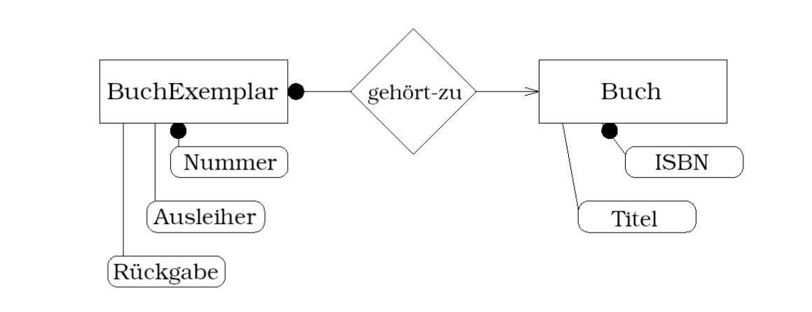
**Schlüsselnotation** im EER-Modell

### 3.1 Komplexe Werte

Mengen- und tupelwertige Attribute:

- **prod**: Tupelbildung (z.B. Adresse)
- **list**: Liste/Folge von Werten (z.B. Punkte eines Polygon)
- **set**: Menge (z.B. Feiertage)
- **bag**: Multimenge (z.B. Geburtstage einer Gruppe)

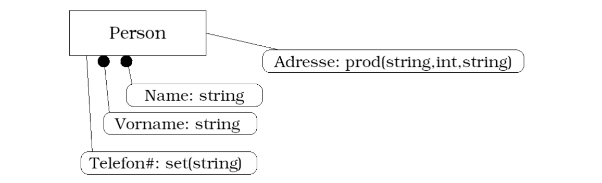
**Komplexe Werte** im EER-Modell

### 3.2 Typkonstruktoren

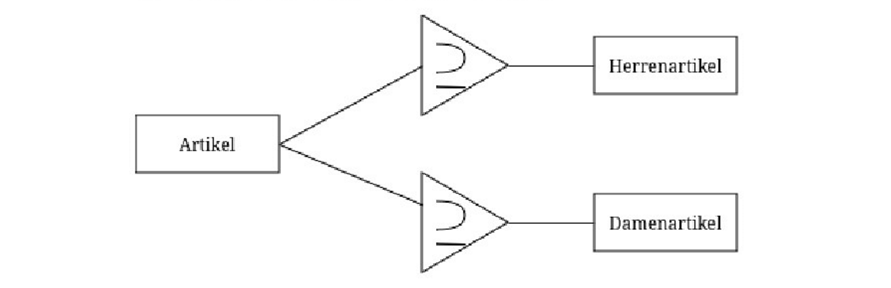
**Spezialisierung** ersetzt IST-Beziehung

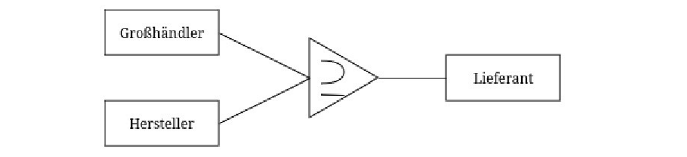
**Generalisierung**

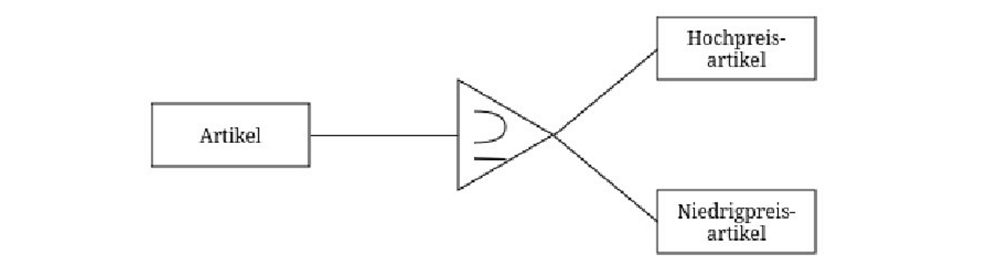
**Partitionierung**

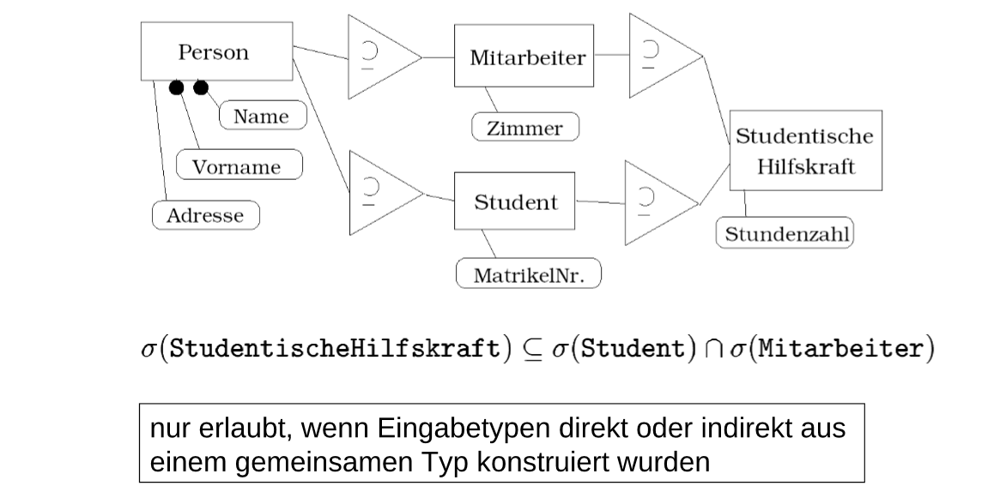
**Mehrfachspezialisierung**

### 3.3 Objektwertige Attribute

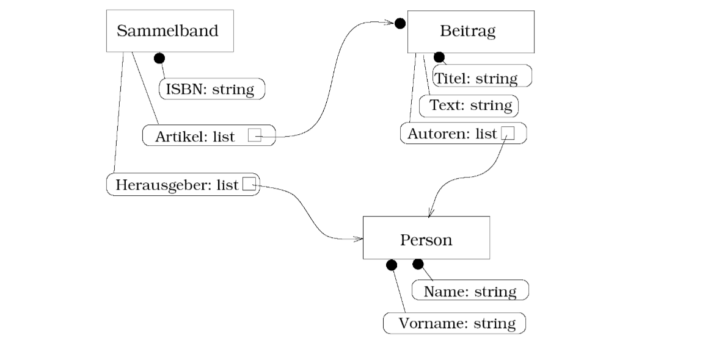
Verwendung **objektwertiger Attribute**, Beitrag durch Sammelband und Titel identifizierbar

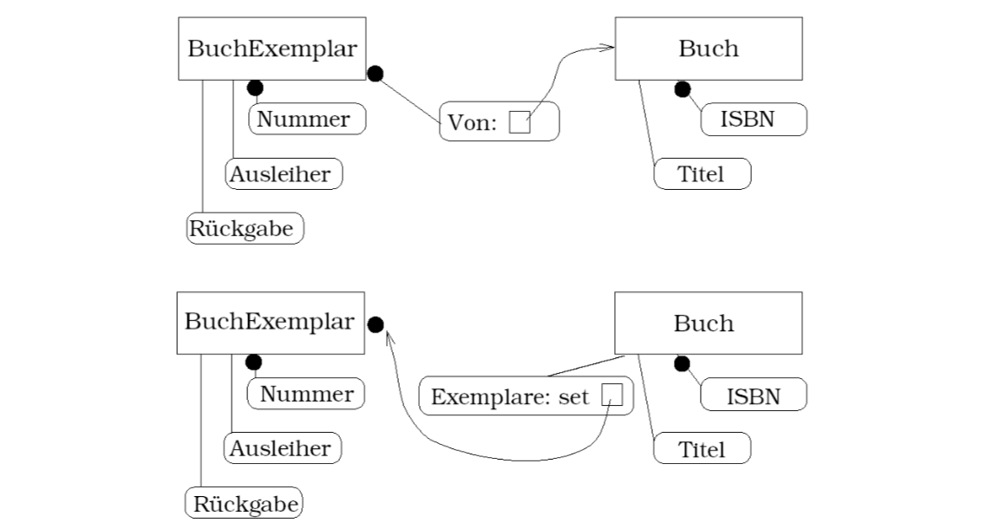
**Abhängige Entity-Typen**, BuchExemplar durch Nummer und Buch identifizierbar

## 4 Vom Entwurf zum Relationenschema

Abbildung des ER-Modells auf ein Relationenschema.

- Erster Teilschritt des logischen Datenbankentwurfs
- **Transformation** manuell nach Faustregeln oder automatisch
- **Kapazitätserhaltende Abbildung** (heißt äquivalenter Modellierungsumfang)

Die vier Schritte:

- (1) Alle Entities und Relationships werden **Tabellen**
  - **Attribute** übernehmen, bei Relationships beteiligte Entities
  - **Schlüsseleigenschaften** werden übernommen
- (2) **Schlüssel** für Relationships anhand **Kardinalitäten** festlegen
  - Suche **[_, 1]**: **Schlüssel der Entity** wird unabhängiger/eigenständiger Schlüssel der
Relationship
  - Ansonsten: **Schlüssel aller beteiligter Entities** werden gemeinsamer Schlüssel der
Relationship
- (3) **Verschmelzung** bei <ins>zwingender und eindeutiger</ins> Beziehung, also [1, 1]
- (4) **Fremdschlüsselbeziehungen** einzeichnen (Pfeile)

Auflösung einer **mehrwertigen Relation** (z.B. 3-dimensional):

- Neue Relation-Entity mit Relation zu jeder der betroffenen Entities
- Auf der Seite der Entity steht die ursprüngliche Kardinalität, bei der Relation-Entity steht jeweils [1, 1]

## 5 Der relationale DB-Entwurf

**Redundanzvermeidung** durch Überführung in **Normalformen**. Also Aufspalten von Relationenschemata mit:

- **Abhängigkeitstreue**: kein Verlust semantischer Informationen, alle gegebenen Abhängigkeiten sind durch Schlüssel repräsentiert
- **Verbundtreue**: Rekonstruktion der Relationen möglich

**Funktionale Abhängigkeiten** (FDs):

- Abbildung eines Attributs auf ein anderes, $x \rightarrow y$
- Zusammenfassung möglich: $x \rightarrow y, z$
- Wenn linke Seite minimal, ist diese ein Schlüssel
- Logische Ableitung möglich: $A \rightarrow B; B \rightarrow C$ dann gilt auch $A \rightarrow C$

### 5.1 Closure

$Closure(F, {x})$ berechnet alle Attribute, die direkt oder indirekt über $F$ von $x$ bestimmt
werden.

$F: A, B \rightarrow C; A \rightarrow D; A \rightarrow E; D \rightarrow G; A, G \rightarrow F; D \rightarrow J; J \rightarrow K$

$Closure(F, \{A\}) = \{A, D, E, G, F\}$

$Closure(F, \{B\}) = \{B, J\}$

$Closure(F, \{A, B\}) = \{A, B, C, D, E, G, F, J, K\}$, somit ist ($A, B$) **Schlüssel**

Anwendung in **Dekomposition** (Test auf Vollständigkeit) und **Synthese** (Eliminierung von Redundanzen).

Mit dem Closure-Algorithmus werden zwei FD-Mengen auf **Äquivalenz** geprüft. Diese liegt vor, wenn jede FD aus $F$ auch aus $G$ folgt und umgekehrt.

$f: x \rightarrow y~~~y \in Closure(G, \{x\})?$

$g: d \rightarrow q~~~q \in Closure(F, \{d\})?$

Man spricht auch von **gegenseitiger Überdeckung**.

### 5.2 Normalformen (NF) 1-3

**1\. Normalform**: nur atomare Attribute im Relationenschema.

**2\. Normalform**: keine partiellen funktionalen Abhängigkeiten. Eine solche liegt vor, wenn
ein Attribut funktional schon von einem Teil des Schlüssels abhängt.

**3\. Normalform**: keine transitiven funktionalen Abhängigkeiten. Eine solche liegt vor, wenn
ein Attribut funktional von einem Nicht-Schlüsselattribut abhängt.

Erreichen der 1. Normalform durch Aufspalten von Attributen. Erreichen der 2. und 3. Normalform durch Auslagerung in neue Tabellen, mit referenzierendem Attribut als Schlüssel bzw.
Fremdschlüssel.

### 5.3 Minimalität

Es gilt zudem, das Prinzip der **Minimalität** einzuhalten. Dabei werden globale Redundanzen vermieden, indem andere Kriterien (die Normalformen) mit **möglichst wenig Schemata**
erreicht werden.

### 5.4 Dekomposition vs. Synthese

#### 5.4.1 Dekomposition

1. Alle Attribute in **eine Tabelle**
2. Leite aus FDs einen **Schlüssel** ab
3. Suche und eliminiere **partielle FDs** (2. NF)
4. Suche und eliminiere **transitive FDs** (3. NF)
5. Zeige **Abhängigkeitstreue**

#### 5.4.2 Synthese

1. Betrachte gegebene FDs
2. Führe alle möglichen **Linksreduktionen** durch
3. Führe alle möglichen **Rechtsreduktionen** durch
4. Aus der **minimalen Überdeckung** Schema bilden: jede FD wird Tabelle mit all ihren Attributen und linker Seite als Schlüssel. (Dabei werden alle FDs mit äquivalenten linken Seiten zu “Klassen” zusammengefasst)
5. Ggf. zusätzliche Tabelle mit **Gesamtschlüssel** (falls Attribute nicht Teil der FDs)

### 5.5 4. Normalform

Eine **mehrwertige Abhängigkeit** ist eine mengenwertige Zuordnung, unabhängig von den
Werten der restlichen Attribute.

$ISBN \rightarrow\rightarrow Autor$

$ISBN \rightarrow\rightarrow V ersion$

$ISBN \rightarrow\rightarrow Stichwort$

Für die **4. Normalform** muss jede mehrwertige funktionale Abhängigkeit in eine **separate Tabelle** ausgelagert werden.

## 6 Nicht relationale Datenmodelle

Unterstützung objektrelationaler Konzepte durch Verbindung mit SQL. Allerdings bisher nur
teilweise umgesetzt. In **Oracle** kamen folgende **Datentypen** hinzu:

- **BLOB, CLOB**: binary/character large objects
- **Boolean**: booleschee Werte
- **Array**: Kollektionstyp für mehrwertige Attribute
- **REF-Typen**: Tupel-Identifikation über OID sowie Navigation über Pfadausdrücke
- **ROW-Typen**: Typkonstruktor für strukturierte Attribute
- **nutzerdefinierte Typen**: Konstruktion neuer Typen

Beispiele:

```sql
create table Bücher (
    titel varchar(100),
    isbn varchar(10),
    preis decimal(5,2),
    abstract clob (10K),
    autoren varchar(20) array [5]
);
create table Kunden (
    name varchar(50),
    adresse row (strasse varchar(30),
    plz char(5),
    ort varchar(30))
);
```

### 6.1 Komplexe Typen

#### 6.1.1 Distinct-Typen

**Umbenennung existierender Typen**, um Typ-Inkompatibilitäten einzuführen, bei Attributen,
Parametern oder Variablen.

Beispiele:

```sql
create type meter as integer final;
create type quadratmeter as integer final;
```

#### 6.1.2 Strukturierte Typen

**Typkonstruktor** zur Definition abstrakter Datentypen, bei Attributen, Parametern, Variablen
oder Tabellen.

Beispiele:

```sql
create type AdresseT as (
    strasse varchar(30),
    plz char(5),
    ort varchar(30)
) not final;
create type KundeT as (
    knr int,
    name varchar(30),
    lieferadresse AdresseT
) not final;
```

#### 6.1.3 Untertypen

**Erweiterung existierender Datentypen** (UDTs) ohne Mehrfachvererbung und nur wenn Typ
**“not final”**.

Beispiele:

```sql
create type PersonT as (...) not final;
create type KundeT under PersonT as (...) not final;
```

#### 6.1.4 Strukturierte Typen für Tabellen

**Definition von Tabellen** auf Basis strukturierter Typen: Attribute werden Spalten und **OID
wird ergänzt**.

Beispiele:

```sql
create table Kunden of KundeT (
    ref is oid user generated
);
```

Alternativ: **ref is ... system generated** oder **ref from** _(Attributliste)_ (z.B. Ableitung von Primärschlüssel)

### 6.2 Objekte und Referenzen

#### 6.2.1 REF-Typen

Typ für **Referenzen auf Instanzen** eines strukturierten Datentyps. Der Gültigkeitsbereich kann
die Tabellen einschränken.

**ref** _(strukturierter-typ)_ [**scope** _gültigkeitsbereich_]

Beispiele:

```sql
create type PersonT as (
    personalnr integer,
    name varchar(30),
    vorgesetzter ref(PersonT)
);
create table Angestellte of PersonT (...);
create table Abteilungen (
    name varchar(10),
    leiter ref(Person) scope(Angestellte),
    mitarbeiter ref(Person) scope(Angestellte) array[10]
);
```

#### 6.2.2 Objekttabellen

```sql
create type PersonT as (
    name varchar(30),
    anschrift AdresseT,
    ehepartner ref(PersonT),
    kinder ref(PersonT) array[10]
);
craete type MitarbeiterT under PersonT as (
    pnr integer,
    ...,
    gehalt decimal(7,2)
);
create table Mitarbeiter of MitarbeiterT (
    ref is oid system generated
);
```
