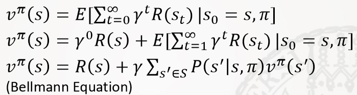
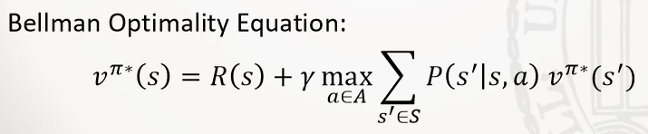
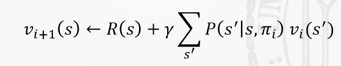
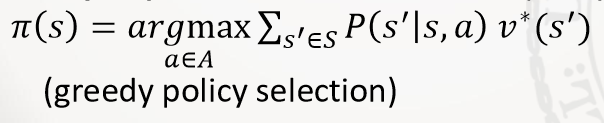

# AI for Games

## Important

- exercises
- be able to interpret formulas
- content:
  - Spatial Publish Subscribe
  - Bulk Load
  - Persistence Protocols
  - Deterministic Planning
  - Non-Deterministic: Bellman Equation, how to apply update
  - Abstract State Spaces (free text)
  - Multi Agents (free text)
  - Elo Updates

## I. Introduction

### A. Games

- Interaction, Experience, Learning & Mastering
- First success: PONG (Atari 1972)
- Business Models:
  - Boxed Games (GTA)
  - Subscription Games (WoW)
  - Micro-Transaction Games (Farmville)
- 2024 market of **95 Bn $**
- Success Factors: appealing experience, challenging, quality of service, sufficient number of players, time spent
- Classification Criteria:
  - number of controlled entities
  - perspective
  - temporal organisation (real-time, game-time, turn-based)
  - control complexity
  - graphics and gaming world
  - number of players
  - avatar development (RPG)
  - influence of randomization
- Genres:
  - Real-Time Strategy Games (**RTS**): Age of Empires
  - Massive Multiplayer Online Role Playing Games (**MMORPGs**): WoW
  - Multiplayer Online Battle Arena Games (**MOBAs**): LoL
  - Firs-Person-Shooter (**FPS**): CS
  - Racing Games: Gran Tourismo
  - Fighting Games: Mortal Combat
  - Economic Simulations & Turn-based Strategy Games: Civilization
  - Adventure Games & Interactive Movies: Leisure Suit Larry
  - Jump 'n' Run: Super Mario
  - Singing, Music, Rythm Games: Sing Star

### B. AI

- analyze & generate behavior of game entities
- **Environment**:
  - contains game state (partially / fully observable)
  - executes reactions to actions (deterministic / non-deterministic)
  - known model / model free
  - competitive / collaborative
  - static / dynamic / semi-dynamic
- **Agents**:
  - autonomous within the environment
  - types:
    - simple reflex agent (condition-action-rule)
    - model-based reflex agent (with state)
    - goal-based agents
    - utility-based agents (optimizes reward)
    - learning agents
- Usage:
  - check game balance
  - detect fraud
  - analyse revenue of micro-transactions $\rightarrow$ adapt pricing
  - control environment: NPCs, Mobs, etc.
  - challenging opponents (adapted to player skill)
- Games are great to train & test autonomous systems
  - clearly defined goals & rewards
  - known action set
  - available experience (observing humans, simulating gameplay)

## II. Game Core

- **Game State**:
  - objects, attributes, relationships, etc.
- **Transition**:
  - change of game state over time
  - triggered by player, agent or transition model (e.g. gravity)
  - game time model for synchronization
    - temporal order of changes
    - restrict number of actions
    - allow all players to act
    - synchronize with wall-clock time
  - **Transition Model**:
    - computes valid reactions or prevents prohibited actions
    - often based on rough approximations of physical laws
    - **Temporal Models**:
      - **Turn based methods**: fixed order, sequential or parallel, game state is fixed during decision
        - Pro: clear & easy to understand, progress based on slowest agent
        - Con: no wall-clock progression, being fast is no advantage
      - **Transaction Systems**: FIFO queue, sequential, no limit on actions
        - Pro: valid state is guaranteed, being fast is an advantage
        - Con: time depends on processing time of transition, no simultaneous actions
      - **Tick Systems** (Soft Real-Time): fixed time intervals, actions within a tick are treated as simultaneous, joint transition, processing the tick can take longer than the defined time interval
        - Pro: synchronizes with wall-clock time, fair action processing, concurrency is possible
        - Con: lags (if transition not computed in time), conflicts possible for concurrent actions, no chronological order
        - shadow memory for consistency: all actions within tick based on same game state
- Games as **Stochastic Process**
  - random elements & varying player actions
  - a discrete time, homogenous **Marcov process** is defined by
    - a set of states S
    - a stochastic function t(s) including start distribution & terminal states
    - and is memoryless: only depends on current state
    - applies for environments without player agents
  - continuous time Markov chains would additionally need to predict the next time a transition might happen
  - inhomogenous processes allow the transition function to vary for different times (i.e. at night)

## III. Spatial Management

### A. Spatial Queries

- get game entities within interaction range: Area of Interest (**AoI**)
- for small game worlds, sequential scans over a list would be sufficient $\rightarrow$ processing cost strongly increases with game state
- possible spatial queries:
  - **$\epsilon$-Range Queries**: Euclidian distance lower or equal to $\epsilon$
  - **Box-Query**: within specific range on each axis
  - **Intersection Query**: all entities with overlapping AoIs
  - **Nearest Neighbor Query**: nearest entity within AoI
- tuning methods:
  - **pruning**: reducing number of considered objects (zoning, sharding, index structures, $\ldots$)
  - reducing number of spatial queries: less query ticks or spatial publish subscribe
  - efficient queries: nearest neighbor, $\epsilon$-Range Join
- **Sharding & Instantiation**:
  - copying a region for a specific group: limited number of players / entities
  - additional game state storage can become expensive for many parallel instances
- **Zoning**:
  - splitting into several fixed areas, only considering one area at a time
  - game state is partitioned and can be distributed over several computers
  - **Micro-Zoning**:
    - only micro zones that intersect with the AoI are relevant
    - grids or voronoi-cells
- **Spatial Publish Subscribe**:
  - combines micro zones with observer pattern
  - game entities are **registered** in micro zone and **subscribe** to micro zones within AoI
  - Pro: close-by objects can be found efficiently & no query is necessary as changes are sent actively to subscribers
  - Con: zones can be overcrowded, too much overhead if zones are small, high change-rate can increase overhead & slow down system

### B. Index Structures

- spatial search trees with restricted number of objects per page region
- **page region**: surrounds several objects
- **balancing**: variance of path lengths / objects per page region
- **page capacity**: min and max number of objects per page region
- **overlap**: intersections between page regions
- **dead space**: space without page regions
- **pruning**: excluding page regions outside AoI
- usually stored in main memory
- index creation time must be compensated by runtime advantage
- **Binary Space Partitioning Trees (BSP-Tree)**:
  - each inner node has 2 successors
  - data objects are leaf nodes
  - most popular: **kD-Tree**:
    - capacity: $[M/2, M]$
    - overflow: split 50/50 along axis, axis changes with every split
    - underflow: merge sibling nodes
  - not balanced, rebalancing is very expensive
  - **Bulk-Load**:
    - recursively distributing all known data objects until all leafs are within capacity
    - creates a balanced tree
- **Quad-Tree**:
  - each inner node has 4 successors (equal parts)
  - not balanced
  - only max capacity
- **R-Tree**:
  - uses data partitioning instead of space partitioning: minimal bounding rectangles (MBR)
  - between $m$ and $M$ successors ($m \leq M/2$)
  - successor's MBR is completely contained in node's MBR
  - all leaves are at the same level
  - **Bulk-Load** with **Sort-Tile Recursive** algorithm:
    - assembling bottom-up with no overlap (for points), for $n$ points / rectangles to store:
      - quantile $q = \lceil \sqrt{n / M} \rceil$
      - quantile after $q \cdot M$ objects in dimension 1
      - quantile after $M$ objects in dimension 2
      - create MBR for each cell
      - restart with MBRs or stop if $q < 2$ (root reached)
- **Throw-Away Indices**:
  - for highly volatile data: spatial movement of objects leads to huge computational overhead or degenerates data structures
    - changing existing data structure is more expensive than rebuilding with bulk load
  - use tree only if tree creation & query on tree is faster than brute force query processing

## IV. Distributed Games

### A. Distributed Architecture

- **Client-Server**:
  - centralized solution for account-management, partitioning game-world, monitoring, persistence
- **Multi-Server**:
  - redundant data storage
  - less distance between client and server
- **Peer-to-Peer**:
  - no server
  - every peer hosts a part of the game-world (dynamically partitioned)
- **Brewer's CAP Theorem**:
  - any networked shared-data system can have at most 2 of the 3 desired properties: **C**onsistency, **A**vailability, **P**artition Tolerance
- Protocol Content:
  - **Action Result Protocol**: current parameter value / relative change
  - **Action Request Protocol**: user input
- **Thin-Client**:
  - uses Action Request Protocol: server calcualtes transition & sends update to clients, clients only have part of game state
  - Pro: game state centrally managed $\rightarrow$ ensures a consistent game state, low potential for cheating
  - Con: maximum server load, round trip times may cause high latencies, processing power of clients largely unused
- **Fat-Client**:
  - clients directly modify part of the game state
  - local game states may vary due to transmission delays
  - chronological sequence may be inconsistent between local & global changes
  - Action Result Protocol is used to get changes acknowledged by the server
  - **Local Lag** Mechanism:
    - local actions are delayed to allow for global actions to arrive in time
    - if this time frame is exceeded, conflict detection & reset are necessary
- Application:
  - **server side** processing where **accuracy & chronological order** are most important (e.g. damage, healing, item pickup)
  - **client side** processing where **response time** is most important (e.g. movements, animations, effects)
- Communication:
  - usually small package sizes & little bandwith
  - required latencies:
    - RTS < 1000 ms
    - RPG < 500 ms
    - FPS < 100 ms
  - TCP/IP for most cases but retransmits may increases latency
  - UDP for just-in-time services (voice, movement, etc.)
  - other protocols do not show a significant increase in performance

### B. Dead Reckoning

- movement has to be calculated locally for fluid rendering
- aspects:
  - **Update Strategy**: frequency of synchronization (bandwidth vs. error rate)
    - **regular update**: fixed time interval
    - **event based update**: on changing direction or movement type
    - **distance-based update**: different rates, depending on distance (weapon range most important)
  - **Movement Model**: extrapolation between transmitted positions (error rate vs. movement perception)
    - Linear movement with constant speed
    - Linear movement with constant acceleration
  - **Error Correction**: may improve perception, but increases processing time
    - if predicted position differs from actual
    - **Hermite graphs** for polynomial smoothing: linear combination of different polynomials

## V. Persistence

### A. Replays & Save Games

- Save Games allow later resuming and preserve a consistent game state in case of a crash
- only important parts are saved
- Replays allow retracing a game for analysis but can grow quite large
- should not slow down (within tick) & should be as up-to-date as possible
- methods:
  - **State-Log**: series of (full) game states
    - Pro: loading is simple
    - Con: high redundancy, large data volume
  - **Transition-Log**: changes are logged with time, entity, attribute, new value
    - Pro: more compact, less effort to save
    - Con: reconstruction is more complex
  - **Action-Log**: sequence of all user inputs
    - Pro: compact, no redundancies
    - Con: expensive reconstruction (re-playing on game)
- place:
  - Database: structured, consistent, recoverable, fast access but more processing time
  - Log-Files: fast save but no efficient access & system errors possible
  - Hybrid Architecture: Log-Files are inserted into database on a persistence server

### B. Checkpoint Recovery Methods

- checkpoints are used to save with minimal overhead inside game loop
- information is copied to shadow memory first
- allows persistence layer to be slower
- classic strategies: bulk copy / selective copy, locking, dirty-bits
- **Naive-Snapshot**:
  - everything is copied to shadow memory, then written to disk from shadow memory
  - no overhead, efficient for large num. of changes but copying whole game state may cause lags
- **Selective Copy**:
  - dirty-bit is set on change, dirty objects are saved & bits reset
  - only considers changed objects but bit resets cause overhead
- **Wait-Free Zigzag**:
  - Flags:
    - **MW** (write): where is written to, opposite is read
    - **MR** (read): = MW on write
    - end of period: if MW == MR, flip MW
  - changes over time possible without locking but bit reset required
- **Wait-Free Ping-Pong**
  - 3 Game States: GS, Odd, Even
  - raed & write is swapped between Odd & Even with each period
  - no locking or bit reset but triple memory requirement

## VI. Agents

- **Policy**: $\pi$ mapping between states S & actions A
  - can be stochastic: likelihood of taking action a in state s
  - determined by environment, purpose & policy function
  - goals:
    - provide elements of game design (e.g. monsters)
    - act human-like
    - maximizing reward
    - minimizing cost
  - types:
    - **Reflex Agent**: set of rules with particular order
      - no optimization (heuristics, learned or pre-optimized)
      - usually very efficient
    - **Model-Based Reflex Agent**
      - internal state resulting from recent observations as current state alone might not be enough
      - e.g. follow object that is not visible all the time
    - **Goal-Based Reflex Agent**
      - reward / cost function $\rightarrow$ planning ahead to maximize reward
    - **Utility-Based Agent**
      - based on MDP
      - non-deterministic: based on cumulated expected reward (utility)
    - **Learning Agents**: Reinforcement Learning
      - approximation of utility function or directly learning a policy function
      - can transfer reasonable policies from similar settings
    - special:
      - Imitation Learning
      - Multi-Agent
- **Observability**: game state or part of
  - fully observable: e.g. board games
  - partial observable: e.g. fog of war
    - deciding on abstraction of true state
- **Non-Detereminism**: usually part of games to keep them challenging
- the environment might change as well
- there may be a goal
- collaborative vs. antagonistic setting
- with / without **known model** (exact rules are known)

## VII. Deterministic Planning

- non-deterministic problems are often solved by making it deterministic and then solving it
- example: assumption that opponent uses same (optimal) policy
- search trees & graphs: nodes are states, edges are transitions
- for an infinite horizon, not all policies may terminate

### A. Algorithms

- **Breadth First Search** (BFS):
  - computes paths in order of length $\rightarrow$ finds path with minimum steps (not necessarily cost)
  - needs much memory
- **Uniform Cost-Search** (aka Dijkstra):
  - BFS but based on cost: with priority queue, extending minimal cost path
  - cycles may occur if not cost increases monotonically along paths
- **Depth First Search** (DFS):
  - extending one path until termination, then the next
  - infinite path problem
- **Depth Limited Search** & **Iterative Deepening**
  - multiple DFS runs with increasing depth limit
- Informed Search: **A* Search**
  - heuristic maps current state to estimate of remaining costs / rewards (Best First Search)
  - has lower bound for remaining cost: for less cost no extension is necessary any more

### B. Visibility Graphs

- an environment of polygons (obstacles)
- connects corners of poygons where it does not intersect with polygon borders
- start & end node are connected
- for extended objects
  - circles have infinite edges $\rightarrow$ graph not derivable
  - for polygons: rotation should be considered
  - solution: rotate polygon & minimal surrounding polygon (hexagon, octagon, etc.)
- with basic abstraction
  - approximate polygons with less corners
  - pre-calculating routes
  - grid-based graph $\rightarrow$ decent approximization

## VIII. Non-Deterministic Planning

- rewards / cost get stochastic as we do not know the future
- agents need to prepare for all situations they might encouter, not just one path
- **Markov Reward Process** (MRP): likelihood that episodes include rewards, fixed action for each state
  - **S**tates, **P**robability matrix (transitions), **R**eward function, discount factor $\gamma$
- **Markov Decision Process** (MDP): considers actions & their impacts, allows comparison of different policies in same environment
  - in addition to MRP: **A**ctions
- horizon:
  - finite: $\gamma = 1 \rightarrow$ future rewards equally weighted
  - infinite: usually $\gamma < 1 \rightarrow$ future rewards less weighted; needed to reach a termination

### A. Evaluating Policies

- Predicting Reward of following policy $\pi$: **Bellman's Equations**

- **Policy Evaluation**: simpler than solving Bellman Optimality
  - solving MRP as linear equation system (operations research)
  - for large state spaces: **Bellman Update**

- **Policy Iteration** (prediction & control):
  - alternates between **Policy Evaluation** & **Policy Improvement**

- **Value Iteration** (control)
  - direct updates from Bellman Optimality equation
  - solve non-linear system of equations with **Dynamic Programming**

### B. Partial Observability

- only part of the game state can be observed
- **Partially Observable MDP** (**POMDP**): MDP with hidden states
  - **S**tates, **A**ctions, **O**bservations, **P**robability matrix, **R**eward function, observation function **Z** (likelihood to observe o for a in s'), discount factor $\gamma$
  - an MDP over **Belief States**:
    - probability distribution over states, based on history
    - computed from previous belief state, action & observation
  - finding the optimal policy for a POMDP needs to solve a continuous state space MDP $\rightarrow$ potentially infinite number of states
    - **Fixed Conditional Plans**: spans all action-observation sequences of a certain length
      - tree structure describing a complete policy
      - allows computing value function with certain horizon

### C. More MDPs

- **QMDP**: assumes full observability after the next step
- **Dynamic Programming** with **asynchronous** backups
  - unlikely states might never be visited under optimal policy
  - **In-place Dynamic Programming**:
    - update value function with each single state directly $\rightarrow$ less memory required & always working on most recent version of the value function
  - **Prioritised Sweeping**:
    - update state with largest Bellman error first & update Bellman errors of affected states
  - **Real-time Dynamic Programming**:
    - agent selects visited states based on experience
- **Replanning**:
  - compute most likely future
  - if the resulting state after an action is not expected, recompute next steps
  - works well if wrong decisions can be corrected at any time

## IX. Reinforcement Learning

- **Model-Free Reinforcement Learning**: the model is not known but relevant parts might be learned from experience
- **exploration**: agents must gather information about unknown state-action pairs
- **exploitation**: agents should employ the current policy to evaluate its performance
- **Monte Carlo Policy Evaluation**:
  - sampling a set of episodes from policy $\rightarrow$ value function converges
  - incremental update
  - simple to use & no bias but high variance (slow convergence)
  - needs sufficient number of samples
- **Temporal Difference Learning**:
  - similar to incremental Monte Carlo learning
  - mean utility is estimated incrementally
  - low variance (fast convergence) but is biased (from mean expectation of the future)
  - works also with limited sample size
- **$\epsilon$-Greedy Exploration**:
  - sampling should consider new actions
  - with probability $\epsilon$ a random action is chosen
- **Policy Optimization**:
  - evaluate policy & update greedily
- **Monte Carlo Policy Iteration**:
  - sampling episodes from environment
  - uses Monte Carlo Policy Evaluation
- **SARSA (State Action Reward State Action)**:
  - TD applied to the q-function
  - $\epsilon$-greedy updates
- **Off-Policy Learning**
  - observe behavior of another policy (humans / other agents) $\rightarrow$ find better policy
  - reuses existing experience
  - **TD with importance sampling**:
    - importance sampling needed as rewards stay the same but distribution over states changes
    - much lower variance than MC importance sampling
  - **Q-Learning**:
    - nedds no importance sampling
    - next action selected based on policy but updates on alternate successor

## X. Abstract State Spaces

- instead of states, descriptions of states like feature vectors are used (**continuous State Space**)
  - can describe infinite set of states
  - state descriptions can be related $\rightarrow$ derive action for new state from similar situation $\rightarrow$ agent can cope with unknown situations
  - function instead of big table $\rightarrow$ more space-efficient
  - methods:
    - **Value function approximation**: learning a function that describes the value function v(S) or state-value function q(S,A)
      - **Mean Squared Value Error** to evaluate quality
      - methods:
        - **Linear predictors** (special case: **Table Lookup Features**)
        - Neural networks
        - Decision trees
        - Regression with Fourier/Wavelet bases
    - **Policy gradient** methods: directly learn a function to predict the best action
    - **Actor Critic** methods

## XI. Multi-Agent Settings

## XII. Game Analytics
