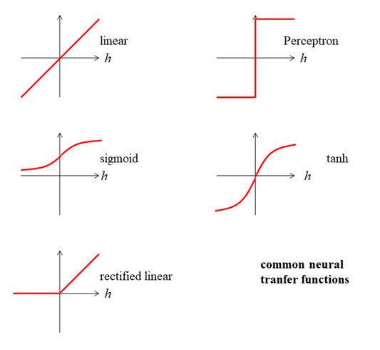
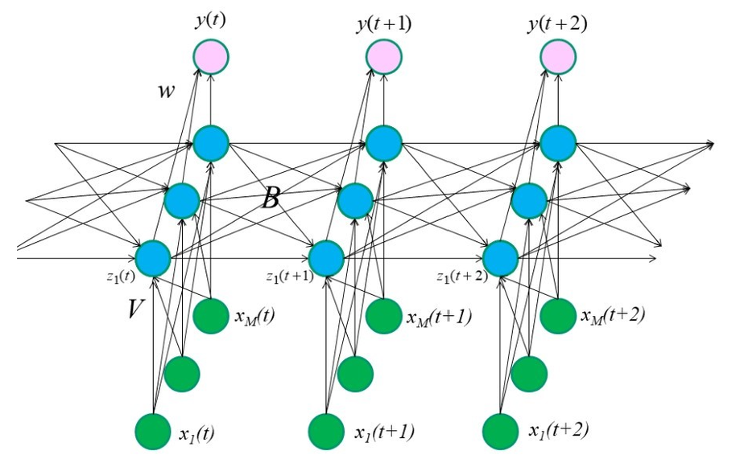
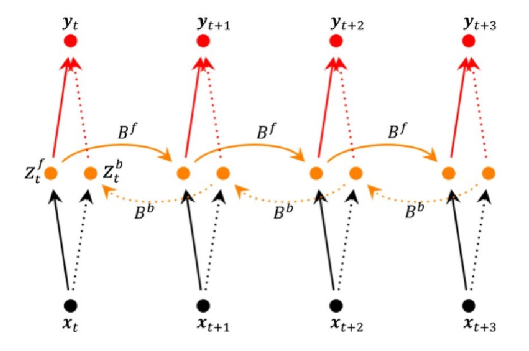
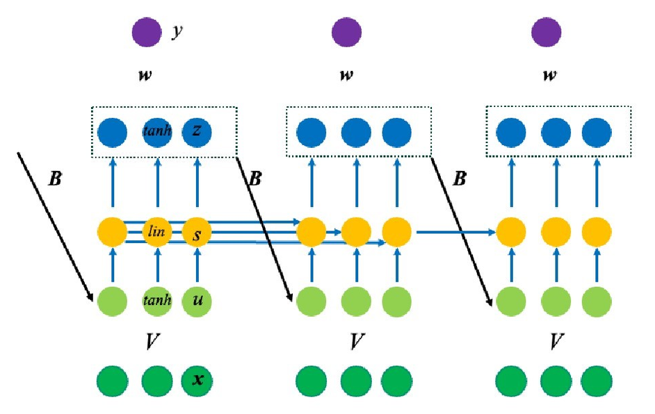
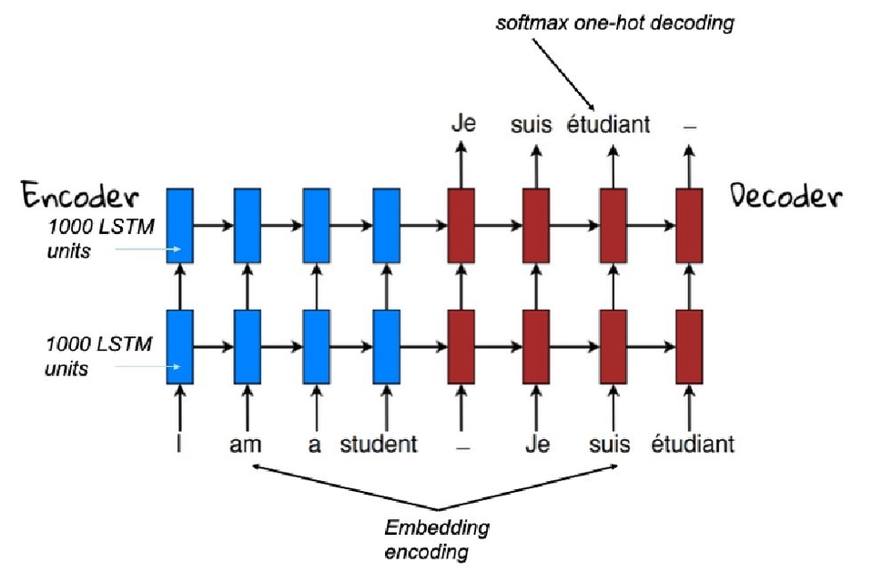

# Machine Learning II

## I. Foundations: Linear Models

### A. Linear Algebra

basics:

- scalar / dot product: $a^Tb$
- outer product: $A = ab^T$
- transpose: $(AB)^T = A^T B^T$
- inverse: $(AB)^{-1} = A^{-1} B^{-1}$
- orthogonal (orthonormal) matrix: $R^TR = RR^T = I$

derivative rules:

- $f(x) \Rightarrow \frac{df}{dx}$
- $x^n \Rightarrow n \cdot x^{n - 1}$
- $f + g \Rightarrow f' + g'$
- $f \cdot g \Rightarrow f' \cdot g + f \cdot g'$
- $f / g \Rightarrow (f' \cdot g - f \cdot g') / g^2$
- $f(g(x)) \Rightarrow \frac{df}{du} \frac{du}{dx}, u = g(x)$
- $(e^x)' = e^x$
- $(\ln x)' = \frac{1}{x}$
- $(\sin x)' = \cos x$
- $(\cos x)' = -\sin x$

### B. Linear Regression

squared-loss cost function:
$$\text{cost}(w) = \sum_{i = 1}^{N}(y_i - f_w(x_i))^2$$

**least-squares** solution:
$$w_{ls} = {(X^T X)}^{-1} X^T y$$

ML as **inverse problem**: forward $w \mapsto y = Xw$, inverse via **Moore-Penrose pseudo inverse** $X^+ = {(X^T X)}^{-1} X^T$

$X^T X$ must be invertible

with weight decay (**Penalized Least Squares** (PLS)):
$$w_{ls} = {(X^T X + \lambda I)}^{-1} X^T y$$

### C. Gradient Descent

- a **delta rule**: driven by difference
- typically $0 < \eta \ll 0.1$

#### Batch Gradient Descent

all $N$ patterns per step:
$$w_j \leftarrow w_j + \eta \sum_{i = 1}^N(y_i - f_w(x_i)) x_{ij}$$

#### ADALINE

**stochastic gradient descent** (one pattern $t$ per step):
$$w_j \leftarrow w_j + \eta (y_t - \hat{y_t}) x_{tj}$$
with $j \in [0,M]$

- helps against local optima

with **weight decay** ("the influence of a single data point should be small"):
$$w_j \leftarrow w_j + \eta \left[(y_t - \hat{y_t}) x_{tj} - \frac{\lambda}{N} w_j\right]$$

- stability of the inverse problem

### D. Perceptron

a linear classifier (the first serious learning machine, 1957)

converges in finitely many steps **if linearly separable** (no convergence for unseparable data e.g. XOR)

steps:

- **training data**: collect, clean, preprocess
- define **free model parameters** (specific model, e.g. a Perceptron)
- selecting **cost function** (e.g. misclassifications)
- **optimizing** the cost function via learning

**net input** (or **pre-activation**):
$$h(x) = \sum_{j = 0}^{M} w_j x_j$$
$x_0 = 1$, so $w_0$ is a **bias**

**activation function**:
$$\hat{y} = \text{sign}(h(x))$$
where $\hat{y} \in \{1, -1\}$ is the output or **post-activation value** and $h(x) = 0$ the classification boundary (**separating hyperplane**)

**Perceptron Cost Function**:
$$\text{cost} = -\sum_{i \in M} y_i h(x_i)$$
where $M \subseteq \{1, \cdots, N\}$ is the index set of currently misclassified patterns

**Perceptron Learning Rule** (pattern-based / stochastic gradient descent):
$$w_j \leftarrow w_j + \eta y_t x_{t,j}$$
with $j \in [0,M]$; same sign on $y_t$ (postsynaptic) and $x_{t,j}$ (presenaptic) $\rightarrow$ weight increase, different sign $\rightarrow$ weight decrease

Alternative Learning Rules:

- Optimal separating hyperplanes (Linear Support Vector Machine)
- Fisher Linear Discriminant
- Logistic Regression

**Delta-rule** (another form of update):
$$w_j \leftarrow w_j + \frac{1}{2} \eta (y_t - \hat{y_t}) x_{t,j}$$
with $j \in [0,M]$

## II. Basis Functions & Model Complexity

in general it is rather unlikely that a true function is linear, often it is also not reasonable to assume that classification boundaries are linear hyperplanes

in a **high-dimensional** space the classification might be linear

### A. Basis Functions

additional inputs are calculated as deterministic functions

a linear model can be written as a sum of basis functions

**Regularized cost function** with weights as free parameters:
$$\text{cost}^{pen}(w) = \sum_{i = 1}^{N} \left(y_i - \sum_{m = 1}^{M_\phi} w_m \phi_m (x_i)\right)^2 + \lambda \sum_{m = 1}^{M_\Phi} w_m^2$$

**Penalized least-squares** solution:
$$\hat{w}_{pen} = \left(\Phi^T \Phi + \lambda I\right)^{-1} \Phi^T y$$

challenge is finding the specific basis functions that make the classes linearly separable

too few (or unsuitable) basis functions do not model the true dependency but many basis functions require many data points to fit all the unknown parameters

**Radial Basis Functions** (RBF), typically Gaussians:
$$\phi_j(x) = \exp(-\frac{1}{2s^2} \| x - c_j \|^2)$$

in basis function space, data can be on a nonlinear manifold

**Forward Selection** (stepwise increase of model complexity)

- **greedy approach**: each time add basis function that decreases cost the most

**Backward Selection** (stepwise decrease of model complexity (**model pruning**))

- **greedy approach**: each time remove basis function whose removal increases cost the least

### B. Manifolds

nature generates data on manifolds

## III. Neural Networks & Backpropagation

neural networks work with several **sigmoid basis functions** (multiple perceptrons) but can also perform dimensionality reduction

can approximate **any continuous function** arbitrarily well and scales well with input dimensions

with at least one hidden layer: **Multilayer Perceptron** (MLP)

**Delta-rule** (output weights):
$$w_{k,h} \leftarrow w_{k,h} + \eta \delta_{i,k} z_{i,h}$$
where $w_{k,h}$ is the weight from hidden to output and $z$ are the outputs of the hidden layer

**Delta-rule** (input weights):
$$v_{h,j} \leftarrow v_{h,j} + \eta \delta_{i,h} x_{i,j}$$

huge number of free parameters might lead to **overfitting**, solutions:

- **Regularization**: adding weight decay term
  - **Cross-entropy Cost Function**
- **Stopped-Training**: at some time the test error will go up again (overfitting to training data), adaptions should be stopped at the right moment
  - optimizing learning rate $\eta$: slow convergence vs. oscillation / divergence
  - Adaptive Moment Estimation (**Adam**): adapting learning rate to progress

dealing with **local optima**

- **Restart**: start with different initial values, take best
- **Comittee**: train from different initial values, average responses or take majority vote
  - **Bagging** (Bootstrap Aggregating): comittee with each neural network trained on different bootstrap sample of the training data (comparable to Random Forest for decision trees)

## IV. Deep Learning

### A. General Techniques

includes any Multi Layer Perceptrons with many hidden layers like

- Recurrent Neural Networks (RNNs)
- Convolutional Neural Networks (CNNs)
- Deep Generative Models (VAEs, GANs)
- Foundation Models (BERT, DALLE, GPT)

and

- Deep Reinforcement Learning
- Representation Learning

does not need feature engineering or basis function design, works with the data as they are

Recipe:

1. large data set
    - the data itself describes its complex decision boundaries
    - 5k labeled examples: acceptable performance, 10 mio labeled examples: potentially already better than a human
2. neural network with many layers
    - example: 10 layers, 1000 neurons/layer
3. using GPUs (optional)
    - can speed up training as matrix multiplications are being used
4. train with **SGD**
    - often regular SGD
    - **Minibatch SGD**: more than one sample/iteration
    - **Gradient clipping**: avoids huge update steps
    - local optima may not be a problem: they may be all very good
    - Adam is here very popular
5. **ReLU** (Rectified Linear Unit) except for output layer
    - no "vanishing gradient" problem $\rightarrow$ faster learning
    - sparse gradients & sparse solution

6. Regularization with **drop-out**
    - for each training instance only 50% of hidden neurons are adapted, for prediction all are used but output weights are multiplied with $1/2$
    - like committee with shared weights
    - works better than stopped training
    - network should be large enough to overfit on data (without drop-out)
    - variants: dropping input neurons or single connections
7. Alternative Regulizations
    - **Weight Regularization**: Weight decay, or better: normalize incoming weight vector
    - **Batch-Normalization**: fast & stable training, applied on pre-activations (typically)
    - **Layer Normalization**: also typically on pre-activation
8. optionally initialize weights with **unsupervised learning**
    - first layer is initialized with encoder part of autoencoder

Tools:

- **PyTorch** (2016, now most preferred framework): automatic differentiation (Autograd), dynamic computation graphs, GPU support
- **JAX**: high-performance numerical computing library
- **CUDA** (Compute Unified Device Architecture, NVIDIA): direct access to virtual instruction set and memory of the GPU
- **W&B** (Weights & Biases): orchestrization for many experiments, many hyperparameters, distributed systems & long running jobs
- **GitHub**: collaboration platform

Milestones:

- 2012 - object recognition: huge improvement with AlexNet (CNN)
- 2012 - speech recognition: first demonstration by MS
- 2014 - face recognition: Facebooks Deep Face
- 2014 - image generation: realistic images with GANs
- 2015: ResNet
- 2015: AlphaGo
- 2016: Neural Machine Translation (NMT)
- 2017: AlphaZero
- 2020 - protein structure prediction: AlphaFold by DeepMind
- 2022: ChatGPT

With over-parametrization the global optima of the cost function are degenerate $\rightarrow$ more volume in parameter space, easier to find by SGD

This "blessing of dimensionality" leads to less required training data for same performance

### B. CNN (Convolutional Neural Network)

**Convolutional Layer** (weight sharing): filter kernels are applied to the image, padding is necessary

**Pooling Layer** (mean pooling / max pooling): summary statistics of image regions $\rightarrow$ reducing dimensionality, less overfitting

Architectures:

- **AlexNet**: 60 mio. parameters, trained on two GPUs for a week with 1 mio. images
- Deep Residual Network (**ResNet**): additive nature, direct connections between layers
- **Regional CNN**: object detection & object segmentation

Adversarial Examples: model behaviour for data away from (training data) manifold is rather unpredictable

Explainability with **Heat Maps**: getting insights on which image parts were relevant for classification

## V. Time Series & Sequential Data: NARX, RNN, LSTM

**Time Series** Modelling: future prediction based on historic data or near-term prediction

- predicting future energy consumption
- predicting stock market

**Sequential** Modelling: inputs & outputs are typically discrete

- classifying sentence sentiment
- translating a sentence

**Encodings** (for Sequential Data)

- **One-hot** Encoding

$$h_t = \sum_{t' = 1}^{T} v_{t'}, word(t - t')$$

- **Embedding** Encoding: embedding vector $a_i$ of abstract attributes that represent the word

$$h_t = \sum_{t' = 1}^{T} \~V_{t'}, a_{word(t - t')}$$

- Combination of both: matrix $A$ connects one-hot encoded input with the first hidden layer; the $i$-th column in matrix $A$ contains $a_i$

$$h_t = \sum_{t' = 1}^{T} \~V_{t'}, Ay_{t - t'}$$

### A. NARX (Nonlinear Regressive Model with external inputs)

**N**onlinear **A**uto **R**egressive Model with e**x**ternal inputs (or Time-Delay Neural Network (TDNN)): for Time Series Modelling

"convolutional" idea: applying the same neural network in all time instances

**Self-supervised Learning**: the time series provides its own labels

**Residual Modelling**: similarity to ResNet

to be able to use the complete history:

- with internal memory: RNN, LSTM
- with ability to grow: Transformer

### B. Language Models

predicting the next word out of a vocabulary based on the last $T$ words

$$P(y_t = k | y_{t - 1}, \ldots, y_{t - T}) = \text{softmax}_k\left(w_k^T \text{sig}\left(\sum_{t' = 1}^{T} \~V_{t'} Ay_{t - t'}\right)\right)$$

the embeddings can be trained self-supervised - typically on models like ELMo, BERT, Word2vec and GloVe - and be used in other applications

as embedding vectors represent a meaning, they can be concatenated or added to receive a new embedding vector with different meaning

### C. RNN (Recurrent Neural Network)

powerful method for sequence modelling, has a memory for previous inputs and can consider the whole history

it is a nonlinear state-space model as it also receives input from the previous time step (in the hidden layer)

**Backpropagation through time** (BPTT): SGD but also backward in time (typically truncated, otherwise back to $t = 1$)

#### Echo State Network

randomly initialized, only output weights are trained (simple rules for linear regression / classification)

#### Bidirectional RNN

predictions depend on past and future inputs, useful for **sequence labelling problems** as handwriting recognition, speech recognition, $\ldots$

### D. LSTM (Long Short-Term Memory)

addresses the **vanishing gradient problem** of RNNs: they have difficulties remembering important information far in the past

the LSTM uses **Gates** to turn on and off individual LSTM units, also has skip connections similar to ResNet

very successful on reading handwritten text, also used for speech recognition, robot control, time series prediction, rhythm learning, music composition, grammar learning, human action recognition, protein homology detection

**no transfer learning** possible $\rightarrow$ needs large data set for any new problem

### E. Encoder-Decoder Networks

basis for Neural Machine Translation (NMT)

**Encoder**: RNN (often LSTM) with no outpup layer

**Decoder**: initialized with encoder vectors, finding the most likely decoded sequence of words

NMT has only a small memory footprint compared to standard MT (no gigantic phrase tables)

## VI. Attention & Transformer

## VII. Advancing LLMs: Fine-tuning, LoRA, RL

## VIII. Generative Models: AE, VAE, GAN

### A. Autoencoder

### B. VAE

### C. GAN

## IX. Diffusion & Flow Matching

## X. Summary
