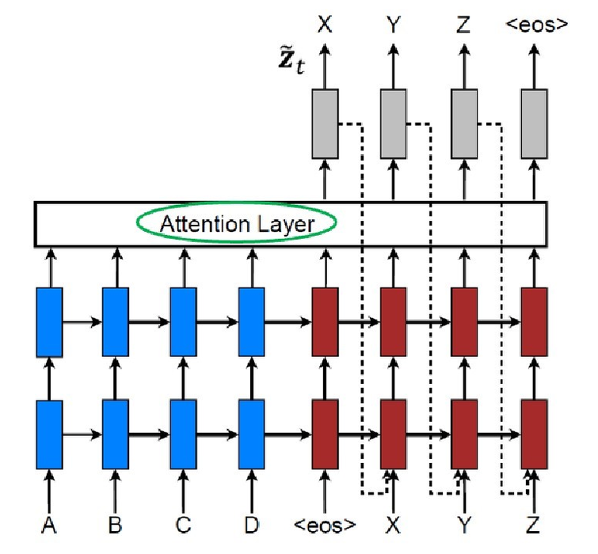
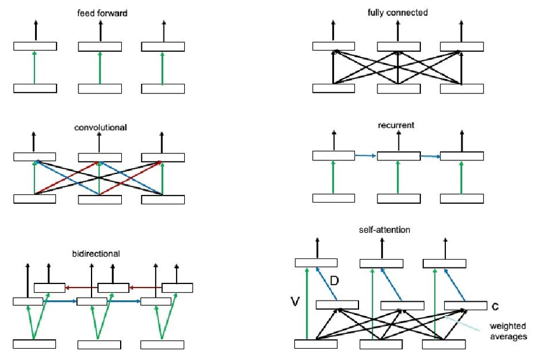
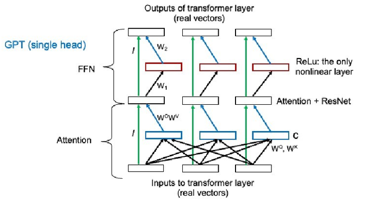
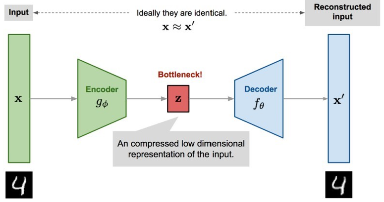
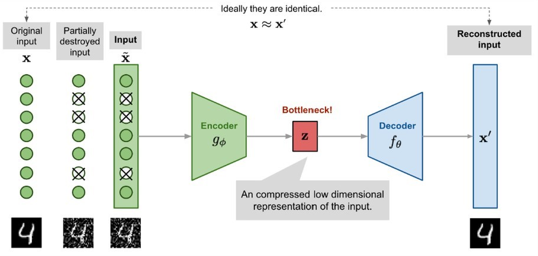
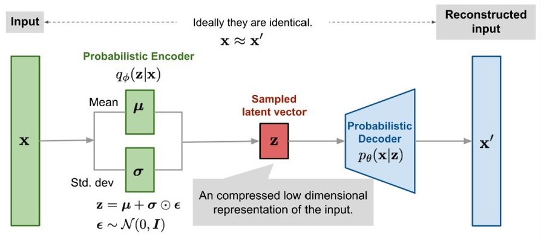

# Machine Learning II

## I. Foundations: Linear Models

### A. Linear Algebra

basics:

- scalar / dot product: $a^Tb$
- outer product: $A = ab^T$
- transpose: $(AB)^T = A^T B^T$
- inverse: $(AB)^{-1} = A^{-1} B^{-1}$
- orthogonal (orthonormal) matrix: $R^TR = RR^T = I$

derivative rules:

- $f(x) \Rightarrow \frac{df}{dx}$
- $x^n \Rightarrow n \cdot x^{n - 1}$
- $f + g \Rightarrow f' + g'$
- $f \cdot g \Rightarrow f' \cdot g + f \cdot g'$
- $f / g \Rightarrow (f' \cdot g - f \cdot g') / g^2$
- $f(g(x)) \Rightarrow \frac{df}{du} \frac{du}{dx}, u = g(x)$
- $(e^x)' = e^x$
- $(\ln x)' = \frac{1}{x}$
- $(\sin x)' = \cos x$
- $(\cos x)' = -\sin x$

### B. Linear Regression

squared-loss cost function:
$$\text{cost}(w) = \sum_{i = 1}^{N}(y_i - f_w(x_i))^2$$

**least-squares** solution:
$$w_{ls} = {(X^T X)}^{-1} X^T y$$

ML as **inverse problem**: forward $w \mapsto y = Xw$, inverse via **Moore-Penrose pseudo inverse** $X^+ = {(X^T X)}^{-1} X^T$

$X^T X$ must be invertible

with weight decay (**Penalized Least Squares** (PLS)):
$$w_{ls} = {(X^T X + \lambda I)}^{-1} X^T y$$

### C. Gradient Descent

- a **delta rule**: driven by difference
- typically $0 < \eta \ll 0.1$

#### Batch Gradient Descent

all $N$ patterns per step:
$$w_j \leftarrow w_j + \eta \sum_{i = 1}^N(y_i - f_w(x_i)) x_{ij}$$

#### ADALINE

**stochastic gradient descent** (one pattern $t$ per step):
$$w_j \leftarrow w_j + \eta (y_t - \hat{y_t}) x_{tj}$$
with $j \in [0,M]$

- helps against local optima

with **weight decay** ("the influence of a single data point should be small"):
$$w_j \leftarrow w_j + \eta \left[(y_t - \hat{y_t}) x_{tj} - \frac{\lambda}{N} w_j\right]$$

- stability of the inverse problem

### D. Perceptron

a linear classifier (the first serious learning machine, 1957)

converges in finitely many steps **if linearly separable** (no convergence for unseparable data e.g. XOR)

steps:

- **training data**: collect, clean, preprocess
- define **free model parameters** (specific model, e.g. a Perceptron)
- selecting **cost function** (e.g. misclassifications)
- **optimizing** the cost function via learning

**net input** (or **pre-activation**):
$$h(x) = \sum_{j = 0}^{M} w_j x_j$$
$x_0 = 1$, so $w_0$ is a **bias**

**activation function**:
$$\hat{y} = \text{sign}(h(x))$$
where $\hat{y} \in \{1, -1\}$ is the output or **post-activation value** and $h(x) = 0$ the classification boundary (**separating hyperplane**)

**Perceptron Cost Function**:
$$\text{cost} = -\sum_{i \in M} y_i h(x_i)$$
where $M \subseteq \{1, \cdots, N\}$ is the index set of currently misclassified patterns

**Perceptron Learning Rule** (pattern-based / stochastic gradient descent):
$$w_j \leftarrow w_j + \eta y_t x_{t,j}$$
with $j \in [0,M]$; same sign on $y_t$ (postsynaptic) and $x_{t,j}$ (presenaptic) $\rightarrow$ weight increase, different sign $\rightarrow$ weight decrease

Alternative Learning Rules:

- Optimal separating hyperplanes (Linear Support Vector Machine)
- Fisher Linear Discriminant
- Logistic Regression

**Delta-rule** (another form of update):
$$w_j \leftarrow w_j + \frac{1}{2} \eta (y_t - \hat{y_t}) x_{t,j}$$
with $j \in [0,M]$

## II. Basis Functions & Model Complexity

in general it is rather unlikely that a true function is linear, often it is also not reasonable to assume that classification boundaries are linear hyperplanes

in a **high-dimensional** space the classification might be linear

### A. Basis Functions

additional inputs are calculated as deterministic functions

a linear model can be written as a sum of basis functions

**Regularized cost function** with weights as free parameters:
$$\text{cost}^{pen}(w) = \sum_{i = 1}^{N} \left(y_i - \sum_{m = 1}^{M_\phi} w_m \phi_m (x_i)\right)^2 + \lambda \sum_{m = 1}^{M_\Phi} w_m^2$$

**Penalized least-squares** solution:
$$\hat{w}_{pen} = \left(\Phi^T \Phi + \lambda I\right)^{-1} \Phi^T y$$

challenge is finding the specific basis functions that make the classes linearly separable

too few (or unsuitable) basis functions do not model the true dependency but many basis functions require many data points to fit all the unknown parameters

**Radial Basis Functions** (RBF), typically Gaussians:
$$\phi_j(x) = \exp(-\frac{1}{2s^2} \| x - c_j \|^2)$$

in basis function space, data can be on a nonlinear manifold

**Forward Selection** (stepwise increase of model complexity)

- **greedy approach**: each time add basis function that decreases cost the most

**Backward Selection** (stepwise decrease of model complexity (**model pruning**))

- **greedy approach**: each time remove basis function whose removal increases cost the least

### B. Manifolds

nature generates data on manifolds

## III. Neural Networks & Backpropagation

neural networks work with several **sigmoid basis functions** (multiple perceptrons) but can also perform dimensionality reduction

can approximate **any continuous function** arbitrarily well and scales well with input dimensions

with at least one hidden layer: **Multilayer Perceptron** (MLP)

**Delta-rule** (output weights):
$$w_{k,h} \leftarrow w_{k,h} + \eta \delta_{i,k} z_{i,h}$$
where $w_{k,h}$ is the weight from hidden to output and $z$ are the outputs of the hidden layer

**Delta-rule** (input weights):
$$v_{h,j} \leftarrow v_{h,j} + \eta \delta_{i,h} x_{i,j}$$

huge number of free parameters might lead to **overfitting**, solutions:

- **Regularization**: adding weight decay term
  - **Cross-entropy Cost Function**
- **Stopped-Training**: at some time the test error will go up again (overfitting to training data), adaptions should be stopped at the right moment
  - optimizing learning rate $\eta$: slow convergence vs. oscillation / divergence
  - Adaptive Moment Estimation (**Adam**): adapting learning rate to progress

dealing with **local optima**

- **Restart**: start with different initial values, take best
- **Comittee**: train from different initial values, average responses or take majority vote
  - **Bagging** (Bootstrap Aggregating): comittee with each neural network trained on different bootstrap sample of the training data (comparable to Random Forest for decision trees)

## IV. Deep Learning

### A. General Techniques

includes any Multi Layer Perceptrons with many hidden layers like

- Recurrent Neural Networks (RNNs)
- Convolutional Neural Networks (CNNs)
- Deep Generative Models (VAEs, GANs)
- Foundation Models (BERT, DALLE, GPT)

and

- Deep Reinforcement Learning
- Representation Learning

does not need feature engineering or basis function design, works with the data as they are

Recipe:

1. large data set
    - the data itself describes its complex decision boundaries
    - 5k labeled examples: acceptable performance, 10 mio labeled examples: potentially already better than a human
2. neural network with many layers
    - example: 10 layers, 1000 neurons/layer
3. using GPUs (optional)
    - can speed up training as matrix multiplications are being used
4. train with **SGD**
    - often regular SGD
    - **Minibatch SGD**: more than one sample/iteration
    - **Gradient clipping**: avoids huge update steps
    - local optima may not be a problem: they may be all very good
    - Adam is here very popular
5. **ReLU** (Rectified Linear Unit) except for output layer
    - no "vanishing gradient" problem $\rightarrow$ faster learning
    - sparse gradients & sparse solution

6. Regularization with **drop-out**
    - for each training instance only 50% of hidden neurons are adapted, for prediction all are used but output weights are multiplied with $1/2$
    - like committee with shared weights
    - works better than stopped training
    - network should be large enough to overfit on data (without drop-out)
    - variants: dropping input neurons or single connections
7. Alternative Regulizations
    - **Weight Regularization**: Weight decay, or better: normalize incoming weight vector
    - **Batch-Normalization**: fast & stable training, applied on pre-activations (typically)
    - **Layer Normalization**: also typically on pre-activation
8. optionally initialize weights with **unsupervised learning**
    - first layer is initialized with encoder part of autoencoder

Tools:

- **PyTorch** (2016, now most preferred framework): automatic differentiation (Autograd), dynamic computation graphs, GPU support
- **JAX**: high-performance numerical computing library
- **CUDA** (Compute Unified Device Architecture, NVIDIA): direct access to virtual instruction set and memory of the GPU
- **W&B** (Weights & Biases): orchestrization for many experiments, many hyperparameters, distributed systems & long running jobs
- **GitHub**: collaboration platform

Milestones:

- 2012 - object recognition: huge improvement with AlexNet (CNN)
- 2012 - speech recognition: first demonstration by MS
- 2014 - face recognition: Facebooks Deep Face
- 2014 - image generation: realistic images with GANs
- 2015: ResNet
- 2015: AlphaGo
- 2016: Neural Machine Translation (NMT)
- 2017: AlphaZero
- 2020 - protein structure prediction: AlphaFold by DeepMind
- 2022: ChatGPT

With over-parametrization the global optima of the cost function are degenerate $\rightarrow$ more volume in parameter space, easier to find by SGD

This "blessing of dimensionality" leads to less required training data for same performance

### B. CNN (Convolutional Neural Network)

**Convolutional Layer** (weight sharing): filter kernels are applied to the image, padding is necessary

**Pooling Layer** (mean pooling / max pooling): summary statistics of image regions $\rightarrow$ reducing dimensionality, less overfitting

Architectures:

- **AlexNet**: 60 mio. parameters, trained on two GPUs for a week with 1 mio. images
- Deep Residual Network (**ResNet**): additive nature, direct connections between layers
- **Regional CNN**: object detection & object segmentation

Adversarial Examples: model behaviour for data away from (training data) manifold is rather unpredictable

Explainability with **Heat Maps**: getting insights on which image parts were relevant for classification

## V. Time Series & Sequential Data: NARX, RNN, LSTM

**Time Series** Modelling: future prediction based on historic data or near-term prediction

- predicting future energy consumption
- predicting stock market

**Sequential** Modelling: inputs & outputs are typically discrete

- classifying sentence sentiment
- translating a sentence

**Encodings** (for Sequential Data)

- **One-hot** Encoding

$$h_t = \sum_{t' = 1}^{T} v_{t'}, word(t - t')$$

- **Embedding** Encoding: embedding vector $a_i$ of abstract attributes that represent the word

$$h_t = \sum_{t' = 1}^{T} \tilde{V}_{t'}, a_{word(t - t')}$$

- Combination of both: matrix $A$ connects one-hot encoded input with the first hidden layer; the $i$-th column in matrix $A$ contains $a_i$

$$h_t = \sum_{t' = 1}^{T} \tilde{V}_{t'}, Ay_{t - t'}$$

### A. NARX (Nonlinear Regressive Model with external inputs)

**N**onlinear **A**uto **R**egressive Model with e**x**ternal inputs (or Time-Delay Neural Network (TDNN)): for Time Series Modelling

"convolutional" idea: applying the same neural network in all time instances

**Self-supervised Learning**: the time series provides its own labels

**Residual Modelling**: similarity to ResNet

to be able to use the complete history:

- with internal memory: RNN, LSTM
- with ability to grow: Transformer

### B. Language Models

predicting the next word out of a vocabulary based on the last $T$ words

$$P(y_t = k | y_{t - 1}, \ldots, y_{t - T}) = \text{softmax}_k\left(w_k^T \text{sig}\left(\sum_{t' = 1}^{T} \~V_{t'} Ay_{t - t'}\right)\right)$$

the embeddings can be trained self-supervised - typically on models like ELMo, BERT, Word2vec and GloVe - and be used in other applications

as embedding vectors represent a meaning, they can be concatenated or added to receive a new embedding vector with different meaning

### C. RNN (Recurrent Neural Network)

powerful method for sequence modelling, has a memory for previous inputs and can consider the whole history

it is a nonlinear state-space model as it also receives input from the previous time step (in the hidden layer)

**Backpropagation through time** (BPTT): SGD but also backward in time (typically truncated, otherwise back to $t = 1$)

#### Echo State Network

randomly initialized, only output weights are trained (simple rules for linear regression / classification)

#### Bidirectional RNN

predictions depend on past and future inputs, useful for **sequence labelling problems** as handwriting recognition, speech recognition, $\ldots$

### D. LSTM (Long Short-Term Memory)

addresses the **vanishing gradient problem** of RNNs: they have difficulties remembering important information far in the past

the LSTM uses **Gates** to turn on and off individual LSTM units, also has skip connections similar to ResNet

very successful on reading handwritten text, also used for speech recognition, robot control, time series prediction, rhythm learning, music composition, grammar learning, human action recognition, protein homology detection

**no transfer learning** possible $\rightarrow$ needs large data set for any new problem

### E. Encoder-Decoder Networks

basis for Neural Machine Translation (NMT)

**Encoder**: RNN (often LSTM) with no outpup layer

**Decoder**: initialized with encoder vectors, finding the most likely decoded sequence of words

NMT has only a small memory footprint compared to standard MT (no gigantic phrase tables)

## VI. Attention & Transformer

Using **attention**, models can learn alignments between different modalities, e.g. image objects & agent actions (dynamic control), speech frames & text (speech recognition), image features & image description (image caption genertion)

### A. Attention

attention-based NMT models are superior, it is the basis for state of the art machine translation and context sensitive embedding models

additional layer on encoder-decoder network, provides information about the top embeddings to the decoder (without overfitting)

**Self-Attention**: can be applied to any layer & provides memoryless modelling of far-range dependencies, can replace convolutional or recurrent layers, enables highly parallel training on massive datasets & unprecedented model scaling

- **Feed forward**: all embeddings are independent
- **Fully connected**: all embeddings are considered, huge number of parameters $\rightarrow$ not used in practice
- **Convolutional layer**: very powerful & successful in NLP, needs zero padding at sentence boundaries
- **Recurrent neural networks**: very powerful & successful in NLP, usually LSTM units
- **Bidirectional recurrent neural network**

### B. Transformer

A transformer consists of many time steps and many layers (ResNet layers)

Attention is added on pre-activation like:
$$x_t \leftarrow \text{LayerNorm}(x_t + \text{AttentOut}(x_t))$$

### C. GPT: Decoder Only

Generative Pre-trained Transformer (**GPT**): a large language model (LLM)

A decoder that is initialized with the prompt

**Tokenization**: most words encoded as single token, rare words may be a sequence of a few tokens

Attention is masked to previous tokens only

Softmax is applied: sampling from tokens with maximum activity

Two directions of reasoning: left to right (RNN) and also bottom to top (all ResNet layers)

Early layers: lexical & local syntax, Middle layers: factual retrieval & abstraction, Late layers: task execution & response generation

GPT-style models demonstrated that a single model can generalize across a wide range of tasks with little or no task-specific training

#### Prompt Engineering

Refining & designing inputs to an AI model so it produces more accurate, useful and reliable outputs

Useful Context:

- **Role Assignment**: who should answer?
- **Constraints**: what is allowed?
- **Examples**: what is a good answer?
- **Structure**: how is a good answer?

#### Hallucination

An inherent property of current LLMs but the severity can be greatly reduced e.g. with external memory (RAG)

### D. BERT: Encoder Only

Bidirectional Encoder Representations from Transformers (**BERT**) by Google: using attention & transformer to learn word contextual relations using a masked language model (**MLM**)

mainly used to calculate **context sensitive embeddings**, encoder-only as it is not a generative model

some tokens of the input sentence are removed (masked) and the model is trained to predict the corresponding tokens at the output layer

### E. Key-value Caching

performance optimization for transformer-based models like GPT to make text generation much faster

tokens are processed one by one, for each attention is calculated for all previous tokens. KV caching removes the necessarity to recompute every time

cache can be larger than the model itself $\rightarrow$ cache management is very important for modern AI applications

## VII. Advancing LLMs: Fine-tuning, LoRA, RL

### A. Model Preparation

**Fine-tuning**: Domain Adaption (e.g. Medical)

- starting from pretrained LLM, train with domain-specific data
- with "aggressive adaption" the original context could be forgotten
- **Instruction Fine Tuning** (IFT): training with instruction-response pairs, can improve usability as an assistant, often unlocks existing capabilities
- **Supervides Fine Tuning** (SFT): training with instruction-response pairs, base for IFT

**LoRA** (Low-Rank Adaption):

- **Parameter-Efficient Fine-Tuning** (PEFT) method
- base model is freezed & only tiny fraction of adapter weights are trained $\rightarrow$ fast & cheap customization, can be easily undone
- only a correction is learned:

$$W' = W + BA$$

- best performance if applied to all projection matrices in all layers
- can also be used at query time: selecting one (user) or having multiple simultaneously

**Knowledge Distillation**: enhancing performance of smaller models by transferring knowledge from larger models

**Alignment**: making an LLM behave consistent with human intentions, preferences, values & safety requirements

usually multiple alignment approaches are combined: preference optimization, safety tuning, **constitutional AI** (revising its own outputs based on explicit principles), **red teaming** (stress-testing by intentionally trying to make it fail or misbehave)

**RLHF** (Reinforcement Learning from Human Feedback)

- important alignment method, using human preference judgements to improve model behaviour
- SFT followed by Reinforcement Learning
- multiple model responses are compared, rewards from human annotators
- used algorithms:
  - **PPO** (Proximal Policy Optimization)
    - classical actor-critic algorithm
    - used less today: computationally expensive, can be unstable
  - **DPO** (Direct Preference Optimization)
    - extremely effective algorithm
    - no absolute reward, only preferences (no reinforcement learning)
  - **GRPO** (Group Relative Policy Optimization)
    - RL with rewards but no critic
    - multiple answers are judged relative to each other
    - avoids the cost & instability of training a critic
  - REINFORCE
    - used by PPO & GRPO
    - similar to supervised learning
    - training data are generated by current policy: **on-policy**

**RLAIF** (Reinforcement Learning from AI Feedback)

### B. Mixture of Experts (MoE)

A FFN is replaced by several FFNs and a **gating network** (determines which experts are being active)

can lead to a large number of total parameters to train but in prediction leads to a better performance

### C. LLM Systems

#### Scaffolding

orchestration layer, manages the LLMs interaction with memory, tools and other components

- building prompts
- maintaining state & memory
- calling tools
- planning
- multi-step workflows
- verifying outputs
- coordinating multiple LLM calls

#### Tags

tokens or structured markers that carry metadata or control information

- for the LLM: how to interpret a text (role)
- for the scaffolding: how to process a text (where to display)
- usually automatically inserted by scaffolding
- for tool calls: generated by LLM, what tool, which parameters (the LLM itself cannot call tools)
- they have a semantic meaning

### D. Long-context & Memory-augmented Models

overcoming standard token limits and giving access to external or historical data

**Sparse Attention**: Longformer (Long Document Transformer)

- processing very long sentences efficiently
- sparse attention (nearby tokens, sliding window, $\ldots$) instead of self-attention

**Retrieval Augmented Generation** (**RAG**):

- augments LLM with external memory, relevant documents are retrieved in inference time
- (external) form of **test-time compute** (TTC)
- each document & the query obtains an **embedding vector**
- the documents with the smallest distance between document embedding & query embedding are found (cosine distance), their content is added to the prompt
- OpenAI has a suitable embedding API

**GraphRAG**:

- knowledge is a graph, not text junks
- natural language questions have to be translated into formal graph queries

**MemGPT**: manages memory like an OS

**Memory-R1**: one step further than MemGPT (more distinct memory types)

### E. Reasoning & Advanced Problem Solving

for complex logic, mathematics and step-by-step problem solving

**Large Reasoning Model** (LRM): often using explicit reasoning signals during training

- long-horizon reasoning, verification-aware outputs
- example: DeepSeek-R1 creates detailed reasoning chains

**Chain-of-Thought (CoT) Reasoning**:

- CoT prompting: LLM is encouraged to break down complex problem into intermediate steps, CoT is an output format, not a cognitive process
- more tokens are generated & processed $\rightarrow$ incraesing test-time compute (TTC)

**RL for Reasoning**:

- Reinforcement Learning with Verifiable rewards (**RLVR**) with GRPO
- can have:
  - Outcome Reward Model (**ORM**): evaluates final answer
  - Process Reward Model (**PRM**): evaluates each reasoning step

**Reasoning Distillation**: imitating reasoning behaviour of a stronger teacher model

**Test-Time Compute** (TTC):

- LLMs cannot improve further with more text
- improving output quality by extra compute power during inference (thinking / planning)

**Test-Time Reasoning** (TTR):

- specific TTC: only reasoning
- CoT, ToT (Tree-of-Thoughts)

**Test-Time Training** (TTT):

- closely related to online learning
- parameters can be updated during deployment from new data, feedback or interactions

**Test-Time-Adaption** (TTA):

- specific TTT: adaption to distribution shifts (e.g. new domain, lighting conditions, environment, $\ldots$)
- using self-supervised or unsupervised objectives

**ATLaS** (Agent Tuning via Learning Critical Steps): focusing only on most important parts of expert behaviour

### F. Agentics & Execution

**Agentic AI**: AI that can autonomously pursue goals by reasoning, planning, taking actions, using tools, interacting with environment & maintaining memory over multiple steps

in contrast to a classical LLM it is proactive and goal-driven

core components:

- **Goals**: explicit objectives defined by the user or the system (fix bug, analyze dataset, book flight)
- **Observation & Feedback**: examine results (succeeded, needs adjustment, failed)
- **Reasoning**: think about intermediate states, alternative solutions (CoT, ToT, self-consistency, verification, search, reflection)
- **Planning**: define sub-tasks & execution order
- **Actions / Tool Use**: interacting with environment (APIs, code execution, browser, database, theorem prover, other models)
  - **Model Context Protocol** (MCP): connecting LLMs to external systems, analogue to USB for hardware
- **Structured Outputs** (JSON): statistically easy to learn, enforced by modern systems, common API output
- **Memory**: RAG, MemGPT, Memory-R1
- **Reflection & Verification**: iterative refinement: generate $\rightarrow$ critique $\rightarrow$ revise $\rightarrow$ verify
- typical architecture: goal $\rightarrow$ planner $\rightarrow$ reasoner $\rightarrow$ tool executor $\rightarrow$ observation $\rightarrow$ memory $\rightarrow$ reflection $\rightarrow$ replanning

**ReAct**: paper by Google that proposed interleaving reasoning & environment interaction

- Thought (Reasoning): CoT
- Action (Acting): tool
- Observation (Feedback)
- Repeat

### G. Multi-Agentic AI

Agents differ by:

1. **Prompting** (most common): different roles (Planner, Researcher, Critic, Programmer)
2. **Tools**: web search, coding sandbox, theorem prover, $\ldots$
3. **Memories**: graph, documents, code repository, evaluation history
4. **Models**: may be specialized on a task

## VIII. Generative Models: AE, VAE, GAN

### A. Generating Images

From a class label (e.g. "dog") to many outputs (pixels)

The average image of a dog is pretty blurry & useless, there are many potential images of a dog (manifold of images)

Features are like basis functions but supplied by nature or an application expert (**feature engineering**)

approximate inverse of feature map:
$$h = g^{enc}(x)$$

$h$ is called **latent vector** in a latent space as it cannot be measured directly

### B. Autoencoder

encoder & generator / decoder are concatenated:
$$\hat{x} = g^{gen}(g^{enc}(x))$$

cost function of neural network autoencoder:
$$cost(W, V) = \sum_{i = 1}^{N} \sum_{j = 1}^{M} (x_{i,j} - \hat{x}_{i,j})^2$$

if $h$ was gaussian distributed, we would have a perfect generator: a random $h$ would return a valid image; this is not the case $\rightarrow$ VAE will be better

**Denoising Autoencoder** (DAE): random noise added to input, prevents autoencoder from learning an identity function

Requirements on a good generator:

1. No manifold in $h$-space (any random $h$ gives a valid image)
2. Smoothness: close vectors should produce similar images
3. Disentanglement: $h$ has semantic, dimensions may have a meaning
4. Conditional models: the generated image has real features (smiling face, beard, glasses, $\ldots$)

### C. VAE (Variational Autoencoder)

The VAE is not perfect, an **evaluator** can help & select the best out of a set of generated images

### D. GAN

A **generator** generates images from a latent random variable

A **discriminator** separates training data & generated data

Both are trained jointly until the discriminator cannot separate training data from generated data anymore

Cross-entropy cost function (minimized by discriminator, maximized by generator):
$$\text{cost}(w,v) = -\sum_{i:x_i \in \text{train}} \log g^{dis}(x_i, w) - \sum_{i':x_i \in \text{gen}} \log [1 - g^{dis}(g^{gen}(h_{i'}, v), w)]$$

**Minimax** solution of a two-player zero-sum game

**DCGAN** (Deep Convolutional GAN):

- with convolutional layers and transposed convolutional layers ("deconvolution", also a convolution, no inverse)

**cGAN** (Conditional GAN):

- class / attribute label as additional input to both generator & discriminator
- text-to-image ("reverse captioning"), image editing, image-to-image

**CycleGAN**:

- example task: turn horses into zebras
- two discriminators, trained with the adversarial loss

## IX. Diffusion & Flow Matching

### A. Probability & Sampling

### B. DDPM

### C. Flow Matching

## X. Multi Modality

## XI. Summary
