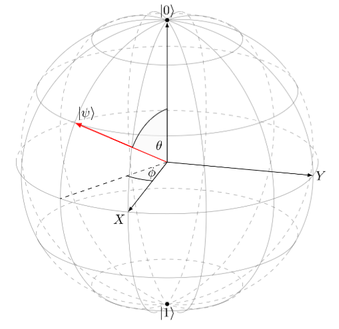
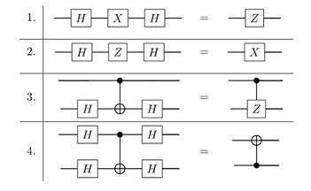
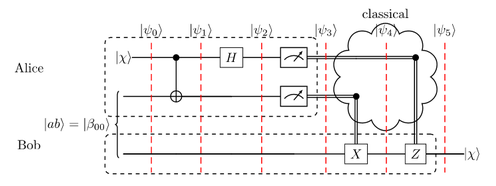
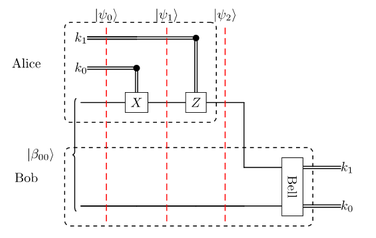
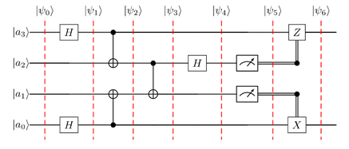
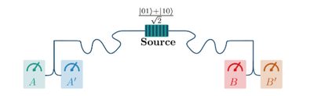

# Introduction to Quantum Computing

## I. Overview

- can speed up some classical computations (e.g. prime factorization)
- can be used for bug proof communication & true randomness
- hardware realizations
  - superconducting
  - ion traps
  - linear optics
  - neutral atoms
- classical 0 or 1 $\rightarrow \alpha \cdot \ket{0} + \beta \cdot \ket{1}$
- $\alpha$ & $\beta$ are **amplitudes**: complex numbers
- quantum states can be in **superposition** of values $\rightarrow$ probabilistic distribution
- quantum states form a complex vector space: **Hilbert space**
- row vector: **Bra** $\bra{\psi}$
- column vector: **Ket** $\ket{\psi}$
- state can be written as linear combination of basisi vectors:

$$\alpha \cdot \begin{pmatrix}1 \\ 0\end{pmatrix} + \beta \cdot \begin{pmatrix}0 \\ 1\end{pmatrix}$$

- **probabilities** to measure are the squared absolute amplitudes and sum up to 1, so: $|\alpha|^2 + |\beta|^2 = 1$
- qubit can be represented as **bloch sphere** with two angles $\theta$ & $\phi$:

$$\ket{\psi} = \cos \left(\frac{\theta}{2}\right) \ket{0} + \sin \left(\frac{\theta}{2}\right) e^{i \phi} \ket{1}$$

## II. 1- and 2-Qubit Systems

### A. Quantum Gates

**Pauli Gates**:
$$I,~X = \begin{pmatrix}0 & 1 \\ 1 & 0\end{pmatrix},~Y = \begin{pmatrix}0 & -i \\ i & 0\end{pmatrix},~Z = \begin{pmatrix}1 & 0 \\ 0 & -1\end{pmatrix}$$

- $X \ket{0} = \ket{1},~X \ket{1} = \ket{0}$
- $Y \ket{0} = i\ket{1},~Y \ket{1} = -i\ket{0}$
- $Z \ket{0} = \ket{0},~Z \ket{1} = -\ket{1}$
- they are inverse: $XX = I,~YY = I,~ZZ = I$

**Hadamard Gate**:
$$H = \frac{1}{\sqrt{2}} \begin{pmatrix}1 & 1 \\ 1 & -1\end{pmatrix}$$

- creates an equal **superposition**
- $H \ket{0} = \frac{1}{\sqrt{2}}(\ket{0} + \ket{1}) = \ket{+}$
- $H \ket{1} = \frac{1}{\sqrt{2}}(\ket{0} - \ket{1}) = \ket{-}$

**Rotation Gates**:
$$R_P(\theta) = e^{i \frac{\theta}{2} P} = \cos\left(\frac{\theta}{2}\right) I - \sin\left(\frac{\theta}{2}\right) P$$

- with $P$ as Pauli $X$/$Y$/$Z$: $R_X,~R_Y,~R_Z$

**Unitary Gates**:
$$U = \begin{pmatrix}a & b \\ c & d\end{pmatrix}$$

- $U$ must be a **unitary** matrix

**CNOT Gate**:
$$CNOT = \begin{pmatrix}1 & 0 & 0 & 0 \\ 0 & 1 & 0 & 0 \\ 0 & 0 & 0 & 1 \\ 0 & 0 & 1 & 0\end{pmatrix}$$

- $CNOT \ket{00} = \ket{00},~CNOT \ket{01} = \ket{01}$
- $CNOT \ket{10} = \ket{11},~CNOT \ket{11} = \ket{10}$

**Toffoli Gate**: multi-controlled X-Gate

**Swap Gate**: needed for multi qubit operations as hardware is not fully connected
$$SWAP = \begin{pmatrix}1 & 0 & 0 & 0 \\ 0 & 0 & 1 & 0 \\ 0 & 1 & 0 & 0 \\ 0 & 0 & 0 & 1\end{pmatrix}$$

**Algorithms**: multiplication in inverse order, e.g. applying gates $A$, $B$ & $C$ to $\ket{\psi}$ leads to $C \cdot B \cdot A \cdot \ket{\psi}$; for matrix multiplications, order is relevant

### B. Quantum Phenomena

The 3 prominent quantum phenomenas are **superposition**, **interference** and **entanglement** (Sec. III)

#### Superposition

- when $\alpha \neq 0$ and $\beta \neq 0$ but still a valid qubit state
- can be achieved with a Hadamard gate

#### Interference

- describes wave property of qubits: amplitudes can **add up** or **cancel** each other **out**
- $HH \ket{0} = \ket{0}$: the second application of the Hadamard gate deterministically yields $\ket{0}$ even though $\ket{0}$ and $\ket{1}$ were equally likely in the previous state
- **Hadamard sandwiches**:
  - $HXH = Z$
  - $HZH = X$
  - CNOT can become CZ
  - CNOT can switch control qubit (Hadamard on both)

### C. Measuring Qubits

a classical bit is read from a qubit (irreversible) and $\ket{0}$ or $\ket{1}$ are obtained with certain probabilities depending on state

the qubit **collapses** into the measured state

if one qubit of a register is measured, the amplitudes are retained proportionally but normalized so they add up to 1 again

usually in  **computational basis** $\{\ket{0}, \ket{1}\}$ (the z-axis): $\alpha \ket{0} + \beta \ket{1}$

#### Measuring in other bases

x-axis
$$\ket{+} = \frac{1}{\sqrt{2}}(\ket{0} + \ket{1}),~\ket{-} = \frac{1}{\sqrt{2}}(\ket{0} - \ket{1})$$
$$\hat{\alpha} \ket{+} + \hat{\beta} \ket{-}$$
$$\hat{\alpha} = \frac{1}{\sqrt{2}}(\alpha + \beta),~\hat{\beta} = \frac{1}{\sqrt{2}}(\alpha - \beta)$$

y-axis
$$\ket{i} = \frac{1}{\sqrt{2}}(\ket{0} + i\ket{1}),~\ket{-i} = \frac{1}{\sqrt{2}}(\ket{0} - i\ket{1})$$
$$\tilde{\alpha} \ket{i} + \tilde{\beta} \ket{-i}$$
$$\tilde{\alpha} = \frac{1}{\sqrt{2}}(\alpha - i\beta),~\tilde{\beta} = \frac{1}{\sqrt{2}}(\alpha + i\beta)$$

on measurement the superposition w.r.t. the measurement basis is destroyed and one of the two corresponding basis states is assumed

#### Bell Measurement

the bell states (Sec. III) form an orthonormal basis of the two-qubit system (**Bell basis**)

**Bell measurement** is the inverse of the Bell state preparation: CNOT followed by Hadamard

- $\ket{\beta_{00}} \Rightarrow \ket{00}$
- $\ket{\beta_{01}} \Rightarrow \ket{01}$
- $\ket{\beta_{10}} \Rightarrow \ket{10}$
- $\ket{\beta_{11}} \Rightarrow \ket{11}$

#### Observables

probability of measuring eigenvalue $m$ for state $\ket{\psi}$:
$$p(m) = \bra{\psi} P_m \ket{\psi}$$

probability to measure $\ket{0}$ while being in state $\ket{+}$:
$$\bra{+} (\ket{0} \bra{0}) \ket{+} = \frac{1}{\sqrt{2}} \begin{pmatrix}1 & 1\end{pmatrix} \begin{pmatrix}1 & 0 \\ 0 & 0\end{pmatrix} \frac{1}{\sqrt{2}} \begin{pmatrix}1 \\ 1\end{pmatrix} = \frac{1}{2}$$

### D. Density Matrix

can represent **mixed states** (probability distributions)

example: with 40% in $\ket{0}$ and 60% in $\ket{1}$:
$$p = \frac{2}{5} \ket{0} \bra{0} + \frac{3}{5} \ket{1} \bra{1} = \begin{pmatrix}\frac{2}{5} & 0 \\ 0 & \frac{3}{5}\end{pmatrix}$$

mixed states are just uncertainty, not a superposition

pure state with same distribution:
$$p = 1 \cdot \left(\sqrt{\frac{2}{5}} \ket{0} + \sqrt{\frac{3}{5}} \ket{1}\right) \left(\sqrt{\frac{2}{5}} \ket{0} + \sqrt{\frac{3}{5}} \ket{1}\right) = \begin{pmatrix}\frac{2}{5} & \frac{\sqrt{6}}{5} \\ \frac{\sqrt{6}}{5} & \frac{3}{5}\end{pmatrix}$$

**expected value** $E$ of the measurement w.r.t. an observable $O$ for density matrix $p$:
$$E = tr(Op)$$

the **trace** $tr$ of a matrix is defined as the sum of elements on its main diagonal

### E. No Cloning Theorem

there is no permitted operation that allows copying of arbitrary states

from $(\alpha \ket{0} + \beta \ket{1}) \ket{0}$ we want to create $(\alpha \ket{0} + \beta \ket{1}) (\alpha \ket{0} + \beta \ket{1}) = \alpha^2 \ket{00} + \alpha \beta \ket{01} + \alpha \beta \ket{10} + \beta^2 \ket{11}$; with CNOT we can achieve $\alpha \ket{00} + \beta \ket{11}$ but this only matches the desired state for $\alpha = 0 \lor \beta = 0$

## III. Applying Entanglement

when the resulting state cannot be written as tensor product of qubits

example: Hadamard on first qubit, then CNOT with first qubit as control, leads to **Bell state**
$$CNOT \otimes (H \otimes I \otimes \ket{00}) = \frac{1}{\sqrt{2}}(\ket{00} + \ket{11}) = \ket{\beta_{00}}$$

$$\ket{01} \Rightarrow \ket{\beta_{01}} = \frac{1}{\sqrt{2}}(\ket{01} + \ket{10})$$

$$\ket{10} \Rightarrow \ket{\beta_{10}} = \frac{1}{\sqrt{2}}(\ket{00} - \ket{11})$$

$$\ket{11} \Rightarrow \ket{\beta_{11}} = \frac{1}{\sqrt{2}}(\ket{01} - \ket{10})$$

measurement of the two qubits will be correlated

### A. Teleportation

two qubits are entangled in state $\ket{\beta_{00}}$ by Bob, one of them is sent to Alice and entangled with the target qubit. Depending on the measurement results, Bob applies gates to his qubit and receives the same state as the target qubit

the no cloning theorem is not violated, as Alice's qubits lose their states as a result of the measurement

### B. Superdense Coding

form of compression: allows transfer of two classical bits with just one qubit

two qubits are entangled in state $\ket{\beta_{00}}$, Alice and Bob each have one; Alice encodes the information in her qubit by conditionally applying X and Z gate and then transmits it to Bob; Bob does a Bell measurement and receives the two classical bits

### C. Entanglement Swapping

entangling two qubits (not directly connected) with the help of another qubit pair. The forwarding of the entangled state is called **quantum repeater**

example circuit:

### D. Bell's Inequality & No-Communication Theorem

when an entangled qubit is measured, the state of the other one immediately collapses into the corresponding state. At first glance this looks like information can propagate faster than the speed of light during the measurement or hidden local variables would predetermine measurement outcomes during entanglement

to prove the correctness of quantum mechanics, John Bell proposed an experiment in 1964

two qubits are entangled (e.g. $\ket{\beta_{00}}$), then separated and measured in different bases; certain values will be measured more frequently than would be possible in a classical model

#### CHSH Inequality

there are four measurement bases: A, A', B, B', each obtains an eigenvalue $+1/-1$

$$A(B + B') + A'(B - B') = \pm 2$$

$$S = |E(AB) + E(AB') + E(A'B) + E(A'B')| \leq 2$$

the CHSH inequality is violated with certain states; it disproved Einstein's theory of hidden local variables

#### No Communication Theorem

despite of the entanglement of qubits, no information transmission faster than light is possible

## IV. Quantum Key Distribution (QKD)

### BB84 Protocol

### E91 Protocol

## V. Quantum Complexity

### A. Classical Complexity

### B. Quantum Complexity

## VI. Quantum Algorithms

### A. Deutsch Algorithm

### B. Hadamard on Quantum Register

### C. Deutsch-Josza Algorithm

## VII. Grover's Algotithm

## VIII. Variational Quantum Algorithms (VQAs)

## IX. Quantum Fourier Transform (QFT)

## X. Shor's Algorithm

## XI. Error Correction & Fault Tolerance
