# Introduction to Quantum Computing

## I. Overview

- can speed up some classical computations (e.g. prime factorization)
- can be used for bug proof communication & true randomness
- hardware realizations
  - superconducting
  - ion traps
  - linear optics
  - neutral atoms
- classical 0 or 1 $\rightarrow \alpha \cdot \ket{0} + \beta \cdot \ket{1}$
- $\alpha$ & $\beta$ are **amplitudes**: complex numbers
- quantum states can be in **superposition** of values $\rightarrow$ probabilistic distribution
- quantum states form a complex vector space: **Hilbert space**
- row vector: **Bra** $\bra{\psi}$
- column vector: **Ket** $\ket{\psi}$
- state can be written as linear combination of basisi vectors:

$$\alpha \cdot \begin{pmatrix}1 \\ 0\end{pmatrix} + \beta \cdot \begin{pmatrix}0 \\ 1\end{pmatrix}$$

- **probabilities** to measure are the squared absolute amplitudes and sum up to 1, so: $|\alpha|^2 + |\beta|^2 = 1$
- qubit can be represented as **bloch sphere** with two angles $\theta$ & $\phi$:

$$\ket{\psi} = \cos \left(\frac{\theta}{2}\right) \ket{0} + \sin \left(\frac{\theta}{2}\right) e^{i \phi} \ket{1}$$

## II. 1- and 2-Qubit Systems

### A. Quantum Gates

**Pauli Gates**:
$$I,~X = \begin{pmatrix}0 & 1 \\ 1 & 0\end{pmatrix},$$
$$Y = \begin{pmatrix}0 & -i \\ i & 0\end{pmatrix},~Z = \begin{pmatrix}1 & 0 \\ 0 & -1\end{pmatrix}$$

- $X \ket{0} = \ket{1},~X \ket{1} = \ket{0}$
- $Y \ket{0} = i\ket{1},~Y \ket{1} = -i\ket{0}$
- $Z \ket{0} = \ket{0},~Z \ket{1} = -\ket{1}$
- they are inverse: $XX = I,~YY = I,~ZZ = I$

**Hadamard Gate**:
$$H = \frac{1}{\sqrt{2}} \begin{pmatrix}1 & 1 \\ 1 & -1\end{pmatrix}$$

- creates an equal **superposition**
- $H \ket{0} = \frac{1}{\sqrt{2}}(\ket{0} + \ket{1}) = \ket{+}$
- $H \ket{1} = \frac{1}{\sqrt{2}}(\ket{0} - \ket{1}) = \ket{-}$

**Rotation Gates**:
$$R_P(\theta) = e^{i \frac{\theta}{2} P} = \cos\left(\frac{\theta}{2}\right) I - \sin\left(\frac{\theta}{2}\right) P$$

- with $P$ as Pauli $X$/$Y$/$Z$: $R_X,~R_Y,~R_Z$

**Unitary Gates**:
$$U = \begin{pmatrix}a & b \\ c & d\end{pmatrix}$$

- $U$ must be a **unitary** matrix

**CNOT Gate**:
$$CNOT = \begin{pmatrix}1 & 0 & 0 & 0 \\ 0 & 1 & 0 & 0 \\ 0 & 0 & 0 & 1 \\ 0 & 0 & 1 & 0\end{pmatrix}$$

- $CNOT \ket{00} = \ket{00},~CNOT \ket{01} = \ket{01}$
- $CNOT \ket{10} = \ket{11},~CNOT \ket{11} = \ket{10}$

**Toffoli Gate**: multi-controlled X-Gate

**Swap Gate**: needed for multi qubit operations as hardware is not fully connected
$$SWAP = \begin{pmatrix}1 & 0 & 0 & 0 \\ 0 & 0 & 1 & 0 \\ 0 & 1 & 0 & 0 \\ 0 & 0 & 0 & 1\end{pmatrix}$$

**Algorithms**: multiplication in inverse order, e.g. applying gates $A$, $B$ & $C$ to $\ket{\psi}$ leads to $C \cdot B \cdot A \cdot \ket{\psi}$; for matrix multiplications, order is relevant

### B. Quantum Phenomena

The 3 prominent quantum phenomenas are **superposition**, **interference** and **entanglement** (Sec. III)

#### Superposition

- when $\alpha \neq 0$ and $\beta \neq 0$ but still a valid qubit state
- can be achieved with a Hadamard gate

#### Interference

- describes wave property of qubits: amplitudes can **add up** or **cancel** each other **out**
- $HH \ket{0} = \ket{0}$: the second application of the Hadamard gate deterministically yields $\ket{0}$ even though $\ket{0}$ and $\ket{1}$ were equally likely in the previous state
- **Hadamard sandwiches**:
  - $HXH = Z$
  - $HZH = X$
  - CNOT can become CZ
  - CNOT can switch control qubit (Hadamard on both)

### C. Measuring Qubits

a classical bit is read from a qubit (irreversible) and $\ket{0}$ or $\ket{1}$ are obtained with certain probabilities depending on state

the qubit **collapses** into the measured state

if one qubit of a register is measured, the amplitudes are retained proportionally but normalized so they add up to 1 again

usually in  **computational basis** $\{\ket{0}, \ket{1}\}$ (the z-axis): $\alpha \ket{0} + \beta \ket{1}$

#### Measuring in other bases

x-axis
$$\ket{+} = \frac{1}{\sqrt{2}}(\ket{0} + \ket{1}),$$
$$\ket{-} = \frac{1}{\sqrt{2}}(\ket{0} - \ket{1})$$
$$\hat{\alpha} \ket{+} + \hat{\beta} \ket{-}$$
$$\hat{\alpha} = \frac{1}{\sqrt{2}}(\alpha + \beta),~\hat{\beta} = \frac{1}{\sqrt{2}}(\alpha - \beta)$$

y-axis
$$\ket{i} = \frac{1}{\sqrt{2}}(\ket{0} + i\ket{1}),$$
$$\ket{-i} = \frac{1}{\sqrt{2}}(\ket{0} - i\ket{1})$$
$$\tilde{\alpha} \ket{i} + \tilde{\beta} \ket{-i}$$
$$\tilde{\alpha} = \frac{1}{\sqrt{2}}(\alpha - i\beta),~\tilde{\beta} = \frac{1}{\sqrt{2}}(\alpha + i\beta)$$

on measurement the superposition w.r.t. the measurement basis is destroyed and one of the two corresponding basis states is assumed

#### Bell Measurement

the bell states (Sec. III) form an orthonormal basis of the two-qubit system (**Bell basis**)

**Bell measurement** is the inverse of the Bell state preparation: CNOT followed by Hadamard

- $\ket{\beta_{00}} \Rightarrow \ket{00}$
- $\ket{\beta_{01}} \Rightarrow \ket{01}$
- $\ket{\beta_{10}} \Rightarrow \ket{10}$
- $\ket{\beta_{11}} \Rightarrow \ket{11}$

#### Observables

probability of measuring eigenvalue $m$ for state $\ket{\psi}$:
$$p(m) = \bra{\psi} P_m \ket{\psi}$$

probability to measure $\ket{0}$ while being in state $\ket{+}$:
$$\bra{+} (\ket{0} \bra{0}) \ket{+} = $$
$$\frac{1}{\sqrt{2}} \begin{pmatrix}1 & 1\end{pmatrix} \begin{pmatrix}1 & 0 \\ 0 & 0\end{pmatrix} \frac{1}{\sqrt{2}} \begin{pmatrix}1 \\ 1\end{pmatrix} = \frac{1}{2}$$

### D. Density Matrix

can represent **mixed states** (probability distributions)

example: with 40% in $\ket{0}$ and 60% in $\ket{1}$:
$$p = \frac{2}{5} \ket{0} \bra{0} + \frac{3}{5} \ket{1} \bra{1} = \begin{pmatrix}\frac{2}{5} & 0 \\ 0 & \frac{3}{5}\end{pmatrix}$$

mixed states are just uncertainty, not a superposition

pure state with same distribution:
$$p = 1 \cdot \left(\sqrt{\frac{2}{5}} \ket{0} + \sqrt{\frac{3}{5}} \ket{1}\right) \cdot$$
$$\left(\sqrt{\frac{2}{5}} \ket{0} + \sqrt{\frac{3}{5}} \ket{1}\right) = \begin{pmatrix}\frac{2}{5} & \frac{\sqrt{6}}{5} \\ \frac{\sqrt{6}}{5} & \frac{3}{5}\end{pmatrix}$$

**expected value** $E$ of the measurement w.r.t. an observable $O$ for density matrix $p$:
$$E = tr(Op)$$

the **trace** $tr$ of a matrix is defined as the sum of elements on its main diagonal

### E. No Cloning Theorem

there is no permitted operation that allows copying of arbitrary states

from $(\alpha \ket{0} + \beta \ket{1}) \ket{0}$ we want to create
$$(\alpha \ket{0} + \beta \ket{1}) (\alpha \ket{0} + \beta \ket{1}) =$$
$$\alpha^2 \ket{00} + \alpha \beta \ket{01} + \alpha \beta \ket{10} + \beta^2 \ket{11}$$
with CNOT we can achieve $\alpha \ket{00} + \beta \ket{11}$ but this only matches the desired state for $\alpha = 0 \lor \beta = 0$

## III. Applying Entanglement

when the resulting state cannot be written as tensor product of qubits

example: Hadamard on first qubit, then CNOT with first qubit as control, leads to **Bell state**
$$CNOT \otimes (H \otimes I \otimes \ket{00}) =$$
$$\frac{1}{\sqrt{2}}(\ket{00} + \ket{11}) = \ket{\beta_{00}}$$
$$\ket{01} \Rightarrow \ket{\beta_{01}} = \frac{1}{\sqrt{2}}(\ket{01} + \ket{10})$$
$$\ket{10} \Rightarrow \ket{\beta_{10}} = \frac{1}{\sqrt{2}}(\ket{00} - \ket{11})$$
$$\ket{11} \Rightarrow \ket{\beta_{11}} = \frac{1}{\sqrt{2}}(\ket{01} - \ket{10})$$

measurement of the two qubits will be correlated

### A. Teleportation

two qubits are entangled in state $\ket{\beta_{00}}$ by Bob, one of them is sent to Alice and entangled with the target qubit. Depending on the measurement results, Bob applies gates to his qubit and receives the same state as the target qubit

the no cloning theorem is not violated, as Alice's qubits lose their states as a result of the measurement

### B. Superdense Coding

form of compression: allows transfer of two classical bits with just one qubit

two qubits are entangled in state $\ket{\beta_{00}}$, Alice and Bob each have one; Alice encodes the information in her qubit by conditionally applying X and Z gate and then transmits it to Bob; Bob does a Bell measurement and receives the two classical bits

### C. Entanglement Swapping

entangling two qubits (not directly connected) with the help of another qubit pair. The forwarding of the entangled state is called **quantum repeater**

example circuit:

### D. Bell's Inequality & No-Communication Theorem

when an entangled qubit is measured, the state of the other one immediately collapses into the corresponding state. At first glance this looks like information can propagate faster than the speed of light during the measurement or hidden local variables would predetermine measurement outcomes during entanglement

to prove the correctness of quantum mechanics, John Bell proposed an experiment in 1964

two qubits are entangled (e.g. $\ket{\beta_{00}}$), then separated and measured in different bases; certain values will be measured more frequently than would be possible in a classical model

#### CHSH Inequality

there are four measurement bases: A, A', B, B', each obtains an eigenvalue $+1/-1$

$$A(B + B') + A'(B - B') = \pm 2$$
$$S = |E(AB) + E(AB') +$$
$$E(A'B) + E(A'B')| \leq 2$$

the CHSH inequality is violated with certain states; it disproved Einstein's theory of hidden local variables

#### No Communication Theorem

despite of the entanglement of qubits, no information transmission faster than light is possible

## IV. Quantum Key Distribution (QKD)

Shor's algorithm is a threat to classical assymetric encryption; QKD allows for save cryptographic key exchange after Q-Day

all those protocols are based on **BB84** & **E91**

both protocols require an authenticated classical channel

classical: Diffie-Hellman key exchange

### BB84 Protocol

by Charles Bennett & Gilles Brassard: uses quantum effects but requires **noise-free** quantum channel

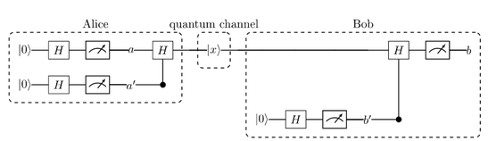

for $a' = b'$, a and b are the same and can be used as key, the process is repeated several times and only the valid bits are taken (after comparison of a' and b')

an attacker does not know in what basis to measure, also disturbance in the quantum channel can be detected upon comparison of the generation-bits

### E91 Protocol

by Artur Ekert: two entangled qubits are measured in different bases

the bases depend on the chosen Bell state, here $\ket{\beta_{01}}$:

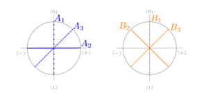

for key generation: $A_1/B_1$ and $A_3/B_2$

attacks can be detected: CHSH inequality **not** violated

- input bases: $A_1/B_2$, $A_1/B_3$, $A_2/B_2$, $A_2/B_3$
- the violation of the CHSH inequality proves that the qubits were isolated and did not interact with the outside world

## V. Quantum Complexity

### A. Classical Complexity

an algorithm is **efficient** if it solves a problem in polynomial runtime for all instances

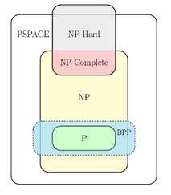

- **P**: problem can be efficiently solved
- **NP**: problem can be efficiently verified
- **NP-complete**: a problem in NP that every problem in NP can be reduced to in ploynomial time
- **NP-hard**: a problem (possibly) outside NP that every problem in NP can be reduced to in polynomial time
- **PSPACE**: problem only takes polynomial memory
- **BPP** (Bounded error Probabilistic Polynomial time): problem can be solved efficiently with a bounded error probability (randomized algorithms) < 50%

### B. Quantum Complexity

#### Bounded error quantum polynomial time (BQP)

class of probabilistic decision problems as quantum algorithms include randomness (analogue to BPP)

if the correct solution is produced with a probability $\geq \frac{2}{3}$ and by uniform quantum circuits of polynomial size

to show that the following holds and $BPP \subseteq BQP$ we will show that quantum circuits can be created from every classical circuit with only polynomial overhead

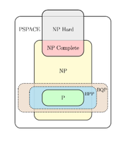

classical AND, OR and XOR are not reversible as they map two inputs to one output

toffoli gates can be used to create these gates:

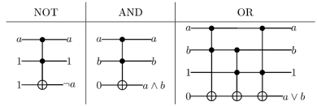

as all classical circuits can be formed from these gates, they can all be mapped to quantum circuits that are at most a linear factor larger

## VI. Quantum Algorithms

### A. Deutsch Algorithm

determine if function is constant or balanced: first demonstrated quantum advantage but no practical use

only needs one call to the oracle, compared to two on a classical computer

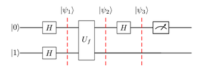

oracle is applied on superposition over all possible function inputs, the subsequent Hadamard gates cause **interference**

the function is constant for a measured $\ket{0}$ and balanced for a measured $\ket{1}$

### B. Hadamard on Quantum Register

for simplicity, a notation is introduced that applies $n$ Hadamard gates to a register of $n$ qubits:
$$H_n \ket{x} = \frac{1}{\sqrt{2^n}} \sum_{z = 0}^{2^n - 1} (-1)^{x \circ z} \ket{z}$$

### C. Deutsch-Josza Algorithm

generalization of Deutsch's problem: operating over $n$ qubits

one query instead of $2^{n - 1} + 1$

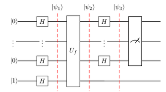

again **phase kickback** encodes information about the function in the phase of the input register; looking at its amplitude yields the result

a constant function leads to $\ket{0 \ldots 0}$ being measured with certainty, while destructive interference prevents it from being measured for a balanced function

## VII. Grover's Algotithm

also using interference to obtain information about an oracle

searching an element in an unsorted database with $O(\sqrt{N})$ instead of $O(N)$

an oracle maps (all) search element(s) to $\ket{1}$ and all others to $\ket{0}$; applying the oracle to the superposition makes the **amplitude negative** at exactly this point (but still measurement probabilities are equally distributed)

### A. Amplitude Amplification

**reflecting** an amplitude $a$ around the mean value $m$:
$$a \mapsto 2 \cdot m - a$$

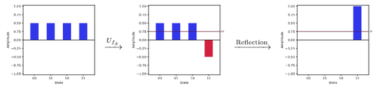

### B. Grover Iterations

the measurement probability of the correct result should be high but after a certain number of iterations the effect is canceled out

the probability is exactly one after $\frac{\pi}{4} \sqrt{\frac{N}{k}}$ iterations when searching for $k$ solutions in $N$ elements

to make sure that the probability does not decrease again, we use the following number of iterations to measure a searched element with almost certainty:
$$\left\lfloor \frac{\pi}{4} \sqrt{\frac{N}{k}} \right\rfloor$$

### C. Quantum Circuit

the **Grover diffusion** operator $D_n$ expresses amplitude amplification as a uniary operator

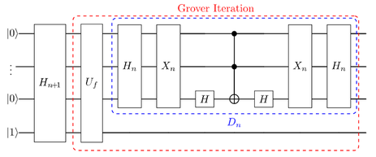

## VIII. Variational Quantum Algorithms (VQAs)

well-suited for **NISQ** (Noisy Intermediate-Scale Quantum) where many required qubits or deep circuits are a problem

**hybrid** approach: also uses classical computation

- quantum computer runs **parametrized quantum circuit**: some gates depend on angles (parameters)
- classical computer **optimizes** parameters
- has to be **repeated** many times

key elements:

- **problem encoding**:
  - defining **cost function**
  - translating into quantum **operator**
- **designing quantum circuit**:
  - parametrized circuit that represents possible solutions
  - flexible & efficient way to sample from large solution space
- **classical optimisation**
  - updating circuit parameters
  - until cost function converges

### A. Quantum Approximate Optimisation Algorithm (QAOA)

a prominent VQA for **combinatorial optimisation** problems: finding optimal solution in discrete set of all possible solutions

example: **Max-Cut** (dividing graph into two disjoint sets with as many edges in between as possible)

- problem encoding
  - cost function: binary variables (0/1), max. quadratic terms (no interaction between more than two qubits), constraints possible with penalty terms
  - formulation as QUBO (Quadratic Unconstrained Binary Optimisation)
  - 0/1 are replaced with +1/-1 (eigenvalues of Pauli-Z)
  - reformulate as **Hamiltonian** (matrix acting on quantum states): assigns an energy to each quantum basis state, in this example:

$$H_C = \sum_{(i,j) \in E} \frac{1}{2}(I - Z_i \otimes Z_j)$$

- creating the circuit
  - **Cost Hamiltonian** ($H_C$): problem encoding
  - **Mixer Hamiltonian** ($H_M$): drives transitions, e.g. X-Mixer $H_M = \sum_i X_i$
  - **Variational Parameters** ($\gamma_1, \beta_1, \ldots, \gamma_p, \beta_p$): for each circuit layer how strongly Hamiltonians are applied (adjusted during optimisation)
  - **Parameter** $p$: depth of circuit (exploration space vs. noise)
- classical optimisation
  - **expectation value** (most important quantity): repeatedly measuring the same observables on identically prepared states, weighted sum of all possible measurement results; objective function for classical optimiser

## IX. Quantum Fourier Transform (QFT)

Fourier Transform is important for modern applications like signal-processing & data compression

the **period finding** algorithm is based on QFT and needed for Shor's algorithm

### A. Discrete Fourier Transform & Fast Fourier Transform

#### Discrete Fourier Transform (DFT)

$N \times N$ matrix with $N$ distinct entries: complex $N$-th roots of unity

example (4th roots): {1, i, -1, -i} / {$i^0, i^1, i^2, i^3$}, can also be represented as vectors in unit circle (dividing it into $N$ sections):

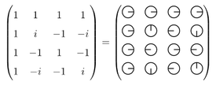

#### Fast Fourier Transform (FFT)

divide-and-conquer principle: reducing complexity from $O(N^2)$ to $O(N \log_2(N))$

- every second $N$-th root of unity corresponds to a $\frac{N}{2}$-th root of unity
- recursive approach: executing two matching DFT $_\frac{N}{2}$ instead of one DFT $_N$

### B. Quantum Fourier Transform

corresponds to DFT but has improved run time

$$QFT_N \ket{j} = \frac{1}{\sqrt{N}} \sum_{k = 0}^{N - 1} \omega_N^{j \cdot k} \ket{k}$$

formula for 3 qubits:

$$QFT_8 = \frac{1}{\sqrt{8}}\left((\ket{0} + \omega_2^j \ket{1}) \otimes (\ket{0} + \omega_4^j \ket{1}) \otimes (\ket{0} + \omega_8^j \ket{1})\right)$$

circuit for 3 qubits:

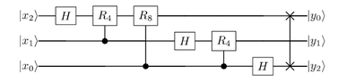

result order is reversed (applying swap-gates)

### C. Period Finding Algorithm

finding the period of a function e.g. $\sin(x) \rightarrow 2\pi$

conditions (when searching period $r$ in domain $M$):

- function is **bijective** (inevitable condition): values appear only once per period
- $r$ is a divisor of $M$
- $M \gg r^2$

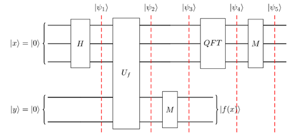

applying the function $U_f$ to a superposition of all possible inputs. After measurement of $\ket{y}$, allnon-zero amplitudes in $\ket{x}$ represent an input for the measured function value; inputs are separated by period $r$

QFT **shifts** the values to $0,~\frac{M}{r},~2 \cdot \frac{M}{r}$ etc.; the measurement yields a multiple of $\frac{M}{r}$ in each run, it is retrieved by **GCD** (greatest common divisor) calculation with high probability, then $r = \frac{M}{\gcd}$

## X. Shor's Algorithm

by Peter Shor (1994): efficient **prime factorization**

it is a threat to many asymmetric cryptography as RSA

### A. RSA

using a **one-way function**: multiplication of large prime numbers

public key $pk$ & secret key $sk$

1. random prime numbers $p$ & $q$
2. **RSA modulus**: $N = pq$, **Euler's totient function**: $\varphi(N) = (p - 1)(q - 1)$
3. $pk$ is chosen as coprime to and smaller than $\varphi(N)$
4. calculate multiplicative inverse $sk$ of $pk$ w.r.t. $\varphi(N)$: $pk \cdot sk \equiv 1 \mod \varphi(N)$ $\rightarrow$ **Euclid's Extended Algorithm**

encrypt with:
$$c = m^{pk} \mod N$$

decrypt with:
$$c^{sk} \mod N = m^{pk \cdot sk} \mod N = m$$

the modulus makes it cyclic $\rightarrow$ can be exploited

### B. Euclid's Algorithm

$$\gcd(x,y) = \gcd(y,\text{rem}(x:y))$$

recursively solving simpler problems

until remainder is $0$ (divider found) or $y = 1$ (x and y coprime)

example:
$$\gcd(72,5) = \gcd(5,\text{rem}(72:5))$$
$$= \gcd(5,2) = \gcd(2,\text{rem}(5:2))$$
$$= \gcd(2,1) = 1$$

#### Euclid's Extended Algorithm (EEA)

solving **Bézout's Identity**: $s \cdot x + t \cdot y = \gcd(x,y)$

going backwards through the EA equations and writing the GCD as sum of intermediate results, until a linear combination of $x$ and $y$ is obtained

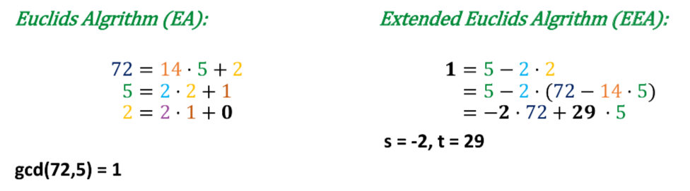

### C. Shor's Algorithm

could also be used for any number (with more than 2 prime factors)

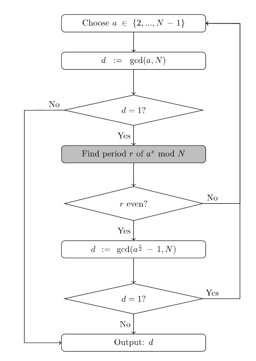

only the period finding is quantum. Everything else can be computed efficiently on classical hardware

## XI. Error Correction & Fault Tolerance

qubits may be influenced by the environment or influence each other, rotations may not be exact $\rightarrow$ **quantum noise**

**fault-tolerant** computing is **hard** because:

- measuring a qubit changes its state
- no-cloning theorem
- errors are continuous

### A. Classical Error Correction

**channel-model**: $D(N(C(x))) = x$ (encoding $C$, noise $N$, decoding $D$)

#### 3-Bit Repetition Code

$$0 \rightarrow 000,~1 \rightarrow 111$$

assuming that no more than 1 bit was changed by noise:
$$\{000,001,010,100\} \rightarrow 0$$
$$\{011,101,110,111\} \rightarrow 1$$

### B. Quantum Error Correction

#### 3-Qubit Bit-Flip Code

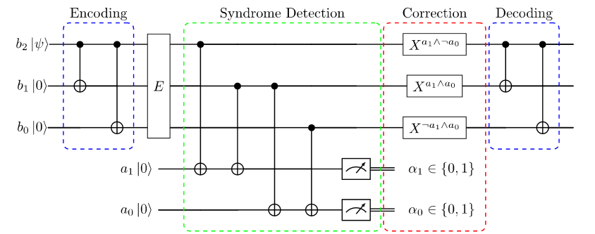

correction of arbitrary X-errors occuring on a single qubit

#### 3-Qubit Phase-Flip Code

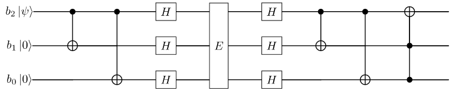

the hadamard sandwich leads to Z errors being recognized as X errors

#### Shor 9-Qubit Code

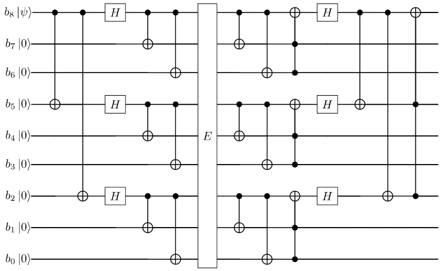

concatenation of bit- and phase-flip code, protects against arbitrary single qubit errors

## XII. Summarizing Questions

### Linear Algebra of Qubits

qubits, gates, registers, simple circuits, measurement, no-cloning theorem

1. When is an operation called unitary and how to check whether it is?
    - when the matrix is unitary: if its conjugate transpose is also its inverse ($U \cdot U^\dagger = I$)
2. Why must operations in quantum circuits be unitary?
    - they are length-preserving and guarantee a valid quantum state as result
3. What property of quantum operations can be inferred from the fact that they must be unitary?
    - they are reversible
4. Explain the term "superposition".
    - ability of a system to exist in multiple states simultaneously
5. Is $\frac{1}{5} \begin{pmatrix}3 \\ 4\end{pmatrix}$ a valid qubit?
    - $9/25 + 16/25 = 1 \rightarrow$ yes, valid state
6. Write the $Z$ gate in matrix notation.
    - $\begin{pmatrix}1 & 0 \\ 0 & -1\end{pmatrix}$
7. Calculate $CCNOT \ket{111}$ in Dirac notation.
    - $\ket{110}$
8. Calculate $(H_2 \otimes I) \ket{001}$.
    - $\frac{1}{2}(\ket{00} + \ket{01} + \ket{10} + \ket{11}) \ket{1}$
9. Draw a suitable circuit for question 8.
10. Draw a circuit for a random number generator.
11. Explain the meaning of measurement (keywords: basis, change of state, effects of measurement, unitary transformation)
    - extracting information from a quantum system: in computational basis, the state collapses into the measured one, non-unitary & irreversible: the original superposition is destroyed, losing information, to measure in other bases, a unitary transform has to be applied first
12. How does measuring a qubit register change the state of the other qubits? (Distinguish between two cases: entangled, unentangled; can of course be generalized)
    - unentangled qubits are unaffected, entangled ones instantly project into a corresponding definite state
13. Explain the term "orthonormal basis".
    - a set of vectors where all vectors are orthogonal (dot product 0) to each other and normalized (length 1)
14. What does a change of basis mean?
    - reeriting the description (of a vector) while it remains physically unchanged
15. Set the state $\frac{1}{\sqrt{3}} \ket{0} + \frac{\sqrt{2}}{\sqrt{3}} \ket{1}$ to the basis $\{\ket{+}, \ket{-}\}$.
    - $\hat{\alpha} = \frac{1}{\sqrt{2}}(\alpha + \beta) = \frac{1 + \sqrt{2}}{\sqrt{6}},~\hat{\beta} = \frac{1}{\sqrt{2}}(\alpha - \beta) = \frac{1 - \sqrt{2}}{\sqrt{6}}$
16. What results or effects does a measurement have?
    - information obtained, qubit collapses to measured state
17. Why is it difficult to give precise information about the state of an unknown qubit?
    - measurements are probabilistic & destructive, no-cloning theorem forbids duplication
18. Compute the density matrix of a given state.
    - outer product of state vector with its conjugate transpose
19. What properties does the density matrix have?
    - **Hermiticity** (its own conjugate transpose, all expectation values and eigenvalues are real), **Unit Trace** (sum of the diagonal is always 1, total probability of all outcomes), **Positive semi-definite** (all eigenvalues non-negative)
20. Compute the expectation value for a given state and observable.
    - using the inner product: $\bra{\psi} O \ket{\psi}$
21. What values can the expected value have?
    - Any value within the allowed spectrum of the measured observable
22. What does the no-cloning theorem say?
    - it is physically impossible to create an identical, independent copy of an arbitrary, unknown quantum state
23. Why is the no-cloning theorem not a contradiction to the fact that two qubits can be brought into the same state?
    - multiple qubits can be brought into the same state using the same state preparation

### B. Applying Entanglement

teleportation, dense coding, entanglement swapping

24. Explain the term and meaning of "entanglement".
    - two or more qubits become so deeply connected that the physical state of one instantly dictates the state of the other, no matter how far apart; they act as a single system
25. Give an example of an entanglement gate.
    - CNOT
26. How can you check whether a state is entangled?
    - if the state cannot be factored into a tensor product
27. Why is communication faster than the speed of light not possible despite entanglement?
    - no-communication theorem: entanglement only creates instantaneous correlation, not active information transfer
28. Name three protocols or algorithms presented in the lecture in which entanglement plays a role.
    - E91-protocol, Teleportation, Superdense Coding
29. What are the Bell states?
    - four specific, maximally entangled two-qubit quantum states
30. Draw and explain the teleportation circuit.
31. What does dense coding do?
    - Transmit two classical bits with just one qubit
32. What does the circuit for dense coding look like and what are the requirements?
33. What is entanglement swapping useful for?
    - connect two qubits that have never directly interacted
34. What does the no-communication theorem say?
    - quantum entanglement cannot be used to transmit classical information faster than the speed of light

### C. Classical vs. quantum computers

toffoli gates, circuit size, complexity, interference

35. Draw a Toffoli gate.
36. Why is the Toffoli gate important for quantum computing?
    - it can be used to recreate any classical circuit with just linear overhead
37. What is the asymptotical size of a quantum circuit when translated from a classical circuit?
    - $O(n)$
38. What does it mean to say that a quantum computer can solve an NP problem, that is not in P, in polynomial run time? Why does it not follow that P = NP?
    - $BQP \neq P$
39. What is a quantum oracle and how is it different to classical oracle?
    - blackbox quantum subroutine that evaluates a function, can process inputs in a superposition instead of one at a time
40. What is interference and how can we use it in combination with quantum oracles?
    - wave-like phenomenon: probability amplitudes reinforce or cancel out, boosting correct answers, erasing incorrect ones
41. Which functionality is implemented when surrounding an $X$ gate with a Hadamard sandwich?
    - Z gate

### D. Quantum Algorithms

#### Problem Solving with a Quantum Advantage

Hadamard-Sandwich, Deutsch, Deutsch-Jozsa, Bernstein-Vazirani, Grover's Algorithm, Oracle

42. Describe the problem of Deutsch. Specify a circuit that can be used to solve the task. How does the solution differ from the classical approach?
    - determining whether a function is constant or balanced: one oracle call instead of two, using phase kickback; oracle on superposition, Hadamard on first qubit before measuring
43. Describe the Bernstein-Vazirani problem. Specify a circuit that can be used to solve the task. How does the solution differ from the classical approach?
    - finding an unknown, secret n-bit binary string hidden in a oracle function: applying oracle to superposition, another Hadamard layer for interference, then measuring: it will be the secret string
44. Draw the quantum circuit for finding an element with Grover’s algorithm.
45. Which effect of $U_f$ does Grover use for the search?
    - using $U_f$ as phase oracle: flipping the phase of solution states
46. How is this state exploited in the Grover iteration?
    - using amplitude amplification: the Grover diffusion operator reflects all amplitudes across the mean $\rightarrow$ increases amplitudes of marked states
47. Explain how the Max-Cut problem was reformulated in the lecture into a problem that can be solved by Grover's algorithm.
    - mapping graph partitions to binary strings & evaluating whether a cut meets a specific threshold
48. Create a circuit to represent a graph of your choice as an oracle to solve the Max-Cut problem with Grover.

#### Variational Algorithms (QAOA)

parameterized Quantum Circuit, cost Hamiltonian, mixer Hamiltonian, updating variational parameters

49. What is a hybrid algorithm in the context of quantum computing? Which ones were introduced in the course of the lecture?
    - combines classical computation (optimizing) with quantum (specific oracle), e.g. QAOA
50. What are the key steps for creating a variational algorithm?
    - encoding the problem, defining a cost function, design parametrized circuit, optimizing the parameters
51. Draw the general circuit for QAOA.
52. Provide a brief outline of the QAOA procedure, starting from the initial state preparation to the measurement of the final state.
    - preparing with Hadamard layer (equal superposition), alternate with cost Hamiltonian & mixer Hamiltonian (depending on parameter $p$), classically optimize $\gamma$ & $\beta$, run & measure final circuit lots of times
53. What are the roles of the Hamiltonians used in QAOA?
    - Cost Hamiltonian encodes the objective function, Mixer Hamiltonian allows transitions between different basis states

#### QFT

Fourier series, discrete Fourier transform, supporting point representation, QFT, roots of unity, interference

54. Draw the circuit for $QFT_8$.
55. Describe to what extent $QFT_N$ and Hadamard $H_N$ are similar.
    - they are both a dicrete linear unitary transform and perform base rotations in Hilbert space, $H$ and $QFT_2$ are identical
56. Explain under which circumstances the results of $QFT$ and Hadamard are the same and when they are different.
    - for $QFT_2$ and for unentangled all-zero states they are identical

#### Shor’s Algorithm

period of the modulo function, run time, factorization, IT security, post-quantum cryptography

57. Shor's algorithm: Draw the flowchart.
58. Which part of Shor’s algorithm is quantum-based?
    - the period finding algorithm
59. Draw the quantum circuit for finding the period of a function $f$.
60. How does Simon's algorithm differ from Shor's algorithm? Describe how the period is found.
    - Simon's algorithm is designed to find a hidden bitstring while Shor's algorithm is used for factoring large integers but both rely on the same principle: an oracle encodes a phase into an equal superposition; with measuring the result register only inputs to that specific function value have non-zero amplitudes. This structural pattern is turned into a phase shifh by Hadamards (Simon's) or QFT (Shor's)
61. What are the consequences for IT-security if Shor's algorithm is implementable on real quantum hardware?
    - cryptography based on prime factorization or discrete logarithms could be broken; "harvest now, decrypt later": post quantum cryptography should already be used

### E. Quantum Key Distribution

BB84 protocol, E91 protocol

62. Draw a circuit that implements BB84/E91.
63. Briefly explain the purpose of the different measurement bases in E91.
    - eavesdropper can be found using CHSH inequality
64. Why is a classical channel necessary for BB84/E91 and which properties does it have to fulfill?
    - it must be authenticated (prevents MitM), retaining only measurements where bases match
65. How does the man-in-the-middle attack work for BB84/E91? How can it be detected?
    - for MitM, the measurement basis would have to be guessed; when comparing results the difference can be observed / for E91 the CHSH inequality is no longer violated

### F. Quantum Error Correction

noise, bit flip, phase flip, syndrome measurement, logical/physical qubits

66. What difficulties must be solved in quantum error correction that do not arise with classical error correction?
    - errors might be continuous, qubits cannot be cloned and cannot be measured without destroying their state
67. What are logical and physical qubits and how do they relate to each other?
    - logical qubits consist of multiple physical qubits: single qubit errors can easily be detected & corrected
68. Describe the relationship between noise and error correction.
    - error correction is needed because of noise
69. What is a syndrome measurement and what is it used for?
    - ancillas are manipulated & measured $\rightarrow$ determine correction steps; allows to apply error correction without collapsing the ongoing computation
70. How do we encode a logical qubit in the bit-flip, phase-flip or Shor's 9-qubit code?
    - mapping physical qubits into logical basis states
71. Name and explain the similarities/differences of the circuits for bit and phase flip correction.
    - correction in X/Z basis, Hadamard sandwich to switch between
72. What is quantum fault tolerance, what is necessary for it?
    - the ability of a quantum computer to detect and correct errors in real-time, ensuring accurate calculations despite noise; needs Quantum Error Correction (QEC), baseline error rate of qubits must be below threshold, logical operations must be possible also on logical qubits, syndrome measurement for real-time error correction

### G. General Questions

73. Which circuits have you learned about?
    - Teleportation, Superdense Coding, Entanglement Swapping, BB84/E91, Deutsch, Deutsch-Josza, Grover, QFT, Period Finding, Bit- and Phase-Flip Error Correction
74. Which gates were introduced?
    - X, Y, Z, H, CNOT, Toffoli, R
75. Assess the extent to which quantum computing can play a role in the present (2 aspects).
    - Quantum Simulations (Chemistry & Materials), Quantum-Enhanced Optimization (Logistics & Finance)
76. Summarize some of the difficulties in developing a physical quantum computer that you learned about.
    - qubits are extremely instable (will return to a less energetic state), influences of the environment (like photons) cannot be completely avoided, it is unclear which approach to build qubits will be successfull / the best suited
