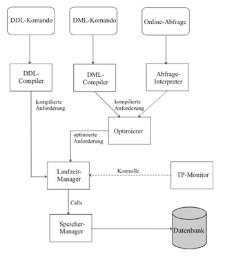
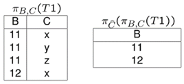
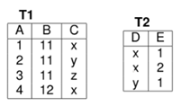
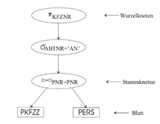
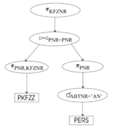
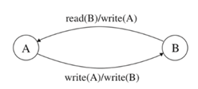
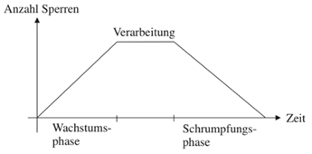
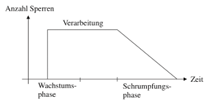

# Datenbanksysteme

## 1 Einführung

**Datenbanksystem (DBS)** = Datenbankmanagementsystem (**DBMS**) + n Datenbanken (**DB**)

Zur effizienten Verwaltung **persistenter Daten**

- Integrierter Datenbestand
- Metadaten
- Intelligente Software (Verwaltung, Manipulation, Mehrbenutzerbetrieb)

Vorteile

- Zentralisierte **Kontrolle** aller Daten durch Datenbankadministrator (**DBA**)
- Verminderte **Redundanz**
- **Inkonsistenzen** der Daten untereinander vermeidbar
- Sicherung der **Datenintegrität**
- **Datenflexibilität** (mehrfach verwendbar)
- **Datensicherung** und **Datenschutz** zentralisiert

**3-Ebenen-Architekturmodell** (Datenintegration bei gleichzeitiger Datenunabhängigkeit)

- **Interne Ebene** (physische Struktur)
  - Internes Schema: Art und Aufbau der Datenstrukturen, Zugriffsmechanismen,
Datenkompression
- **Konzeptionelle Ebene** (logische Gesamtsicht)
  - Konzeptionelles Schema: abstrahierendes Datenmodell
- **Externe Ebene** (Benutzersichten „Views“)
  - Externes Schema: reduzierte Komplexität, erhöhter Zugriffsschutz

**Datenunabhängigkeit** (2 Stufen)

- **Physische Datenunabhängigkeit**: keine Kenntnis über Ort & Struktur der Daten
- **Logische Datenunabhängigkeit**: problemlose Änderungen in logischer Gesamtsicht
  - Nur sehr bedingt: Attribute können einfach hinzugefügt werden, aber möchte man
beispielsweise ein Attribut aufsplitten, muss eine schreibende Anwendung angepasst
werden

DBMS-Komponenten

- Übersetzer
- Optimierer
- Transaktionsmanager
- Laufzeitmanager
- Speichermanager



Anwendungsbereiche

- Operational OLTP (Online Transaction Processing)
- Analytisch OLAP (Online Analytical Processing)
  - Data Warehouses

## 2 Informationsanalyse & Datenmodellierung

**Datenmodell** besteht aus Kollektionen von

- **Objekttypen** (Grundstrukturen)
- **Operatoren** (Hilfsmittel zur Manipulation)
- **Allgemeine Integritätsbedingungen** (Menge "gültiger" Zustände)

### Gebräuchliche Datenmodelle

- **Semantisches Datenmodell** (ER-Modell, UML-Klassendiagramm)
- **Logisches Datenmodell** (Relationenmodell, Netzwerkmodell)
- **Physisches Datenmodell** (Implementierte Datenbank)

### Abstraktionsmechanismen

- Klassifikation
- Aggregation
- Generalisierung / Spezialisierung

### Logische Datenmodelle

- Veraltet: **Hierarchisches Datenmodell**
  - Abbildung von **Hierarchien** durch **Pointer-Struktur**
  - Schlechte Modellierung: **Redundanzvermehrung** wo keine Hierarchien
  - Ein **einziger Einstiegspunkt** (Wurzel) $\rightarrow$ schlechte Performance
  - Spielt heute keine Rolle mehr, weil zu starr
- Veraltet: **Netzwerk-Modell**
  - Erweiterung des Hierarchischen Modells
  - "Navigation" durch das Netz mit Pointern (**"Currency-Konzept"**, sehr fehlerträchtig)
- **Relationales Datenmodell**
  - **1970** vom Engländer **Edward F. Codd** entwickelt
  - Beziehungen durch **Relationen** (zweidimensionale Tabellen)

### Relation

- Definition: **Relationenname** (Tabelle), Attributname (Spalte), Domäne (Wertebereich)
- Menge von **Tupeln** ohne Reihenfolge
- **Schlüsselkandidat**: minimale Attributkombination, die einen Tupel einer Relation eindeutig identifiziert
- **Primärschlüssel**: Das zur Identifikation gewählte Attribut (NOT NULL)
- **Fremdschlüssel**: Stellt Beziehungstyp (intrarelationale Bedingung) dar
  - **Update Rule (URULE)**:
    - restricted (nur löschbar, wenn nicht referenziert)
    - cascade (löscht alle referenzierten Tupel mit)
    - nullify (referenzierende Attribute werden auf NULL gesetzt falls möglich)

### Relationenschema

- Zeitinvariante "Beschreibung" der Menge aller Relationen über einer gegebenen Attributmenge, welche die semantischen (**intrarelationalen**) Bedingungen erfüllt.

## 3 Theoretische Grundlagen des Relationenmodells

### 3.1 Relationenalgebra

- Formale Basissprache für relationale Datenbanksysteme
- Operationen werden auf **Relationen** angewandt und liefern eine **Relation als Ergebnis**

Typkompatibilität

- Attribute, wenn **Domänen typkompatibel**
- Relationen, wenn **Attribute paarweise typkompatibel**

Klassische Mengenoperationen (bis auf Kartesisches Produkt Typkompatibilität erforderlich)

- Vereinigung $R \cup S := \{t | t \in R \lor t \in S\}$
- Differenz $R - S := \{t | t \in R \land t \notin S\}$
- Durchschnitt $R \cap S := \{t | t \in R \land t \in S\}$
- Kartesisches Produkt $R \times S := \{r \bullet s | r \in R \land s \in S\}$
  - Summe aller Attribute

**Umbenennung** von Relationen oder Attributnamen: $\rho$-Operator (**Rho-Operator**):

$\rho 𝐿𝑂𝐺𝐼𝑆𝑇𝐼𝐾, 𝑀𝐴𝑁𝑅 \leftarrow 𝑃𝑁𝑅, 𝐴𝑈𝑇𝑂 \leftarrow 𝐾𝐹𝑍𝑁𝑅^{(PKFZZ)}$

Umbenennung von PKFZZ (PNR, KFZNR, FAEHIGKEIT) nach LOGISTIK (MANR, AUTO, FAEHIGKEIT), entspricht:

```sql
SELECT pnr [AS] manr, kfznr [AS] auto, faehigkeit FROM pkfzz [AS] logistik;
```

**Projektion** (Spaltenauswahl): $\pi$-Operator (**Pi-Operator**):

$\pi _{ABTNR,GEHALT} (PERS)$

Entspricht:

```sql
SELECT abtnr, gehalt FROM pers;
```

**Selektion bzw. Restriktion** (Tupel-Auswahl): $\sigma$-Operator (**Sigma-Operator**):

$\sigma _{GEHALT\ge 6} (PERS)$

Entspricht:

```sql
SELECT * FROM pers WHERE gehalt >= 6;
```

$\theta$-Verbund bzw. $\theta$-Join (**Thetaverbund = Kartesisches Produkt**):

$ABT \bowtie _{ABTNR=ABTNR} ABTL$

Join von abt und abtl unter der Bedingung abtnr=abtnr (Natural Join)

Entspricht:

```sql
SELECT * FROM abt, abtl WHERE abt.abtnr = abtl.abtnr;
```

**Divisions-Operator** (**Allquantifizierung**, Umkehrung zum Kartesischen Produkt (auch Multiplikation)):

$\pi _{B,C} (T1) [C \div D] T2 = {11}$

Bei folgenden Tabellen:




Ergebnis:

$\{x,y\} \subseteq W (11) = \{x,y,z\}$

$\{x,y\} \nsubseteq W (12) = \{x\}$

Bemerkungen zur Relationenalgebra

- **Sichere Sprache**: endliche Ergebnismenge in endlicher Zeit
- **Effizient auswertbar**: polynomieller Zeitaufwand aufgrund folgender Zeitkomplexitäten
  - Umbennenung: $O(1)$
  - Selektion: $O(n)$
  - Projektion, Verbund Mengenoperationen: $O(n~log~n)$
- Dafür aber **beschränkte Ausdruckskraft** (nicht Turingvollständig)
- Verzicht auf einige Operatoren möglich, außer den **minimalen Repräsentanten**
  - $\rho, \pi, \sigma, \times, \cup, -$
- Für die Implementierung von DBS'en, **Erweiterung** um Operationen für **Aggregation**,
**Gruppierung** und **Rekursion**

### 3.2 Logische Anfrageoptimierung

- **Umformung** eines relationen-algebraischen Ausdrucks für eine möglichst **effiziente Ausführungsstrategie**
- Systemintern: Repräsentation eines relationen-algebraischen Ausdrucks durch einen **Anfragebaum** (query tree)

Regeln

- Verbund, Vereinigung, Durchschnitt und Kartesisches Produkt sind **assoziativ** und **kommutativ**
  - $R \bowtie (S \bowtie T) = (R \bowtie S) \bowtie T$
  - $R \bowtie S = S \bowtie R$
- Selektionen sind **vertauschbar**
  - $\sigma _{Bed1} (\sigma _{Bed2} (R)) = \sigma _{Bed2} (\sigma _{Bed1} (R))$
- Selektion kann nach Projektion stattfinden, falls Projektion keine Selektionsbedingungen
entfernt
  - $\pi _{Attrlist} (\sigma _{Bed} (R)) = \sigma _{Bed} (\pi _{Attrlist} (R))$, falls Bedingungsattribute $\subseteq$ Attrlist
- Selektion kann vor einem Kartesischen Produkt stattfinden, falls Selektionsbedingung nur
Attribute einer der beiden Relationen enthält
  - $\sigma _{Bed} (R \bowtie S) = \sigma _{Bed} (R) \bowtie S$ bzw. $\sigma _{Bed} (R \times S) = \sigma _{Bed} (R) \times S$
- Selektionen können mit Mengenoperatoren **vertauscht** werden
  - $\sigma _{Bed} (R \cup S) = \sigma _{Bed} (R) \cup \sigma _{Bed} (S)$
  - $\sigma _{Bed} (R \cap S) = \sigma _{Bed} (R) \cap \sigma _{Bed} (S)$
  - $\sigma _{Bed} (R - S) = \sigma _{Bed} (R) - \sigma _{Bed} (S)$

**Heuristische Prinzipien** (Operationen am besten in folgender Reihenfolge)

- Selektionen so **früh** wie möglich
- Projektionen so **früh** wie möglich, aber möglichst **nach Selektionen**
- Verbundoperationen und Kartesische Produkte so **spät** wie möglich, da aufwändig

Beispiel-Anfragebaum mit Optimierung




## 4 SQL mit Oracle (SQL-2)

- **Mengenorientiert**
- **Deskriptiv** (logische Beschreibung der gewünschten Ergebnisse)
- **Integritätsprüfungen** meist nicht ausreichend
- **Redundanz** (verschiedene Formulierungen einer Anfrage, welche ist effektiver?)
- Erlaubnis von uneigentlichen Relationen (**Multisets**), also Duplikaten

### **Datentypen** (Varchar höchstens als letztes Attribut für bessere Zugriffszeiten)

- NUMBER(ziffern)
- NUMBER(nachkommastellen, ziffern)
- CHAR(länge)
- VARCHAR2(länge)
- DATE

### **DDL** (Data Definition Language)

```sql
CREATE TABLE tablename (spalte1 typ1, spalte2 typ2, …);
DROP TABLE tablename;
ALTER TABLE tablename ADD | DROP | MODIFY (spalte1 typ1, spalte2 typ2, …);
CREATE [UNIQUE] INDEX indexname ON tablename (spalte1 [ASC | DESC], spalte2 [ASC | DESC], …);
DROP INDEX indexname;
CREATE VIEW viewname [(spalte1, spalte2, …)] AS SELECT … [WITH CHECK OPTION];
DROP VIEW viewname;
GRANT recht1, recht2, … | ALL ON tablename1, tablename2, … TO PUBLIC | benutzer1, benutzer2, …
[WITH GRANT OPTION];
REVOKE recht1, recht2, … | ALL ON tablename1, tablename2, … FROM PUBLIC | benutzer1, benutzer2, …;
```

### **DML** (Data Manipulation Language)

```sql
SELECT [ALL | DISTINCT] spalte1 [[AS] alias1], spalte2 [[AS] alias2], … FROM tablename1, tablename2,
… WHERE bedingung | subquery GROUP BY spalte1, spalte2, … HAVING bedingung | subquery
ORDER BY spalte1, spalte2, … [ASC | DESC];
INSERT INTO tablename [(spalte1, spalte2, …)] VALUES (wert1, wert2, …);
INSERT INTO tablename [(spalte1, spalte2, …)] SELECT …;
UPDATE tablename SET … [WHERE …];
DELETE FROM tablename [WHERE …];
```

### Bedingungen

- Logische Operatoren NOT, AND, OR
- Mathematische Operatoren +, -, *, /, =, <>, >, <, >=, <=
- Mengenoperatoren IN (kommt vor), ANY (Kombination mit Vergleich, min. 1 Treffer), ALL (Kombination mit Vergleich, min. 1 Treffer)
- Mustervergleich [NOT] LIKE ´String´, Platzhalter "%"" (beliebige Zeichenkette), "_" (beliebiges Zeichen)
- Bereichsabfrage [NOT] BETWEEN expression1 AND expression2

### Nullmarken

- Vergleich nur über IS [NOT] NULL
- „Normaler“ Vergleich (>, <, …) oder Mustervergleich liefert ein undefiniertes Ergebnis (**?**), arithmetische Ausdrücke **NULL**
- Bei SELECT DISTINCT und ORDER BY ausnahmsweise identisch

### Aggregatfunktionen

- AVG(), COUNT(), MAX(), MIN(), SUM()
- Anwendbar in SELECT oder HAVING
- MIN und MAX auf **jeden Datentyp** anwendbar
- COUNT(*) für alle, COUNT(spalte) für alle in spalte NOT NULL, COUNT(DISTINCT spalte) ohne Duplikate
- **Gruppierung** nach allen anderen Spalten im SELECT, sonst Dimensionsfehler (**Dimension Mismatch**)

### Joins

Ohne Bedingung

```sql
SELECT … FROM tablename1 CROSS JOIN tablename2;
```

Mit Bedingung

```sql
SELECT … FROM tablename1 [[AS] alias1], tablename2 [[AS] alias2], … WHERE join-bedingung;
```

### Temporäre Tabellen

```sql
CREATE GLOBAL TEMPORARY TABLE ON COMMIT PRESERVE ROWS AS SELECT …;
```

### Unterabfragen

```sql
SELECT spaltenliste FROM tabellenliste WHERE spalte [NOT] IN subquery | spalte <operator> [ANY | ALL] subquery;
```

- **Single-Row-Subquery** (eine Ergebniszeile) vs. **Multiple-Row-Subquery** (viele Ergebniszeilen)
- **Unkorrelierte Unterabfrage** heißt unabhängig von der umschließenden Abfrage
  - Streng sequenzielle Ausführung
- **Korrelierte Unterabfrage** enthält min. 1 Spaltenname aus äußerer Abfrage (**Korrelationsvariable**) in Punktnotation
  - Für jede Zeile der äußeren Abfrage einmal ausgewertet

### Quantifizierung

- **Existenzquantifizierung** (EXISTS)
  - Prüft, ob Unterabfrage min. 1 Zeile liefert
- **Allquantifizierung** (kein SQL-Operator)
  - Doppelte Negation schafft Abhilfe: "Es gibt kein Auto, das nicht rot ist" $\rightarrow$ "Alle Autos sind rot"
  - Dafür verwendet man 2-mal hintereinander den NOT EXISTS Operator

### Mengenoperationen

```sql
SELECT … UNION [ALL] | INTERSECT | EXCEPT SELECT …
```

### Constraints

- NOT NULL: ungleich NULL
- UNIQUE: keine Dopplungen
- PRIMARY KEY(spaltenliste): Primärschlüssel
- CHECK(bedingung): grob formulierte "Suchbedingungen"
- FOREIGN KEY (spaltenliste) REFERENCES tablename [(spaltenliste)] [Zusatzregeln]:
Fremdschlüssel, mit folgenden Zusatzregeln
  - ON DELETE CASCADE
  - (ON UPDATE CASCADE) nicht in Oracle
  - ON DELETE SET NULL/DEFAULT
  - ON UPDATE SET NULL/DEFAULT

### Transaktionen

Beginn

```sql
SET TRANSACTION READ [ONLY | WRITE];
```

Speicherpunkte

```sql
SAVEPOINT <savepointname>;
```

Ende

```sql
COMMIT; /* bei DDL-Anweisung automatisch */
/* oder */
ROLLBACK [TO <savepointname>];
```

Oder durch Abmeldung oder Abbruch des Benutzerprozesses

## 5 Interne DB-Organisation und Transaktionsverwaltung

Es geht um operationale Integrität (**Datensicherheit**), also Verhinderung **systembedingter Fehler**. Fehleranfälligkeit bei **Synchronisation** paralleler Aktivitäten.

### Transaktion

Eine Folge **logisch zusammengehöriger Operationen**, die in ihrer **Gesamtheit** die DB von einem **konsistenten** Anfangszustand in einen **konsistenten** Endzustand überführen. ACID-Prinzip:

- **Atomicity** (Atomarität): ganz oder gar nicht
- **Consistency** (Konsistenz): nicht zwingend durchgängig konsistent, aber konsistenter Endzustand
- **Isolation**: keine Auswirkungen auf andere Transaktionen
- **Durability** (Dauerhaftigkeit): Wirkung einer erfolgreichen Transaktion darf nicht durch Ereignis zerstört werden

### Mögliche Probleme

- **"Lost Update"**: ein Update einer Transaktion wird durch eine andere überschrieben
- **"inkonsistente DB-Sicht"**: keine Konsistenz, da Lesevorgang während anderem Update
- **"inkonsistente DB"**: keine Konsistenz, z.B. bei Vertausch von Addition und Multiplikation
- **"Temporary Update"**: Änderungen werden durch Rollback rückgängig gemacht, wurden aber bereits von einer anderen Transaktion gelesen
- **"Phantom Problem"**: Während der Transaktion kommt ein Objekt dazu, oder wird gelöscht ("Inverses Phantom").
- **"Incorrect Summary"**: Während Aggregatfunktion ändern sich Werte $\rightarrow$ beruht auf inkonsistentem Zustand und ist nicht reproduzierbar

Zusammenfassung zu **3 Anomalien-Kategorien**

- **Dirty Read**: Lesen von Daten, **ohne COMMIT** oder wo noch ein **ROLLBACK kommt**
  - "inkonsistente DB-Sicht", "inkonsistente DB", "Temporary Update"
- **Non-Repeatable Read**: Lesevorgang nicht wiederholbar, da Daten inzwischen von anderer
Transaktion geändert
  - "Incorrect Summary"
- **Phantom-Problem**: besondere Form des Non-Repeatable Read

**"Lost Update"** gehört zu keiner der Kategorien, er sollte **generell verhindert werden**. **Serialisierung** führt zu korrekter Synchronisation konkurrierender Zugriffe auf gemeinsame Objekte.

### Serialisierbarkeit

Ein System paralleler Transaktionen ist **serialisierbar**, wenn es mindestens eine mögliche serielle Ausführung derselben Transaktionen gibt mit **demselben DB-Endzustand** und **denselben Ausgabedaten** der Transaktionen.

### Transaktionsschedule

Der **zeitliche Ablauf** von **read/write**-Operationen für beliebige Objekte und beliebige Transaktionen. Zusammenfassung aller **Logbücher** (für ein Objekt).

### Konfliktgraph

2 Konfliktoperationen (Zugriff auf selbes Objekt, min. 1 write)

- Pfeil von erster zu zweiter Operation

2 mögliche Folgerungen, <ins>keine Umkehrschlüsse</ins> möglich

- Nicht serialisierbar $\rightarrow$ Kreis
- Kein Kreis $\rightarrow$ serialisierbar

**NP-vollständiges** Entscheidungsproblem, daher Einsatz **nicht praktikabel**!



### Synchronisationsverfahren (polynomieller Zeitaufwand, garantieren Serialisierbarkeit)

- **Optimistische Verfahren** (Unterstellung **seltener Konflikte**, im Zweifel ROLLBACK)
  - **Lesephase**: Verarbeitung in Puffer-Speicher
  - **Validierungsphase**: Falls gelesene Objekte in Zwischenzeit modifiziert ROLLBACK
  - **Schreibphase**: Schreiben von Puffer in DB
- **Pessimistische Verfahren** (**Verhinderung** nicht serialisierbarer Schedules)
  - **Zeitstempel bzw. Zeitmarkenverfahren**
    - Zeitmarke ist **Startzeitpunkt** der Transaktion
    - Bei Objekten letzter Lese- (TSR) und letzter Schreibzugriff (TSW)
    - "Konfliktoperationen" in **Zeitmarken-Reihenfolge**
  - **Sperrverfahren**
    - TA sperrt Teil der DB, auf dem sie arbeitet
    - Kein anderer Zugriff während Sperre
      - **R-Sperre** (Lesesperre): Lesezugriff anderer TAs erlaubt
      - **X-Sperre** (Schreibsperre): Kein Zugriff anderer Tas
    - Bei den meisten SQL-Befehlen **automatische Sperren** (z.B. UPDATE)
    - **Ab SQL99** können **Isolationsstufen** gesetzt werden
    - **Sperrgranularität**
      - Oft nach **Hierarchie**: Zeile $\rightarrow$ Tabelle $\rightarrow$ Bereich $\rightarrow$ Datenbank
      - **Feinere Sperren** $\rightarrow$ höhere **Parallelisierbarkeit**, aber auch mehr **Verwaltungsaufwand**
    - Mögliche **Probleme**
      - **Verzögerungen** bei ungünstiger Zuteilung
      - Verklemmungen (**deadlocks**)
      - **Kaskadierende Rücksetzungen**: Bei zu früher Freigabe und anschließendem ROLLBACK Inkonsistenzen, da andere Transaktionen auf nichtexistierende Transaktion aufbauen

### Sperrprotokolle

Üblich Zwei-Phasen-Sperrprotokoll (two-phase locking, 2PL): nach erstem „unlock“ kein „lock“ mehr



Varianten

- **Preclaiming-Protokoll**: erst alle benötigten Objekte sperren
  - **Keine Deadlocks**
  - Längere Sperren als nötig (schlechtere Performance)



- **Striktes Zwei-Phasen-Sperrprotokoll**: Sperren bis zum Ende
  - Keine Kaskadierenden Rücksetzungen
  - Längere Sperren als nötig (schlechtere Performance)


Zur Verhinderung aller Probleme **beide Varianten** gleichzeitig, aber **schlechtere Performance**. **Preclaiming schwierig**, da zu sperrende Objekte nicht sofort bekannt. Daher oftmals **Abwandlung des strikten 2PL**: lange X-Sperren, kurze R-Sperren (nicht sicher). Dadurch notwendige **Deadlock-Behandlung** beispielsweise über **TA-Wartegraphen**

### Datensicherung

Wiederherstellung eines konsistenten DB-Zustands durch **Recovery**

**Undefinierter DB-Zustand** durch TA-Abbruch oder Systemabsturz

- **Physische Inkonsistenz** (falsche Zeiger)
- **Logische Inkonsistenz** (widersprüchliche / veraltete Daten)

Relevante Fehlerklassen

- **Transaktionsfehler**: Benutzerfehler, Programmierfehler, Konsistenzverletzung, Deadlock
  - Rollback
- **Systemfehler**: Strom- oder Betriebssystemausfall
  - Instance- bzw. Crash-Recovery
- **Speicherfehler**: mechanische Störung wie Head-Crash
  - Media-Recovery

**Recovery-Methode** meist physisches Logging in Logfile (auf Sekundärspeicher)

- Für alle Zugriffe
  - **Marke für Beginn** der TA (TA-ID)
  - **Before-Image** (pro verändertes Objekt: ID, alter Wert, TA-ID)
  - **After-Image** (pro verändertes Objekt: ID, neuer Wert, TA-ID)
  - **Marke für Ende** der TA (TA-ID)
  - **Checkpoints** (Liste aktiver Transaktionen, z.B. 10-minütlich)
- **Rückwärts Lesen** zum Rücksetzen, für Rollback filtern nach der Transaktion
- **Rekonstruktion** durch Archivkopie ("Dump") und Protokolldatei:
  - Einspielen Kopie und Einarbeitung aller bereits abgeschlossener Änderungen
