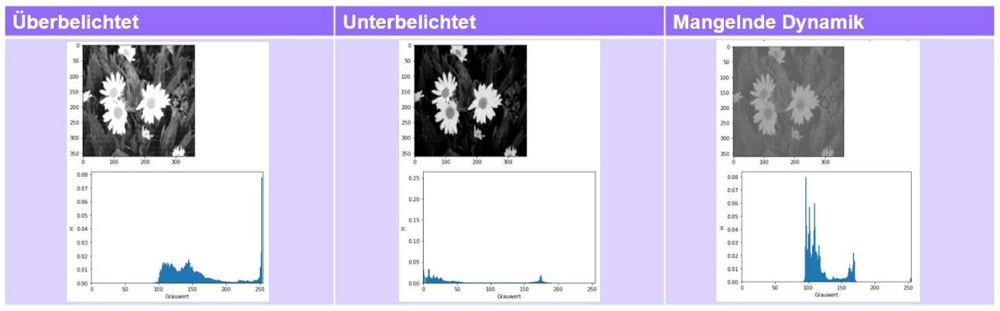

# Computergarfik und Bildverarbeitung

## Einführung

Computergrafik (Bildsynthese) $\iff$ Bildverarbeitung (Bildanalyse)

Bildverarbeitung ist die Aufbereitung eines Bildes, die Generierung einer abstrakten Beschreibung zu einem Bild heißt Computer Vision.

### Farbwahrnehmung

- **Farbe** entsteht durch Licht (elektromagnetische Wellen), **Farbreiz** ist die Spektralverteilung sichtbarer elektromagnetischer Strahlung
- **Farbeindruck** ist die Verarbeitung neuronaler Signale im Visuellen Cortex, hängt von Umgebung und Anapssung des Auges an die Lichtverhältnisse ab

### Zentralperspektive

- Perspektive in Malerei große Kulturleistung
- heute: Projektion von 3D-Punkten auf Bildebene und 3D-Rekonstruktion aus 2D-Bildern
- vereinfachte Darstellung ohne Linsengeometrie oder dergleichen

### Anwendungsgebiete

- 3D-Computergrafik: Ausbildungssimulation, Telepräsenz (virtuelle Museen), Datenvisualisierung, Entwicklungssimulationen (CAD), Unterhaltung (Computerspiele), Datenübertragung (Bilddatenkodierung)
- mit harter Echtzeit (min. 60 Hz / fixe Deadlines) oder weicher Echtzeit
- Bildverarbeitung: Qualitätskontrolle, Robotik, Überwachung, Medizin, autonomes Fahren, Kriminilogie, Photographie, Multimedia, Wettervorhersage, Astronomie, Archäologie, Militär

### Fragestellungen zur Einleitung

- Wie hängen CG und BV zusammen?
- Wie entsteht ein Farbeindruck aus einem Farbreiz?
- Nennen Sie Anwendungsgebiete für CG/BV
- Aufgabe: Projektion eines Objekts auf Bildebene einzeichnen

## Bildverarbeitung

Bild als Funktion s

$s: \mathbb{R}^M \rightarrow \mathbb{R}^N$, M = 2, N = \{1,3\}

Ein zweidimensionaler Bildpunkt bekommt hier 1 oder 3 Kanäle zugewiesen. Bild ist Funktion auf kontinuierlichen Mengen $\rightarrow$ für Digitalisierung ist Diskretisierung notwendig, dafür 2 Strategien:

- **Rasterung** (Abtastung): Festlegung eines einzelnen Werts pro Bildbereich / Pixel
- **Quantisierung**: Festlegung von Flächen mit demselben Wert

Gerastertes Bild kann als Matrix (**Bildmatrix**) definiert werden, Einträge sind über **Koordinatentupel** referenzierbar

Bildarten: Binärbilder, Grauwertbilder und Farbbilder

Kanal als letzter Eintrag im Tupel für Referenzierung einzelner Farbwerte:

$$s(x,y,n) = g,g \in G$$

### Statistische Größen

- Extraktion aussagekräftiger Merkmale als Vorverarbeitung
- Visualisierung anwendungsbezogener Bildeigenschaften
- für das Bild $S = s(x,y,n)$, hier nur Grauwertbild

#### Mittelwert

Durchschnittshelligkeit (pro Kanal)

$$m_S = {1 \over L~\cdot~R} \sum _{x=0}^{L-1} \sum _{y=0}^{R-1} s(x,y)$$

#### Quadratische Abweichung

Variation / Lebhaftigkeit (pro Kanal)

$$q_S = {1 \over L~\cdot~R} \sum _{x=0}^{L-1} \sum _{y=0}^{R-1} (s(x,y) - m_S)^2$$

#### Relative Häufigkeit

Beschreibung von Helligkeitsverteilungen

$$p_S(g_0,...,g_{N-1}) = {a_{g_0,...,g_{N-1}} \over L~\cdot~R}, g_n \in G$$

#### Histogramme

Darstellung der Relativen Häufigkeit

Charakterisierung von **Beleuchtung** und **Dynamik**:

Bei zwei lokalen Maxima $\rightarrow$ **Bimodales Histogramm** $\rightarrow$ Segmentierung möglich

#### Relative Summenhäufigkeit

Kumulative Relative Häufigkeit

$$h_S(g) = \sum _{i=0}^g p_S(i), g \in G$$

#### Co-Occurence-Matrix

- mit einer **Relation** $r$ (z.B. "rechter Nachbar")
- zählt Häufigkeiten von Wertkombinationen
- Eintragung bei Spalten- und Zeilenindex der Wertkombination, z.B. 2 "rechter Nachbar" 3 in Zeile mit Index 2 und Spalte mit Index 3
- Die **Hauptdiagonale** entspricht **homogenen** Bereichen, starke Besetzung der linken unteren und rechten oberen **Ecke** bedeuten viel **Kontrast**
- Einsatz in **medizinischer Bildverarbeitung**
- **Haralick Features**: 14 Merkmale aus Co-Occurence-Matrix
- Für Richtungsinvarianz: Rotation der Relation und anschließende Mittelung

### Fragestellungen zu Digitalen Bildern

- Was ist ein bimodales Histogramm?
- Was kann man im Histogramm erkennen?
- Wozu lässt sich die Co-Occurrence nutzen?

- Aufgabe: Berechnung statistischer Größen (z.B. Relative Häufigkeiten, Histogramm, ...) für ein Bild mit gegebener Grauwert-Matrix
- Aufgabe: gg. Grauwertbilder $\rightarrow$ Histogramme zuordnen
- Aufgabe: gg. Histogramm $\rightarrow$ Beleuchtung und Dynamik zuordnen
- Aufgabe: gg. Grauwertbild, Relation $\rightarrow$ Co-Occurrence Matrix berechnen

### Punktoperationen

Modifikation der Bildpixel (Grauwerte $G = \{0, ..., 255\}$) ohne Berücksichtigung der Umgebung, ist Funktion, die Eingabebild $S_e$ auf Ausgabebild $S_a$ abbildet

- bessere bildliche Reproduktionsqualität bei der **Videodigitalisierung**
- für Ausdrucke mit weniger als 256 Graustufen

#### Lineare Skalierung

$$f(g) = (g + c_1) \cdot c_2 = c_2 g + c_1 c_2$$

- $c_1 < 0$: dunkler, Histogramm nach links
- $c_1 > 0$: heller, Histogramm nach rechts
- $0 < c_2 < 1$: weniger Kontrast, Histogramm gestaucht
- $c_2 > 1$: mehr Kontrast, Histogramm gestreckt
- $c_1 = 0, c_2 = 1$: Identitätsabbildun

Grauwerte < 0 und > 255 werden abgeschnitten, dadurch gehen ggf. Informationen verloren

Anpassung für bessere Ergebnisse:

$$f(g) = c_2(g - 128) + 128 + c_1$$

Dadurch "dreht" die Multiplikation um den Ursprung

Für **Falschfarbendarstellung** oder eine **Beschleunigung** der Berechnung kann eine **Lookup-Tabelle** eingesetzt werden: Zuordnung Grauwert $\rightarrow$ Grauwert

#### Äquidensiten

Eine stückweise konstante Skalierung

- **1\. Ordnung**: Direktes Ergebnis mit Flächendarstellung
- **2\. Ordnung**: Nur die Ränder der Flächen werden dargestellt
- **Gemischte Ordnung**: Sowohl Flächen als auch Ränder werden dargestellt

Grenzen können aus Relativer Summenhäufigkeit abgeleitet werden $\rightarrow$ **Randerkennung**

Problem: **Rauschanfälligkeit**

Spezialfall: Binär- (0 und 255) oder Zweipegelbild (2 beliebige Graustufen)

- Anwendung in der **Segmentierung**
- **Binarisierung** über Schwellenwert, der automatisch ermittelt werden kann

#### Histogrammlinearisierung

Skalierungsfunktion, die dafür sorgt, dass $g$ **gleichverteilt** ist und den gesamten Wertebereich füllt (effizient mit Lookup-Tabelle da keine Parameter)

$$f_n(g) = 255 \cdot h_S(g)$$

- mehr **Kontrast** (in dunklen und in hellen Bereichen), hilfreich bei kontrastarmen Bildern
- feine **Bildstrukturen** sind besser sichtbar
- mittlere Grauwerte nahezu unverändert
- Problem: **sichtbares Rauschen** in hellen Bildbereichen

### Fragestellungen zu Punktoperationen

- Wie lassen sich bei der linearen Skalierung entstehende Grauwerte > 255 behandeln?
- Wie wirkt sich ein c_2 > 1 auf das resultierende Grauwerthistogramm aus?
- Was ist die Folge des Abschneidens von Werten > 255?
- Warum gilt bei einem Ausgabebild, das alle Grauwerte enthält, nicht exakt p_s(g)=1/256?
- Für welche Bilder eignet sich Histogrammlinearisierung nicht?
- Aufgabe: gg. Bilder von Äquidensiten $\rightarrow$ Zuordnung der Ordnung
- Aufgabe: gg. Eingabebild, linear skaliertes Bild $\rightarrow$ Zuordnung

### Lineare Filter

Im Gegensatz zu Punktoperationen **Einbezug der Umgebung** (Nachbarpixel) $\rightarrow$ lineare Abhängigkeit (gewichtete Summe) von seinen Nachbarn

Operationen **im Ortsbereich** (vs. im Frequenzbereich)

Anwendung in:

- **Vorverarbeitungsschritten** bspw. vor Segmentierung
- **Rauschunterdrückung** (Videosequenz / einfache Bilder)
- **Hervorhebung von Kanten**
- als Teil eines **Neuronalen Netzes** zur Erkennung von Bildinhalten

#### Bewegter Mittelwert

$$s'(x,y) = {1 \over 9} \sum _{u=-1}^{+1} \sum _{v=-1}^{+1} s(x-u, y-v)$$

#### Diskrete Faltung und Korrelation

Lineare Filter werden als Diskrete Faltung umgesetzt:

- **Flippen** des Filterkernels horizontal und vertikal bzw. Punktspiegelung bzw. Rotation um 180 Grad
- Korrelation ist ohne das Flippen, daher sind die **Vorzeichen** in der Formel vertauscht

**Diskrete Faltung**:

$$s'(x,y) = \sum _{u=-k}^{k} \sum _{v=-k}^{k} s(x-u, y-v)$$

**Korrelation**:

$$s'(x,y) = \sum _{u=-k}^{k} \sum _{v=-k}^{k} s(x+u, y+v)$$

Im Gegensatz zum Bewegten Mittelwert wird dabei der Mittelwert nicht erhalten. Dies kann durch einen Vorfaktor $1 \over m^2$ erreicht werden. $m^2$ muss dabei der Summe der Filterkoeffizienten entsprechen.

#### Randpixelergänzung

3 verschiedene Strategien möglich

- Zero-Padding
- Extrapolation
- Zyklische Fortsetzung

#### Separierbarkeit

Anwendung eines linearen Filters in $O(2m)$ statt $O(m^2)$

Gegeben wenn Filterkern als **äußeres Produkt** geschrieben werden kann, separierte Filterkerne werden nacheinander angewandt

Beispiel **Bewegter Mittelwert**:

$${1 \over 9} \begin{pmatrix}1 & 1 & 1 \\ 1 & 1 & 1 \\ 1 & 1 & 1\end{pmatrix} = {1 \over 3} \begin{pmatrix}1 \\ 1 \\ 1\end{pmatrix} \cdot {1 \over 3} \begin{pmatrix}1 & 1 & 1\end{pmatrix}$$

Beispiel **Gauß Weichzeichner**:

$${1 \over 16} \begin{pmatrix}1 & 2 & 1 \\ 2 & 4 & 2 \\ 1 & 2 & 1\end{pmatrix} = {1 \over 4} \begin{pmatrix}1 \\ 2 \\ 1\end{pmatrix} \cdot {1 \over 4} \begin{pmatrix}1 & 2 & 1\end{pmatrix}$$

Separierbarkeit gegeben, wenn **Rang** der Matrix 1 (alle Spalten- / Zeilenvektoren linear abhängig)

#### Arten linearer Filter

- **Summen-** oder **Glättungsoperatoren** (**nur positive** Werte im Filterkern)
  - Glättung
    - **Box-Filter** (schlecht): scharf abfallende Ränder, gleiches Gewicht überall, keine Isotropie (Auswirkung sollte in alle Richtungen gleich sein)
    - **Gauß Filter** (bzw. Gauß-Weichzeichner): diskrete Approximation der Gauß-Glockenkurve, gutes Frequenzverhalten, Isotrop für Filtermasken mit $m > 4$
- **Differenzoperatoren** (auch negative Werte im Filterkern)

#### Unsharp Masking

Es wird die Differenz aus einem Bild und seinem weichgezeichneten Bild gebildet, mit einem Faktor $c$ multipliziert und auf das Bild addiert

$c = 1$ ist der Standard, ein größerer Wert verursacht "Highboost-Filtering", ein kleinerer reduziert den **Einfluss** der Maske

#### Grauwertgradient

Partielle Ableitungen nach x- und y-Richtung

$$grad(s) = \begin{pmatrix}{\delta s(x,y) \over \delta x} \\ {\delta s(x,y) \over \delta y}\end{pmatrix}$$

Betrag:

$$\sqrt{\begin{pmatrix}{\delta s(x,y) \over \delta x}\end{pmatrix}^2 + \begin{pmatrix}{\delta s(x,y) \over \delta y}\end{pmatrix}^2}$$

Richtung:

$$arctan \begin{pmatrix}{{\delta s(x,y) \over \delta y} \over {\delta s(x,y) \over \delta x}}\end{pmatrix}$$

Können per **Differenzoperatoren** berechnet werden

#### Differenzoperatoren

- **Sobel Operator**
  - Differenzbildung zur übernächsten Spalte / Zeile $\rightarrow$ **weniger Störungsanfälligkeit**
  - **Rauschminderung** durch Mittelung quer zum Gradienten
  - **Richtungsabhängigkeit**: nur horizontale und vertikale Kanten können erkannt werden

$$H_x = \begin{pmatrix}1 & 2 & 1 \\ 0 & 0 & 0 \\ -1 & -2 & -1\end{pmatrix}~~~~H_y = \begin{pmatrix}1 & 0 & -1 \\ 2 & 0 & -2 \\ 1 & 0 & -1\end{pmatrix}$$

- **Laplace-Operator**
  - richtungsunabhängiger Operator (punktsymmetrisch)
  - etwas anfälliger ggü. Bildstörungen

$$H = \begin{pmatrix}0 & -1 & 0 \\ -1 & 4 & -1 \\ 0 & -1 & 0\end{pmatrix}~~oder~~H = \begin{pmatrix}-1 & -1 & -1 \\ -1 & 8 & -1 \\ -1 & -1 & -1\end{pmatrix}$$

### Fragestellungen zu Linearen Filtern

- Was ist der Unterschied zwischen linearen und nichtlinearen Filtern?
- Welchen Vorteil bietet die Filtereigenschaft der Separierbarkeit?
- Was versteht man unter dem Grauwertgradient? Wozu kann er verwendet werden?
- Was passiert bei der Bildschärfung, wenn der Parameter c einen Wert kleiner 1 annimmt?
- Warum ist der Laplace-Filter richtungsunabhängig?
- Aufgabe: gg. Grauwertbild (Matrix), Filterkern $\rightarrow$ Ergebnis
- Aufgabe: gg. Grauwertbild (Matrix) $\rightarrow$ Bewegter Mittelwert
- Aufgabe: gg. Gefiltertes Grauwertbild $\rightarrow$ Filter
- Aufgabe: gg. Filterkernel $\rightarrow$ Glättungs- oder Differenzoperator?

### Nichtlineare Filter

Keine lineare Abhängigkeit von Nachbarpixeln

#### Morphologische Operatoren

Änderung der äußeren Form von Bildstrukturen durch "Schrumpf"- und "Wachs"-Operationen

- Selektive Entfernung störender Bildstrukturen
- Füllen von "Löchern" in Binärbildern
- Qualitätskontrolle, OCR

**Strukturierendes Element** $K$ beschreibt, welche Bildpunkte "Nachbarn" sind

Operatoren

- **Dilatation** ("Wachsen"): kommutativ und assiozativ
- **Erosion** ("Schrumpfen"): nicht kommutativ aber assoziativ
- **Opening** (Erosion $\rightarrow$ Dilatation): entfernt kleine Bildstrukturen
- **Closing** (Dilatation $\rightarrow$ Erosion): füllt Löcher und Zwischenräume

Dilatation und Erosion sind **nicht zueinander invers**, aber **dual**: Dilatation des Vordergrundes $==$ Erosion des Hintergrundes. Beide sind **idempotent**: eine weitere Anwendung würde nichts mehr ändern

Bei **Grauwertbildern** werden Rangordnungsoperatoren eingesetzt: die Nachbarn aus dem strukturierenden Element werden nach Größe sortiert

- **Dilatation**: Das Maximum wird der neue Wert
- **Erosion**: Das Minimum wird der neue Wert

Operatoren haben gleiche Eigenschaften wie bei Binärbild, auch Opening und Closing

Anwendung

- Gezielte Extraktion von Formen: Opening / Closing, Ergebnis vom Original subtrahieren
- Exraktion von Kanten / Linien: Closing & Subtraktion vom Original

#### Median-Filter

Es wird immer der Median aller Nachbarswerte gewählt

So kann **Salt-and-Pepper-Rauschen** reduziert werden

### Fragestellungen zu Nichtlinearen Filtern

- Ist die Erosion kommutativ?
- Mit welchem Operator lassen sich kleine Bildstrukturen entfernen?
- Aufgabe: Wenden Sie das strukturierende Element x auf Grauwert/Binärbild y mit Operator z an.
- Aufgabe: gg. Grauwertbild $\rightarrow$ Welcher Operator wurde angewandt?

### Fouriertransformation

Zerlegung von Bildern in "Schwingungen" unterschiedlicher Frequenzen

- effizientere Anwendung linearer Filter im "Frequenzraum"
- Erkennung interessanter Bildeigenschaften

#### Fourierreihen

**Gewichtete Summe** harmonischer Schwingungen unterschiedlicher Frequenz $\rightarrow$ periodische, kontinuierliche Funktion mit unendlicher Zahl an Summanden $\rightarrow$ **Reihenentwicklung**

**Fourier's Theorem**: Jede reelwertige, integrierbare, periodische Funktion lässt sich als Summe von Sinus- und Kosinusfunktionen unterschiedlicher Frequenzen darstellen - _Jean Baptiste Joseph Fourier_

#### 1D Fouriertransformation

Nichtperiodische Funktion ist periodische Funktion mit **unendlicher Periode** $\rightarrow$ **Grenzwertbildung** $\rightarrow$ Delta benachbarter Frequenzen geht gegen 0 $\rightarrow$ Frequenzen treten in infinitesimal kleinen Abständen im Spektrum auf $\rightarrow$ aus diskretem Spektrum wird kontinuierliches

Das **Fourierintegral** heißt auch spektrale Zerlegung von $g$

#### Diskrete 1D Fouriertransformation

Relevant sind v.a. diskrete Funktionen (endliche Zahl an Funktionswerten, z.B. Messwerte)

**Abtastfrequenz** $\tau$, $N$ Abtastpunkte $\rightarrow$ Periodenlänge $T = N \cdot \tau$

Abtastung mit **Kammfunktion** als Abfolge sog. **Impulsfunktionen** im Abstand von $\tau$

**Shannon'sche Abtasttheorem**: wenn Abtastfrequenz $\tau$ mehr als doppelt so groß wie höchste Frequenz des Spektrums $\rightarrow$ fehlerfreies Abtasten möglich ($r > 2 \cdot f_{max}$)

Abtastwerte können **komplex** sein

Effizienter Algorithmus: **Fast Fourier Transformation** (FFT) - Laufzeitverhalten $O(n \cdot log(n))$

Nicht periodische diskrete Funktionen werden durch Wiederholung periodisch

#### Diskrete 2D Fouriertransformation

Analog zu 1D, aber statt nur einer diskreten Frequenz $k$ **vertikale** und **horizontale** Frequenz / **Wellenzahl** $u$ und $v$

2D-Feld diskreter Abtastpunkte $(x,y) \in [0, ..., L-1] \times [0, ..., R-1]$, (x, y) sind **Bildkoordinaten**, (u, v) sind Spektralkoordinaten

Eigenschaften

- **bijektiv**: kein Verlust von Bildinformationen
- **komplexwertig**
- Multiplikation im **Ortsraum** $==$ Faltung im **Frequenzraum**

**Leistungsspektrum** (auch Betragsspektrum / Amplitudenspektrum)

- periodisch und symmetrisch zum Ursprung
- **Zentrierte Darstellung des Ursprungs** $\rightarrow$ niedrige Wellenzahlen im Zentrum
- **Skalierung** auf **quadratische Größe** $\rightarrow$ Richtungswinkel in Bild und Spektrum identisch
- Windowing
  - Bild wird an Rändern wiederholt, damit es **periodisch** ist $\rightarrow$ **abrupte Übergänge** möglich
  - Lösung: Multiplikation mit Fensterfunktion, die Übergänge weicher macht (dadurch gehen jedoch Informationen verloren)
  - bei einem steileren Abfall am Rand bleiben zwar mehr Informationen erhalten, aber das Spektrum wird breiter ("verwischt") und "Periodizitätsartefakte" werden stärker
- Skalierung
  - umgekehrter Effekt im Spektralraum
- Translation
  - kein Effekt im Spektralraum
- Rotation
  - Rotation im Spektralraum mit gleichem Winkel
- Periodische Bildmuster
  - isolierte Maxima im Frequenzraum
- Gerichtete, längliche Strukturen
  - breite Streifen im Frequenzraum, orthogonal zu Orientierung im Bild
- Natürliche Muster
  - kaum gerade, künstliche Strukturen, weniger deutliche Ausprägung im Spektralraum
- Druckraster
  - klar erkennbare Maxima in Spektralraum

Orts- und Frequenzbereich

- $FT$: Ortsbereich $\rightarrow$ Frequenzbereich
- $FT^{-1}$: Frequenzbereich $\rightarrow$ Ortsbereich

Faltungssatz

Multiplikation im Ortsbereich $==$ Faltung im Frequenzbereich $\rightarrow$ effizienteres Anwenden von Filtern (wenn Bild groß genug, dass notwendige FT nicht ins Gewicht fällt)

- **Tiefpassfilter** (nur niedrige Frequenzen werden beibehalten, Filter ist Kreis im Zentrum des Spektralraums): Herausfilterung klarer Kanten, wird verschwommen
- **Hochpassfilter** (nur hohe Frequenzen werden beibehalten, Kreis im Zentrum des Spektralraums wird herausgefiltert): Flächen verschwinden aber Kanten bleiben stehen
- **Filterkeil** (nur Keil auf Achse wird beibehalten): Kanten ortogonal zur gegebenen Achse bleiben übrig, sonst nichts

Inverse Filterung

- kann Unschärfe entfernen

### Fragestellungen zur Fouriertransformation

- DFT: Wie wird mit nicht-periodischen diskreten Funktionen umgegangen? Welche Probleme entstehen? Welche Lösungen gibt es?
- Nennen Sie ein Anwendungsgebiet der DFT (bzw. inverse DFT)
- Wie lautet das Shannon-Theorem?
- Wie lautet der Faltungssatz?
- Aufgabe: Zuordnung Bild zu Frequenzspektrum
- Aufgabe: Zuordnung gefiltertes Bild zu Frequenzspektrum
- Aufgabe: Zuordnung Übertragsfunktion zu gefiltertem Bild

### Klassifikation

Zuordnung eines **Klassenlabels** zu einem Bild anhand bestimmter **Merkmale**

- Statistische Größen (Mittelwert, Histogramm, Co-Occurence-Matrix, ...)
- Farbe
- Fourier-Koeffizienten
- Muster und Kanten
- ...

Arten **maschinellen Lernens**:

- **Überwachtes Lernen**: Training mit Stichprobe aus Trainingsdaten
- **Unüberwachtes Lernen**: Ableitung von Klassenlabels aus Struktur der Daten (z.B. Clustering)

#### Überwachtes Lernen

- **Minimum-Distance-Klassifikator** (MDK)
  - Zentren der Klassen werden durch Training berechnet
  - Zuordnung zum nächsten Zentrum
  - Darstellung in Voronoi-Diagramm
- **Nächste-Nachbarn-Klassifikator** (NNK)
  - Zuordnung zum nächstliegenden Merkmalsvektor
  - Darstellung in Voronoi-Diagramm

Der Unterschied zwischen Prädiktion $\^y$ und Erwartung $y$ wird mit der **Loss-Funktion** bestimmt

- wenn nur Klassenlabel prediziert wird: **Hinge-Loss**
- wenn zu jedem Label die Wahrscheinlichkeit prädiziert wird: **Kreuzentropie-Loss**

Training wird zu **Optimierungsproblem** mit dem Ziel die **Kostenfunktion** zu minimieren

#### Neuronale Netze

Abstrakte und vereinfachte Umsetzung biologischer Neuronen, haben flexible Struktur $\rightarrow$ können jede Funktion approximieren

Basiselement **Perzeptron**

- Aktivierungsfunktionen $A$: nichtlinearität
  - in den inneren Schichten meist **ReLU**, da sehr einfach zu berechnen
  - für letzte Schicht **Softmax**: Summe der Wahrscheinlichkeiten wird 1
- Bias-Neuronen $B$: konstant (meist 1), Verschiebung der Aktivierungsfunktion für besseres Fitting
- Loss-Funktion $L$: Kreuzentropie-Loss

Im Lernprozess: **Gradient Descent**

- Minimierung der Kostenfunktion: Gradient gibt Richtung des steilsten Anstiegs an $\rightarrow$ Bewegung in Gegenrichtung um Lernrate $\eta$ bis keine Verbesserung mehr
- zu Verwendung aller Trainingsdaten (**Batch Gradient Descent**) effizientere Variante mit Teilmenge der Trainingsdaten (**Mini-batch Gradient Descent**)
- Verwendung auch in effizientem Verfahren Adaptive Moment Estimation (**ADAM**)
- die partiellen Ableitungen können mit **Reverse-Mode AutoDiff** gebildet werden, in Kombination mit Gradient Descent spricht man von **Backpropagation**

**CNNs** (Convolutional Neural Networks)

Für "automatische" Merkmalsextraktion aus Bildern, inspiriert vom visuellen Kortex, wo Neuronen nur für bestimmten Bereich des Sichtfeldes "feuern"

Reihung von Merkmalskarten (Feature-Maps) die vom Detail ins Allgemeine gehen, dabei jeweils ReLU-Aktivierung und Pooling, am Ende "Flatten-Schicht" für die Klassifikation

- **Convolution**
  - es wird korreliert (aber von Faltung gesprochen)
  - **Padding**: Randbedingung
  - **Stride**: Schrittweite größer 1 für ein kleineres Ergebnis
  - Summenbildung aller Kanäle mit kanalspezifischem Bias
- **Pooling**
  - Unterabtastung $\rightarrow$ Betrachtungsfenster wird auf einzelnen Wert reduziert
  - Reduzierung von Komplexität, Ermöglichung von Translationsinvarianz
  - Startegien
    - Max-Pooling (maximaler Wert)
    - Average-Pooling (Durchschnittswert)
- **Flatten**
  - erzeugt eindimensionales Array

Eigenschaften

- Gewichte werden pro Kanal geteilt (**Weight Sharing**)
- Translationsäquivarianz und Translationsinvarianz
- Nutzen Korrelation zwischen Umgebungspixeln (**Lokalität**)
- oft mehrere Convolution-/Pooling-Schichten

#### Transfer Learning

Beschleunigtes Lernen einer neuen Aufgabe durch Nutzen eines **vortrainierten Netzes**

1. geeignetes Netz identifizieren
2. hintere Layer löschen bspw. die Klassifikation
3. neue Layer anfügen und Lernprozess mit vortrainierten Parametern beginnen

Existierende Parameter können

- unverändert bleiben (**Freezing**)
  - vermeidet **Overfitting** bei wenigen Labels
  - oft **kostengünstiger**
- weiter trainiert werden (**Fine-Tuning**)
  - bei starkem Unterschied in den Daten
  - benötigen oft **viele gelabelte Daten** für das Training

### Segmentierung

Klassifikation pro Pixel

- **Semantische Segmentierung**: Klassenlabel
  - einfach: Binarisierung mit Schwellenwert
- **Instanz-Segmentierung**: Instanz- und Klassenlabel für zählbare Objekte
- **Panoptische Segmentierung**: Klassenlabel und bei zählbaren Objekten auch Instanzlabel

Für Texturmerkmale muss Umgebung betrachtet werden $\rightarrow n$-dimensionaler Merkmalsvektor

Metriken zur Bestimmung der **Prädiktionsqualität**:

- **Intersection over Union** (IoU)

$$IoU = {Area~of~Overlap \over Area~of~Union}$$

- **Mean Intersection over Union** (mIoU): IoU pro Klasse $\rightarrow$ Durchschnitt
- **Pixelgenauigkeit** (pixel accuracy)

#### Up-Sampling

CNN ohne Down-Sampling ist teuer, daher Down-Sampling mit Pooling und Stride

**Fully Convolutional Networks**: Up-Sampling mit **Transposed Convolutions**

### Fragestellungen zu Klassifikation und Segmentierung

- Was ist der Unterschied zwischen Klassifikation und Segmentierung?
- Wie funktioniert der Minimum-Distance-Klassifikator?
- Wie ist ein Perzeptron (/ MLP) aufgebaut?
- Was passiert in der Convolution-Schicht eines CNNs?
- Welche Aktivierungsfunktion wird in der letzten Schicht eines MLPs für eine Mehrklassen-Klassifikation oft genutzt?
- Eine Convolution-Schicht hat als Eingabe 5 Merkmalskarten und soll 10 Merkmalskarten als Ausgabe haben. Wie viele Filterkernel werden benötigt?
- Sie haben ein vortrainiertes Netz und einen Datensatz mit wenigen, aber sehr ähnlichen Zieldaten. Freezing oder Fine-Tuning?
- Aufgabe: gg. Instanzen aus n Klassen $\rightarrow$ Klassifizieren Sie folgende Merkmalsvektoren (g_1, g_2, g_3) mittels MDK/NNK
- Aufgabe: Für einen Punkt auf der Lösungsoberfläche der Kostenfunktion soll per Gradient Descent der nächste Punkt berechnet werden (gg. Punkt, Gradient und Schrittweite)

### Affine Transformationen 2D

$$x_a = A \cdot x_e + v$$

- $x_a$: Ausgabepunkt
- $x_e$: Eingabepunkt
- $A$: 2 $\times$ 2 Transformationsmatrix mit $det(A) \neq 0$
- $v$: Verschiebevektor

Geraden bleiben Geraden und Parallelen parallel, Distanz- und Winkelerhaltung nur bei **Euklidischen Transformationen** Translation, Rotation, Reflektion und <ins>nicht</ins> Skalierung und Scherung

Transformationen:

- **Translation**: Verschiebung
- **Rotation**: um einen Winkel
- **Skalierung**: in x- und y-Richtung
- **Scherung**: in Koeffizienten $a_x$ und $a_y$

**Reihenfolge** der Transformationsschritte spielt eine Rolle, da Matrixmultiplikation nicht kommutativ

### Fragestellungen zu Affinen Transformationen 2D

- Aufgabe: gg. Transformiertes Bild $\rightarrow$ Affine Transformation
- Aufgabe: gg. Transformationssequenz $\rightarrow$ Objekt-Koordinatensystem und Objekt

## Computergrafik

### Rasterisierung vs. Raytracing

Die zwei Paradigmen der Bildsynthese, lange Zeit war aber nur Rasterisierung (bzw. Scanline Rendering) in Echtzeit möglich (außer Raycasting)

#### Rasterisierung

- Berücksichtigung der Tiefe von Elementen (Dreiecken) wichtig
- **lokales Beleuchtungsmodell** (nur direkte Beleuchtung)
- spiegelnde Oberflächen und Schatten sind verhältnismäßig aufwendig

#### Raytracing

- Simulation von Schatten durch Schattenfühler (bzw. Schattenstrahl) zur Lichtquelle
- Tiefe von Objekten wird implizit berücksichtigt
- **Rekursives Raytracing** (bzw. Whitted-Raytracing): Aussenden gespiegelter Strahlen, wo diese auf spiegelnde Oberflächen treffen (**Sekundärstrahlen**)

### Fragestellungen zu Rasterisierung vs. Raytracing

- Beschreiben Sie das Raytracing-Prinzip
- Was ist indirektes Licht und wird es bei lokalen Beleuchtungsmodellen berücksichtigt?
- Aufgabe: Manuelles rekursives Raytracing basierend auf Szene mit Objekten (2D) und Kamera

### OpenGL

**Open Graphics Library** (seit 1992)

API zur Echtzeitdarstellung dreidimensionaler Objekte

Profile

- Compatibility (alt)
- Core (ca. 200 Methoden)

Gründe dafür

- hohe Marktdurchdringung
- Betriebssystem- und hardware**unabhängig**
- viele Sprachanbindungen (C, C++, C#, Java, Python)
- von Industriekonsortium weiterentwickelt

Prinzip eines Zustandsautomaten (Zustand heißt **OpenGL Context**)

- legt fest, **wie** (in welchem Modus) Objekte **gerendert** werden
  - glEnable(...) und glDisable(...)
- legt fest, **was** (welche Objekte) **gerendert** werden soll
  - Geometrie
  - Texturen
  - Shader

In Objekten können Teilmengen eines Zustandes zusammengefasst werden

### Fragestellungen zu OpenGL

- Was legt der Zustand des OpenGL Zustandsautomats fest?
- Szenario (z.B. Plattformunabhängige Simulation). Macht hier OpenGL Sinn? Wenn ja, warum?

### Geometriebeschreibung

Kategorien von Repräsentationsschemas

- Implizite Repräsentationsschemas
  - CSG (**Konstruktionsbaum**): Baumstruktur aus einzelnen Primitiven
  - SDF (**Signed Distance Functions**): implizite Funktion gibt kürzesten Weg zu einem Punkt auf der Oberfläche zurück
- Aufzählende Repräsentationsschemas
  - **Parametrisierungen**: Funktion die nach äquidistanten Schritten ausgewertet wird
  - **Zellgruppierungen**: Aufteilung in endliche Zahl Zellen gleichen Typs
    - **Voxel-Repräsentation**: Würfel in 3D-Gitternetz $\rightarrow$ Approximation
    - **Octree-Repräsentation**: Baumstruktur $\rightarrow$ rekursive Zerlegung in Sub-Quader $\rightarrow$ Approximation
    - **3D-Punktwolke**: Liste von Punkten $\rightarrow$ Approximation
  - **Zellkomplexe**: Aufteilung in endliche Zahl Zellen unterschiedlicher Form und Dimensionalität (konvexe Polytope)
- Begrenzungsflächenmodelle
  - Implizit, z.B. Definition algebraischer Flächen
  - Aufzählend
    - Polygonnetze (stückweise lineare Approximation bspw. durch Dreiecke)

#### Orientierung

- Dreiecke haben Vorder- und Rückseite
- Konvention: wenn Vertizes von Dreiecken **CCW** (counter clock wise) auf dem Bildschirm erscheinen, ist die Vorderseite zu sehen (**Back-Face Culling**) $\rightarrow$ **Reihenfolge** bestimmt Drehrichtung (**Winding**) und damit Orientierung
- 3D-Objekte müssen eine konsistente Orientierung besitzen

#### Füllung

- normalerweise Ausfüllung (**GL_FILL**)
- Wireframe-Modus (**GL_LINE**)
- Punktewolke (**GL_POINT**)

#### Grafik-Primitive

- GL_POINTS: langsam
- GL_LINES: mittelschnell
- GL_TRIANGLES: schnell
- GL_TRIANGLE_FAN: schnell
  - der erste Vertex ist gemeinsam, ist Zentrum des Fächers
  - für runde / kegelförmige Objekte
- GL_TRIANGLE_STRIP: am schnellsten
  - Optimierung der Grafikkarte
  - nur $n+2$ Vertizes für $n$ Dreiecke

Tipps

- Lücken vermeiden
- Oberflächen-Tesselierung anpassen:
  - wenig Detail oder flache Oberfläche $\rightarrow$ wenig Dreiecke
  - rotierende Objekte $\rightarrow$ genaue Modellierung der Silhouette

Damit Vertizes mehrfach verwendet werden können, gibt es **Indizes**

### Fragestellungen zu Geometriebeschreibung

- Welches Grafik-Primitive ist effizientesten (Rendering Speed, Speicherplatz)?
- Auf welches Grafik-Primitiv ist Grafik-Hardware meist optimiert?
- Sie sollen ein sich stetig rotierendes Objekt modellieren. Welche Modell-Aspekt sollten dabei besonders detailliert modelliert werden?
- Sie haben n verbundene Dreiecke darzustellen. Wie viele Vertizes benötigen Sie, wenn Sie Triangle Strips verwenden?
- Aufgabe: gg. Liste (mit Reihenfolge) von Vertizes (v_1, … v_n+2) $\rightarrow$ Indizes aller n verbundenen Dreiecke des Triangle Strips

### OpenGL-Rendering-Pipeline

### Fragestellungen zu OpenGL-Rendering-Pipeline

- Was ist Face Culling und in welcher Pipeline-Stufe kommt es zum Einsatz?
- Was enthält der Framebuffer?
- In welcher Stufe befindet sich der Vertex-Shader, wo der Fragment-Shader und welche Funktion haben sie?
- In welcher Stufe kommt der Depth-Buffer zum Einsatz?
- Welches Problem existiert bei der Interpolation von z.B. Farbwerten während der Rasterisierung?
- Warum findet der "Perspective Divide" erst nach der eigentlichen Projektion bei der Normierung statt?
- Welche Strategie ist effektiver bei Modellen mit vielen Vertizes: Alle Vertizes der Reihe nach mit der Matrix jeder Transformationsstufe multiplizieren oder zuvor alle Matrizen aller Transformationsstufen multiplizieren und Resultat mit jedem Vertex multiplizieren?
- Wie funktioniert der Maler-Algorithmus? Warum wurde dieser in den meisten Anwendungsbereichen durch den Z-Buffer-Algorithmus verdrängt?
- Wo kommt die ortografische Projektion zum Einsatz?
- Was passiert mit Teilungsverhältnissen nach der Anwendung der perspektivischen Projektion?
- Warum ist die Reihenfolge von Rotate und Translate-Transformationen relevant?
- Aufgabe: 2D Transformationssequenz auf Objekt anwenden, Objekt und Objekt-Koordinatensystem zu bestimmten Transformationsschritten in Weltkoordinatensystem einzeichnen.
- Depth-Buffer Aufgabe (siehe Skript)

### Texturen

### Fragestellungen zu Texturen

- Was versteht man unter einem Texel?
- Welchen Effekt hat der Textur-Fortsetzungsmodus Clamp?
- Wozu benötigt man Textur-Filter?
- Wie funktioniert der MipMap-Verkleinerungsfilter?
- Aufgabe: gg. Ein Schachbrett bestehend aus 4 x 4 Vertices, Eine quadratische Textur, die ein 2 x 2 Schachbrett darstellt. Gesucht: Textur-Fortsetzungsmodus und Texturkoordinaten für jeden der 16 Vertices, um ein 4 x 4 Schachbrett darzustellen.

### Beleuchtung und Schattierung

### Fragestellungen zu Beleuchtung und Schattierung

- Wieso wertet man nicht gleich für jedes Pixel die Beleuchtungsformel aus?
- Was ist der Halfway-Vektor und warum wird er eingesetzt (ist ja nur Approximation)?
- Komponenten des Phong-Blinn-Beleuchtungsmodells?
- Was bewirkt der Shininess-Faktor im Phong-Blinn-Beleuchtungsmodell? Welche Auswirkungen hat eine Änderung auf die Darstellung des Modells?
