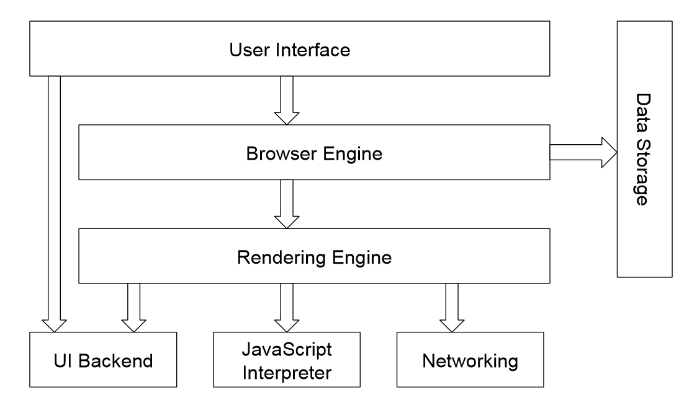

# Sicherheit von Webanwendungen

## Grundlagen

- Authentifizierung
  - Nachweis der Identität durch den Server
- Verschlüsselung
  - Von Klartext zu Ciphertext durch Cipher / Chiffre, symmetrisch oder asymmetrisch, umkehrbar
- kryptografische Prüfsumme
  - Synonym für Hash
- Sicherheitsziele
  - CIA: Confidentiality, Integrity, Availability; Privatheit; Authentizität; Verbindlichkeit / Nichtabstreitbarkeit
- Härtung
  - Verbesserung der Resilienz eines Systems
- Passwörter
  - gehasht gespeichert, gesalzen, Übertragung im Klartext
- Zertifikate
  - asymmetrische Kryptografie, Nachweis der Echtheit, Baumstruktur mit Root CA
- Angriffswerkzeuge bei Webanwendungen
  - ZAP, burp, hydra, john the ripper, cupps
- OWASP TOP 10
  - neues Ranking erste Hälfte von 2025
  - Ergebnis von 2021:
    1. Broken Access Control
    2. Cryptographic Failures
    3. Injection
    4. Insecure Design
    5. Security Misconfiguration
    6. Vulnerable and Outdated Components
    7. Identification and Authentication Failures
    8. Software and Data Integrity Failures
    9. Security Logging and Monitoring Failures
    10. Server Side Request Forgery

### HTTP (Hypertext Transfer Protocol)

Bestandteile eines HTTP Requests

- **Methode** (GET, POST, PUT, DELETE, HEAD, PATCH)
- **URL** (Uniform Resource Locator)
  - Protokoll (http / https)
  - Host
  - Port (sonst 80 / 443)
  - Verzeichnis
  - Ressource
  - Parameter (? ... & ...)
  - Anker (#)
- Protokoll **Version** (z.B. HTTP/1.1)
- **Headers** (Host, User-Agent, Accept, ...)
- **Body** (optional) nach einer Leerzeile

Bestandteile der HTTP Response

- Version
- Status
- Status-Nachricht
- Headers
- Body nach einer Leerzeile

### HTML (Hypertext Markup Language)

markiert und attributiert Bestandteile eines Dokuments, Darstellung durch Browser

Baumstruktur durch Schachtelung der Tags $\rightarrow$ **DOM** (Document Object Model)

- **Programmierschnittstelle** für Manipulation der Seite
  - Animationen
  - Rich Internet Applications
  - browserunabhängig, in Skriptsprachen integriert

### Web-Browser

Client-Programm für die Darstellung von Webseiten / Webanwendungen

Basiert in der Regel auf Chromium oder Firefox

- **User Interface**: Menüleiste und Navigation
- **Browser Engine**: Koordination zwischen UI und Rendering Engine
- **Rendering Engine**: Parsing von HTML und CSS $\rightarrow$ Darstellung
- **Data Storage**: Persistierung (z.B. Cookies)
- **UI Backend**: benutzt Methoden des OS
- **JavaScript Interpreter**: kann JavaScript ausführen
- **Networking**: Kommunikation über das Internet

### Web-Anwendung

Software, die auf einem Webserver ausgeführt wird und auf Benutzereingaben (HTTP) dynamisch reagiert

Angreifbar sind sowohl Client-Anwendung als auch Kommunikation und Server-Anwendung

## 01 Broken Access Control

Fehlerhafte **Autorisierung** (Konfiguration oder Code der Authentifizierung)

Beinhaltet ehemalige Kategorien **Insecure Direct Object References** und **Missing Function Level Access Control**

### Direct Object References

- Referenz durch Pfad nach außen sichtbar
- Referenz kann manipuliert werden
- Dadurch möglicherweise Zugriff auf Objekt, für das der Anwender keine Rechte hat
- Jeder Zugriff auf direkte Objektreferenzen MUSS eine Überprüfung der Autorisierung beinhalten

### Access Control

- **Role-based Access Control** (RBAC)
  - zugewiesene Rollen $\rightarrow$ daraus Berechtigungen
- **Attribute-based Access Control** (ABAC)
  - zugewiesene Policies $\rightarrow$ beinhalten Attribute $\rightarrow$ Evaluation über Bool'sche Berechnung
  - auch "policy-based" (PBAC) oder "claims-based" (CBAC)

### Angriffsmöglichkeiten

- Directory Traversal
  - **Local File**: durch bspw. "../" o.ä. wird eine lokale Datei wie /etc/passwd eingebunden
  - **Remote File**: eine potenziell schädliche Datei wird als Parameter übergeben
  - **Environment Discovery**: Rückschluss auf Netzwerkstruktur
  - **Show Source Code**: Rückschluss auf Quelltext
- URL Encoding und Double URL Encoding
  - "../" als "%2e%2e%2f"
- Unicode /UTF-8 Encoding
  - "../" als "..%c0%af"
- Forced Browsing (bruteforce)
  - Testen von "Standard"-Verzeichnissen

### Schutzmechanismen

- **DRY** (don't repeat yourself): einmalige Implementierung + Vererbung
- konfigurierbare Rollen
- nur anzeigen, worauf zugegriffen werden kann
- OWASP "Guide to Authorization":
  1. regelmäßig Rechte **neu testen** oder Benutzer abmelden
  2. **Least Privilege**: so wenige Rechte wie möglich, so viele Rechte wie nötig
  3. **Zentralisierte Autorisierung**: <ins>eine</ins> Schnittstelle
  4. Zugangskontrolle bei geschützten Ressourcen: nicht nur prüfen ob Aktion erlaubt, sondern auch ob Zugriff erlaubt
  5. Auch Zugriff auf statische Ressourcen schützen: z.B. zufälliger Datei- oder Ordnername
  6. Reautorisierung oder sogar Reauthentifizierung bei wichtigen Aktionen
  7. Geeignetes **Framework** nutzen, kein eigener Code
  8. **Session Management** beachten, Autorisierung an Session koppeln
